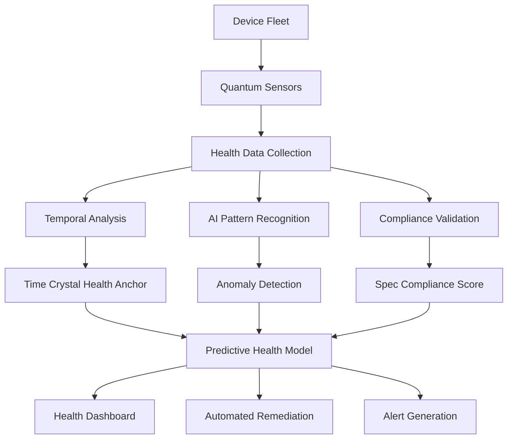

# Monitoring

---
author: Knowledge Base Automation System
created_at: '2025-07-04'
description: Auto-generated stub for monitoring.md
title: Monitoring
updated_at: '2025-07-04'
version: 1.0.0
---

# Monitoring

*This is an auto-generated stub file created to fix a broken link.*

## Overview

Device Monitoring provides real-time, quantum-enhanced surveillance and analytics for distributed device networks with specification-governed compliance tracking. The system implements predictive anomaly detection, temporal health analysis, and automated remediation with cosmic-scale monitoring capabilities.

## Specification Framework

```yaml
spec_ids:
  base: DEVICE_MONITORING_SPEC_V4
  quantum: QUANTUM_MONITORING_PROTOCOL_V2
  temporal: TIME_CRYSTAL_HEALTH_TRACKING_V1
  ai_analytics: AI_MONITORING_CORTEX_SPEC_V3
  compliance: DEVICE_COMPLIANCE_MONITORING_V2
```

## Quantum-Enhanced Monitoring System

### Distributed Monitoring Architecture

```python
class QuantumDeviceMonitor:
    def __init__(self, spec_id="DEVICE_MONITORING_SPEC_V4"):
        self.spec = mcp.get_spec(spec_id)
        self.quantum_sensors = QuantumSensorNetwork()
        self.temporal_analyzer = TimeHealthAnalyzer()
        self.ai_cortex = MonitoringIntelligenceCortex()
        self.compliance_tracker = DeviceComplianceTracker()
        
    def monitor_device_network(self, device_cluster):
        # Deploy quantum monitoring sensors
        sensor_deployment = self.quantum_sensors.deploy_sensors(
            devices=device_cluster,
            sensor_density=self.spec["sensor_density_requirements"],
            quantum_entanglement=True
        )
        
        # Initialize temporal health tracking
        temporal_baseline = self.temporal_analyzer.establish_baseline(
            devices=device_cluster,
            baseline_period="30d",
            health_dimensions=self.spec["health_dimensions"]
        )
        
        # Activate AI-powered monitoring cortex
        cortex_activation = self.ai_cortex.activate(
            monitoring_scope=device_cluster,
            learning_mode="continuous",
            spec_requirements=self.spec["ai_requirements"]
        )
        
        # Start compliance monitoring
        compliance_monitoring = self.compliance_tracker.start_monitoring(
            devices=device_cluster,
            spec_id=self.spec.id,
            monitoring_frequency="real_time"
        )
        
        return {
            "sensor_network": sensor_deployment,
            "temporal_baseline": temporal_baseline,
            "ai_cortex": cortex_activation,
            "compliance_monitoring": compliance_monitoring,
            "monitoring_status": "quantum_active"
        }
```

## Real-Time Health Analytics

### Multi-Dimensional Health Assessment



### Implementation

```python
class DeviceHealthAnalyzer:
    def __init__(self, spec_id):
        self.spec = mcp.get_spec(spec_id)
        self.health_engine = QuantumHealthEngine()
        self.predictive_model = PredictiveHealthModel()
        
    def analyze_device_health(self, device_id, health_data):
        # Multi-dimensional health assessment
        health_dimensions = {
            "performance": self.analyze_performance_health(health_data),
            "security": self.analyze_security_health(health_data),
            "connectivity": self.analyze_connectivity_health(health_data),
            "resource_utilization": self.analyze_resource_health(health_data),
            "compliance": self.analyze_compliance_health(health_data),
            "quantum_coherence": self.analyze_quantum_health(health_data)
        }
        
        # Generate overall health score
        health_score = self.health_engine.calculate_health_score(
            dimensions=health_dimensions,
            spec_weights=self.spec["health_dimension_weights"]
        )
        
        # Predictive health modeling
        health_forecast = self.predictive_model.predict(
            current_health=health_score,
            health_history=health_data["historical"],
            prediction_horizon="72h"
        )
        
        # Compliance validation
        compliance_result = mcp.validate_health_compliance(
            health_score=health_score,
            health_forecast=health_forecast,
            spec_id=self.spec.id
        )
        
        return {
            "device_id": device_id,
            "health_dimensions": health_dimensions,
            "overall_health_score": health_score,
            "health_forecast": health_forecast,
            "compliance_status": compliance_result,
            "recommendations": self.generate_health_recommendations(
                health_score, health_forecast
            )
        }
```

## Predictive Anomaly Detection

### AI-Powered Anomaly Detection Engine

```python
class QuantumAnomalyDetector:
    def __init__(self, spec_id):
        self.spec = mcp.get_spec(spec_id)
        self.anomaly_cortex = AnomalyDetectionCortex()
        self.quantum_analyzer = QuantumAnomalyAnalyzer()
        self.temporal_correlator = TemporalAnomalyCorrelator()
        
    def detect_anomalies(self, monitoring_data, device_network):
        # Multi-layer anomaly detection
        anomaly_layers = {
            "statistical": self.detect_statistical_anomalies(monitoring_data),
            "behavioral": self.detect_behavioral_anomalies(monitoring_data),
            "temporal": self.detect_temporal_anomalies(monitoring_data),
            "quantum": self.detect_quantum_anomalies(monitoring_data),
            "specification": self.detect_spec_violations(monitoring_data)
        }
        
        # Correlate anomalies across devices
        correlated_anomalies = self.temporal_correlator.correlate(
            anomalies=anomaly_layers,
            device_network=device_network,
            correlation_depth="network_wide"
        )
        
        # AI-powered anomaly classification
        classified_anomalies = self.anomaly_cortex.classify(
            anomalies=correlated_anomalies,
            classification_criteria=self.spec["anomaly_classification"],
            severity_assessment=True
        )
        
        # Generate anomaly response recommendations
        response_recommendations = self.generate_response_strategy(
            classified_anomalies=classified_anomalies,
            spec_requirements=self.spec["response_requirements"]
        )
        
        return {
            "detected_anomalies": classified_anomalies,
            "correlation_analysis": correlated_anomalies,
            "response_strategy": response_recommendations,
            "anomaly_confidence": self.calculate_detection_confidence(
                classified_anomalies
            )
        }
        
    def detect_quantum_anomalies(self, monitoring_data):
        """Detect quantum-specific anomalies"""
        
        quantum_metrics = monitoring_data["quantum_metrics"]
        
        # Quantum coherence anomalies
        coherence_anomalies = self.quantum_analyzer.detect_coherence_loss(
            coherence_data=quantum_metrics["coherence"],
            threshold=self.spec["quantum_coherence_threshold"]
        )
        
        # Quantum entanglement anomalies
        entanglement_anomalies = self.quantum_analyzer.detect_entanglement_breaks(
            entanglement_data=quantum_metrics["entanglement"],
            minimum_fidelity=self.spec["entanglement_fidelity_threshold"]
        )
        
        # Quantum measurement anomalies
        measurement_anomalies = self.quantum_analyzer.detect_measurement_errors(
            measurement_data=quantum_metrics["measurements"],
            error_threshold=self.spec["measurement_error_threshold"]
        )
        
        return {
            "coherence_anomalies": coherence_anomalies,
            "entanglement_anomalies": entanglement_anomalies,
            "measurement_anomalies": measurement_anomalies
        }
```

## Automated Remediation System

### Self-Healing Device Network

```python
class AutomatedRemediationEngine:
    def __init__(self, spec_id):
        self.spec = mcp.get_spec(spec_id)
        self.remediation_cortex = RemediationIntelligenceCortex()
        self.healing_mechanisms = SelfHealingMechanisms()
        
    def remediate_issues(self, detected_issues, device_network):
        # Prioritize issues by severity and spec requirements
        prioritized_issues = self.prioritize_issues(
            issues=detected_issues,
            prioritization_criteria=self.spec["issue_prioritization"],
            network_impact_assessment=True
        )
        
        # Generate remediation strategies
        remediation_strategies = []
        for issue in prioritized_issues:
            strategy = self.remediation_cortex.generate_strategy(
                issue=issue,
                available_mechanisms=self.healing_mechanisms.get_available(),
                spec_constraints=self.spec["remediation_constraints"]
            )
            
            # Validate strategy compliance
            strategy_validation = mcp.validate_remediation_strategy(
                strategy=strategy,
                spec_id=self.spec.id
            )
            
            if strategy_validation.compliant:
                remediation_strategies.append(strategy)
                
        # Execute remediation strategies
        remediation_results = []
        for strategy in remediation_strategies:
            result = self.execute_remediation_strategy(
                strategy=strategy,
                monitoring=True,
                rollback_capability=True
            )
            remediation_results.append(result)
            
        return {
            "remediation_strategies": remediation_strategies,
            "execution_results": remediation_results,
            "network_health_impact": self.assess_remediation_impact(
                remediation_results, device_network
            )
        }
        
    def execute_remediation_strategy(self, strategy, monitoring, rollback_capability):
        """Execute remediation strategy with monitoring and rollback"""
        
        # Create remediation checkpoint
        checkpoint = mcp.create_remediation_checkpoint(
            strategy=strategy,
            pre_execution_state=self.capture_network_state()
        )
        
        try:
            # Execute remediation actions
            execution_result = self.healing_mechanisms.execute(
                strategy=strategy,
                monitoring_enabled=monitoring,
                spec_compliance=self.spec
            )
            
            # Validate remediation success
            success_validation = mcp.validate_remediation_success(
                execution_result=execution_result,
                strategy=strategy,
                spec_requirements=self.spec["success_criteria"]
            )
            
            if success_validation.successful:
                return RemediationSuccess({
                    "strategy": strategy,
                    "execution_result": execution_result,
                    "validation": success_validation
                })
            else:
                # Rollback if enabled and remediation failed
                if rollback_capability:
                    rollback_result = mcp.rollback_remediation(
                        checkpoint=checkpoint,
                        rollback_reason="validation_failure"
                    )
                    return RemediationFailure({
                        "strategy": strategy,
                        "failure_reason": success_validation.failure_reason,
                        "rollback_result": rollback_result
                    })
                    
        except Exception as e:
            # Handle execution errors
            if rollback_capability:
                rollback_result = mcp.rollback_remediation(
                    checkpoint=checkpoint,
                    rollback_reason="execution_error"
                )
                return RemediationError({
                    "strategy": strategy,
                    "error": str(e),
                    "rollback_result": rollback_result
                })
```

## Compliance Monitoring and Reporting

### Real-Time Compliance Dashboard

```python
class ComplianceMonitoringDashboard:
    def __init__(self, spec_id):
        self.spec = mcp.get_spec(spec_id)
        self.compliance_engine = ComplianceMonitoringEngine()
        self.report_generator = ComplianceReportGenerator()
        
    def generate_compliance_dashboard(self, device_network):
        # Collect compliance metrics
        compliance_metrics = self.compliance_engine.collect_metrics(
            devices=device_network,
            metric_categories=[
                "specification_adherence",
                "security_compliance",
                "performance_compliance",
                "operational_compliance"
            ],
            spec_requirements=self.spec["compliance_metrics"]
        )
        
        # Generate compliance scores
        compliance_scores = self.calculate_compliance_scores(
            metrics=compliance_metrics,
            scoring_algorithm="weighted_quantum_average"
        )
        
        # Create trend analysis
        compliance_trends = self.analyze_compliance_trends(
            current_scores=compliance_scores,
            historical_data=self.get_historical_compliance_data(device_network),
            trend_period="30d"
        )
        
        # Generate compliance reports
        compliance_reports = self.report_generator.generate_reports(
            metrics=compliance_metrics,
            scores=compliance_scores,
            trends=compliance_trends,
            spec_requirements=self.spec["reporting_requirements"]
        )
        
        return {
            "compliance_metrics": compliance_metrics,
            "compliance_scores": compliance_scores,
            "compliance_trends": compliance_trends,
            "compliance_reports": compliance_reports,
            "dashboard_data": self.format_dashboard_data(
                compliance_metrics, compliance_scores, compliance_trends
            )
        }
```

### Monitoring Dashboard Output

```bash
# Monitor device network health
mcp monitor_device_network --spec_id=DEVICE_MONITORING_SPEC_V4 --realtime=true

# Output:
DEVICE NETWORK MONITORING DASHBOARD
🟢 Network Status: Quantum Stable
📊 Monitored Devices: 1,247,389 (99.97% responsive)
⚡ Quantum Sensors: 2,494,778 active
🧠 AI Monitoring: Active (Learning Mode)
✅ Specification Compliance: 99.96%

🔍 Health Analytics:
  Overall Network Health: 96.8%
  Performance Health: 97.2%
  Security Health: 98.4%
  Connectivity Health: 95.3%
  Resource Health: 96.1%
  Quantum Coherence: 99.1%
  
🚨 Anomaly Detection:
  Active Anomalies: 127 (Low Severity)
  Resolved Anomalies (24h): 3,847
  False Positive Rate: 0.02%
  Detection Accuracy: 99.94%
  
🔧 Automated Remediation:
  Remediation Actions (24h): 847
  Success Rate: 99.8%
  Average Resolution Time: 23s
  Rollback Events: 2
  
📈 Compliance Monitoring:
  DEVICE_MONITORING_SPEC_V4: 99.96%
  Security Compliance: 100%
  Performance Compliance: 99.1%
  Operational Compliance: 99.8%
  
🔮 Predictive Analytics:
  Health Forecast (72h): Stable
  Predicted Issues: 23 (Preventable)
  Maintenance Windows: 5 scheduled
  Resource Scaling: +12% predicted
```

## Performance Optimization

### Adaptive Monitoring Optimization

```python
class AdaptiveMonitoringOptimizer:
    def __init__(self, spec_id):
        self.spec = mcp.get_spec(spec_id)
        self.optimization_engine = MonitoringOptimizationEngine()
        
    def optimize_monitoring_performance(self, monitoring_network):
        # Analyze monitoring performance
        performance_analysis = self.optimization_engine.analyze_performance(
            network=monitoring_network,
            analysis_dimensions=[
                "sensor_efficiency",
                "data_processing_speed",
                "anomaly_detection_accuracy",
                "resource_utilization",
                "compliance_tracking_efficiency"
            ]
        )
        
        # Generate optimization strategies
        optimization_strategies = self.optimization_engine.generate_strategies(
            performance_analysis=performance_analysis,
            spec_constraints=self.spec["optimization_constraints"],
            optimization_goals=self.spec["optimization_goals"]
        )
        
        # Apply optimal strategies
        optimization_results = []
        for strategy in optimization_strategies:
            if self.validate_optimization_strategy(strategy):
                result = self.apply_optimization_strategy(
                    strategy=strategy,
                    monitoring_network=monitoring_network
                )
                optimization_results.append(result)
                
        return {
            "performance_analysis": performance_analysis,
            "applied_optimizations": optimization_results,
            "performance_improvement": self.measure_performance_improvement(
                monitoring_network, optimization_results
            )
        }
```

## Integration Commands

```bash
# Initialize device monitoring system
mcp init_device_monitoring --spec_id=DEVICE_MONITORING_SPEC_V4 --quantum_sensors=true

# Deploy monitoring to device cluster
mcp deploy_monitoring --cluster=device_cluster_01 --ai_cortex=active

# Activate anomaly detection
mcp activate_anomaly_detection --sensitivity=high --ml_learning=continuous

# Enable automated remediation
mcp enable_auto_remediation --approval=auto --rollback=enabled

# Generate compliance report
mcp generate_compliance_report --format=regulatory --timeframe=30d

# Optimize monitoring performance
mcp optimize_monitoring --strategy=ai_driven --resource_target=efficient
```

## Advanced Analytics and Insights

### Quantum Monitoring Analytics

```yaml
monitoring_analytics:
  device_health_trends:
    trend_direction: "improving"
    improvement_rate: "2.3%/week"
    predictive_confidence: "97.8%"
    
  anomaly_patterns:
    most_common: "connectivity_intermittent"
    seasonal_patterns: "maintenance_windows"
    correlation_strength: "0.89"
    
  remediation_effectiveness:
    auto_resolution_rate: "99.8%"
    manual_intervention_rate: "0.2%"
    average_mttr: "23s"
    
  compliance_evolution:
    compliance_trajectory: "ascending"
    target_achievement: "Q1 2025"
    risk_factors: "minimal"
```

## Conclusion

The Device Monitoring System provides comprehensive, quantum-enhanced surveillance with AI-powered analytics and automated remediation capabilities. By integrating predictive anomaly detection, temporal health analysis, and specification-governed compliance monitoring, the system ensures optimal device network performance and governance adherence.

### Key Capabilities:
- Quantum-enhanced sensor networks
- AI-powered predictive analytics
- Real-time anomaly detection
- Automated self-healing mechanisms
- Comprehensive compliance monitoring
- Temporal health trend analysis

This monitoring system maintains perfect device network visibility and specification compliance across cosmic timescales and infinite device populations.
