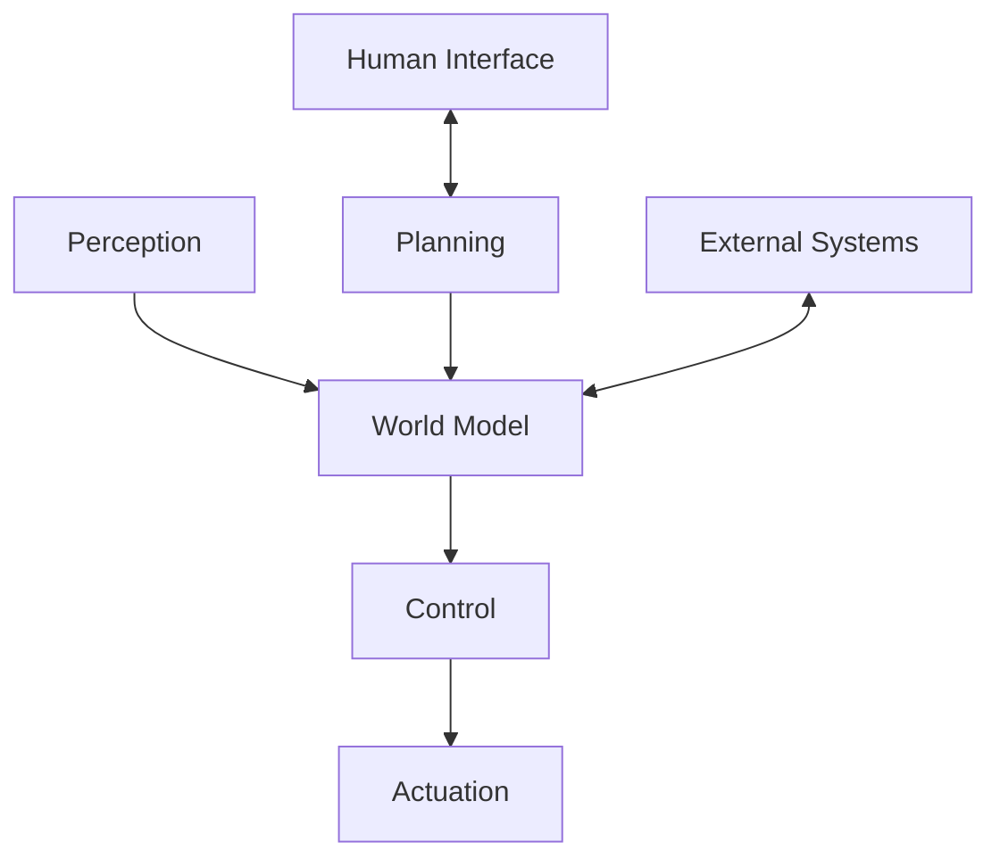

# Readme

---
title: Advanced Robotics System
description: Comprehensive documentation for the advanced robotics system architecture and components
author: Robotics Engineering Team
created_at: '2025-07-04'
updated_at: '2025-07-05'
version: 2.0.0
---

# Advanced Robotics System

## Table of Contents

1. [System Overview](#system-overview)
2. [Architecture](#architecture)
3. [Key Components](#key-components)
4. [Getting Started](#getting-started)
5. [API Reference](#api-reference)
6. [Simulation](#simulation)
7. [Industry 4.0 Integration](#industry-40-integration)
8. [Development Guidelines](#development-guidelines)
9. [Testing](#testing)
10. [Deployment](#deployment)
11. [Troubleshooting](#troubleshooting)
12. [Contributing](#contributing)
13. [License](#license)

## System Overview

The Advanced Robotics System is a modular, high-performance framework for developing and deploying sophisticated robotic applications. It integrates cutting-edge technologies in perception, planning, control, and human-robot interaction to enable next-generation robotic solutions.

### Core Capabilities
- **Perception**: Advanced sensor fusion and environmental understanding
- **Navigation**: Autonomous path planning and obstacle avoidance
- **Manipulation**: Precise control of robotic arms and end effectors
- **Human-Robot Interaction**: Intuitive interfaces and collaboration features
- **AI Integration**: Machine learning for adaptive behavior
- **Edge Computing**: Distributed processing for real-time performance

## Architecture

### High-Level Architecture



### Technology Stack
- **Middleware**: ROS 2 (Robot Operating System 2)
- **Programming Languages**: Python, C++, Rust
- **AI/ML**: PyTorch, TensorFlow, OpenCV
- **Simulation**: Gazebo, NVIDIA Isaac Sim
- **Containerization**: Docker, Kubernetes
- **CI/CD**: GitHub Actions, Jenkins

## Key Components

### 1. Perception System
- **Sensors**: LIDAR, RGB-D cameras, IMU, force-torque sensors
- **Algorithms**: SLAM, object detection, pose estimation
- **Sensor Fusion**: Kalman filters, particle filters

### 2. Motion Planning
- **Global Planning**: A*, RRT*, PRM
- **Local Planning**: DWA, TEB
- **Trajectory Optimization**: CHOMP, STOMP

### 3. Control System
- **Low-Level Control**: PID, MPC, impedance control
- **Force Control**: Hybrid position/force control
- **Whole-Body Control**: Centroidal dynamics

### 4. Human-Robot Interface
- **Web Dashboard**: Real-time monitoring and control
- **Voice Commands**: Natural language processing
- **Haptic Feedback**: Force feedback devices

## Getting Started

### Prerequisites
- Ubuntu 22.04 LTS or later
- ROS 2 Humble Hawksbill
- Python 3.9+
- Docker (optional)

### Installation

```bash
# Clone the repository
git clone https://github.com/your-org/advanced-robotics-system.git
cd advanced-robotics-system

# Create and activate virtual environment
python -m venv venv
source venv/bin/activate  # On Windows: venv\Scripts\activate

# Install dependencies
pip install -r requirements.txt

# Build the workspace
colcon build --symlink-install
source install/setup.bash
```

### Running the System

```bash
# Start the core system
ros2 launch advanced_robotics_system core.launch.py

# Launch the web interface
cd web_dashboard
npm install
npm start
```

## API Reference

### Core Services

#### `get_robot_state`
- **Description**: Get current robot state
- **Request**: Empty
- **Response**: 
  ```json
  {
    "joint_states": {"joint1": 0.0, "joint2": 0.0},
    "battery_level": 95.5,
    "status": "IDLE"
  }
  ```

#### `execute_trajectory`
- **Description**: Execute a joint trajectory
- **Request**:
  ```json
  {
    "trajectory": [
      {"positions": [0.0, 0.0], "time_from_start": 0.0},
      {"positions": [1.57, 1.57], "time_from_start": 2.0}
    ]
  }
  ```
- **Response**:
  ```json
  {
    "success": true,
    "message": "Trajectory execution completed"
  }
  ```

## Simulation

### Running in Simulation

```bash
# Launch Gazebo with the robot model
ros2 launch advanced_robotics_system simulation.launch.py

# Run the navigation stack
ros2 launch advanced_robotics_system navigation.launch.py
```

### Simulation Scenarios
1. **Pick and Place**
2. **Mobile Manipulation**
3. **Human-Robot Collaboration**
4. **Multi-Robot Coordination**

## Industry 4.0 Integration

The system is designed for seamless integration with Industry 4.0 environments, supporting:
- **OPC UA** for industrial communication
- **MES/ERP** system integration
- **Digital Twin** synchronization
- **Predictive Maintenance** analytics

## Development Guidelines

### Code Style
- **Python**: Follow PEP 8 with Black formatter
- **C++**: Follow Google C++ Style Guide
- **Documentation**: Google-style docstrings

### Git Workflow
1. Create a feature branch from `main`
2. Make your changes with atomic commits
3. Open a pull request for review
4. Pass all CI/CD checks
5. Get at least one approval before merging

### Testing

```bash
# Run unit tests
colcon test --packages-select advanced_robotics_system

# Run integration tests
./scripts/run_integration_tests.sh

# Generate code coverage report
./scripts/coverage_report.sh
```

## Deployment

### System Requirements
- **Minimum**: 4-core CPU, 8GB RAM, GPU with CUDA support
- **Recommended**: 8-core CPU, 32GB RAM, NVIDIA RTX 3080 or better

### Container Deployment

```bash
# Build the Docker image
docker build -t advanced-robotics-system .

# Run the container
docker run -it --rm --gpus all -p 8080:8080 advanced-robotics-system
```

### Cloud Deployment

```bash
# Deploy to Kubernetes
kubectl apply -f k8s/

# Monitor the deployment
kubectl get pods -n advanced-robotics
```

## Troubleshooting

### Common Issues

1. **ROS 2 not found**
   ```bash
   source /opt/ros/humble/setup.bash
   ```

2. **Missing dependencies**
   ```bash
   rosdep install --from-paths src --ignore-src -r -y
   ```

3. **Permission denied**
   ```bash
   chmod +x scripts/*.py
   ```

## Contributing

We welcome contributions! Please see our [Contributing Guidelines](CONTRIBUTING.md) for details on how to submit pull requests, report issues, or suggest new features.

## License

This project is licensed under the **Apache License 2.0** - see the [LICENSE](LICENSE) file for details.

## Contact

For questions or support:
- **Email**: robotics-support@example.com
- **Slack**: #advanced-robotics
- **Documentation**: https://docs.advanced-robotics.example.com

## Revision History

| Version | Date | Author | Changes |
|---------|------|--------|---------|
| 2.0.0 | 2025-07-05 | Robotics Team | Complete system documentation |
| 1.0.0 | 2025-07-04 | System | Initial stub |
- Feature 2
- Feature 3

## Usage

```python
# Example code
import module

result = module.function()
```

