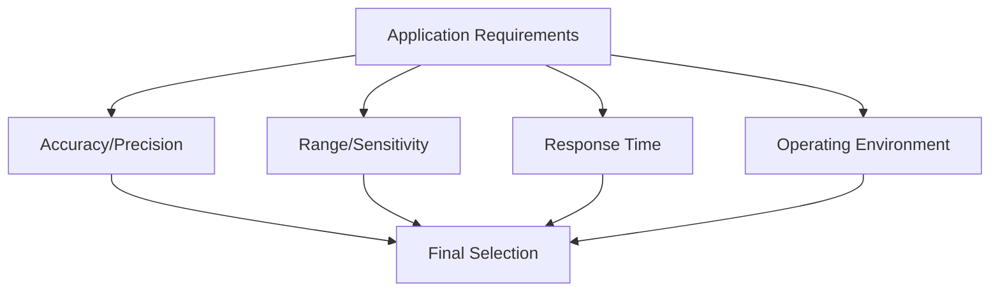

# Types

---
title: Sensor Types and Specifications
description: Comprehensive guide to different types of sensors, their characteristics, and applications
author: Sensor Engineering Team
created_at: '2025-07-04'
updated_at: '2025-07-05'
version: 2.0.0
---

# Sensor Types and Specifications

## Table of Contents

1. [Introduction](#introduction)
2. [Environmental Sensors](#environmental-sensors)
3. [Motion and Inertial Sensors](#motion-and-inertial-sensors)
4. [Optical Sensors](#optical-sensors)
5. [Proximity and Position Sensors](#proximity-and-position-sensors)
6. [Biosensors](#biosensors)
7. [Chemical and Gas Sensors](#chemical-and-gas-sensors)
8. [Acoustic Sensors](#acoustic-sensors)
9. [Emerging Sensor Technologies](#emerging-sensor-technologies)
10. [Selection Criteria](#selection-criteria)
11. [Integration Considerations](#integration-considerations)
12. [References](#references)

## Introduction

Sensors are the fundamental building blocks of modern measurement and automation systems. This guide provides a comprehensive overview of various sensor types, their operating principles, specifications, and typical applications.

### Sensor Classification

Sensors can be classified based on several criteria:

- **Measurand Type**: What physical quantity is being measured
- **Operating Principle**: How the measurement is performed
- **Output Type**: Analog, digital, or frequency-based
- **Power Requirements**: Active vs. passive sensors
- **Application Domain**: Industrial, medical, consumer, etc.

## Environmental Sensors

### 1. Temperature Sensors

| Type | Range | Accuracy | Response Time | Applications |
|------|-------|----------|---------------|--------------|
| **Thermocouple** | -200°C to 2300°C | ±0.5°C to ±5°C | 0.1-10s | Industrial processes, HVAC |
| **RTD** | -200°C to 850°C | ±0.1°C to ±1°C | 1-50s | Laboratory, medical |
| **Thermistor** | -90°C to 130°C | ±0.1°C to ±1.5°C | 0.1-10s | Consumer electronics, automotive |
| **IC Sensors** | -55°C to 150°C | ±0.5°C to ±2°C | 5-60s | Computers, appliances |

### 2. Humidity Sensors

| Type | Range | Accuracy | Response Time | Interface |
|------|-------|----------|---------------|-----------|
| **Capacitive** | 0-100% RH | ±2% to ±5% RH | 10-30s | I²C, SPI, Analog |
| **Resistive** | 20-90% RH | ±3% to ±10% RH | 10-30s | Analog |
| **Thermal** | 0-100% RH | ±1.5% to ±5% RH | 4s | Digital |

### 3. Pressure Sensors

| Type | Range | Accuracy | Applications |
|------|-------|----------|--------------|
| **Absolute** | 0-1000 bar | ±0.1% FS | Weather stations, altimeters |
| **Gauge** | -1 to 1000 bar | ±0.1% FS | Tire pressure, industrial processes |
| **Differential** | 0.001-1000 bar | ±0.05% FS | Flow measurement, filtration |
| **Sealed Gauge** | 0-1000 bar | ±0.1% FS | Medical devices, HVAC |

## Motion and Inertial Sensors

### 1. Accelerometers

| Type | Range | Bandwidth | Noise Density | Applications |
|------|-------|-----------|----------------|--------------|
| **MEMS** | ±2g to ±400g | 0-5kHz | 25-500 µg/√Hz | Smartphones, wearables |
| **Piezoelectric** | ±2g to ±500g | 0.1-10kHz | 100-1000 µg/√Hz | Vibration monitoring |
| **Piezoresistive** | ±2g to ±200g | 0-2kHz | 100-500 µg/√Hz | Automotive airbags |
| **Capacitive** | ±2g to ±16g | 0-1.5kHz | 25-100 µg/√Hz | IoT devices, gaming |

### 2. Gyroscopes

| Type | Range | Sensitivity | Zero-Rate Output | Applications |
|------|-------|-------------|-------------------|--------------|
| **MEMS** | ±125 to ±2000°/s | 4-131 LSB/°/s | ±10°/s | Drones, robotics |
| **Fiber Optic** | ±0.01 to ±2000°/s | 0.001-10 °/h | ±0.01°/h | Navigation, aerospace |
| **Ring Laser** | ±0.001 to ±1000°/s | 0.0001-1 °/h | ±0.001°/h | Strategic grade navigation |

### 3. IMUs (Inertial Measurement Units)

| Type | Sensors Included | Typical Applications |
|------|------------------|----------------------|
| **6-DoF** | 3-axis accel + 3-axis gyro | Drones, robotics |
| **9-DoF** | 6-DoF + 3-axis magnetometer | Augmented reality |
| **10-DoF** | 9-DoF + barometer | Indoor navigation |

## Optical Sensors

### 1. Photodiodes

| Type | Wavelength | Responsivity | Response Time | Applications |
|------|------------|--------------|----------------|--------------|
| **Silicon** | 190-1100 nm | 0.4-0.6 A/W | 1-100 ns | Light meters, medical |
| **InGaAs** | 800-2600 nm | 0.9-1.3 A/W | 1-10 ns | Fiber optics, spectroscopy |
| **Germanium** | 800-1800 nm | 0.7-0.8 A/W | 0.1-1 µs | Laser detection |

### 2. Image Sensors

| Type | Resolution | Pixel Size | Frame Rate | Applications |
|------|------------|------------|------------|--------------|
| **CMOS** | VGA to 100+ MP | 0.8-10 µm | 30-1000+ FPS | Smartphones, automotive |
| **CCD** | 1-100 MP | 3-25 µm | 1-60 FPS | Astronomy, scientific |
| **sCMOS** | 1-20 MP | 6.5-11 µm | 20-100 FPS | Low-light imaging |

### 3. Time-of-Flight (ToF) Sensors

| Type | Range | Accuracy | Frame Rate | Applications |
|------|-------|----------|------------|--------------|
| **Direct ToF** | 0.1-1000m | ±1cm | 1-100 FPS | LiDAR, robotics |
| **Indirect ToF** | 0.1-5m | ±1% of distance | 30-60 FPS | Face recognition, gesture control |

## Proximity and Position Sensors

### 1. Ultrasonic Sensors

| Type | Range | Beam Angle | Accuracy | Applications |
|------|-------|------------|----------|--------------|
| **Air Ultrasonic** | 2cm-10m | 5-30° | ±1% | Parking sensors, level measurement |
| **Ultrasonic ToF** | 20cm-5m | 15-25° | ±1cm | Object detection, robotics |

### 2. Inductive Proximity Sensors

| Type | Sensing Distance | Output | Applications |
|------|------------------|--------|--------------|
| **Shielded** | 0.8-40mm | NPN/PNP | Factory automation |
| **Unshielded** | 2-60mm | NO/NC | Position sensing |
| **Analog** | 2-25mm | 0-10V/4-20mA | Distance measurement |

### 3. GPS/GNSS Receivers

| Type | Accuracy | Update Rate | Power | Applications |
|------|----------|-------------|-------|--------------|
| **Standard** | 2.5m CEP | 1-10Hz | 20-50mW | Navigation, tracking |
| **RTK** | 1cm+1ppm | 5-20Hz | 0.5-2W | Surveying, precision agriculture |
| **Assisted** | 2-10m | 1Hz | 10-30mW | Wearables, asset tracking |

## Biosensors

### 1. Biometric Sensors

| Type | Measured Parameter | Accuracy | Applications |
|------|-------------------|----------|--------------|
| **PPG** | Heart rate, SpO₂ | ±2 BPM | Smartwatches, medical |
| **ECG/EEG** | Electrical activity | 1-100 µV | Medical diagnostics |
| **GSR** | Skin conductance | 0.01-100 µS | Stress monitoring |
| **EMG** | Muscle activity | 10-5000 µV | Prosthetics, rehabilitation |

### 2. Environmental Biosensors

| Type | Target | Detection Limit | Response Time |
|------|--------|-----------------|---------------|
| **Enzymatic** | Glucose, lactate | 1 µM - 1 mM | 1-60s |
| **Immunosensors** | Proteins, pathogens | 1 pg/mL | 5-30 min |
| **DNA Sensors** | Genetic material | 1 fM | 15-60 min |

## Chemical and Gas Sensors

### 1. Gas Sensors

| Type | Target Gases | Range | Response Time |
|------|--------------|-------|---------------|
| **Electrochemical** | CO, NO₂, O₃ | 1-2000 ppm | 20-60s |
| **NDIR** | CO₂, CH₄ | 400-50000 ppm | 10-60s |
| **MOS** | VOCs, CO, H₂ | 1-1000 ppm | 10-30s |
| **PID** | VOCs | 0.1-5000 ppm | 2-5s |

### 2. pH and Ion Sensors

| Type | Range | Accuracy | Response Time |
|------|-------|----------|---------------|
| **Glass Electrode** | 0-14 pH | ±0.01 pH | 5-30s |
| **ISFET** | 0-14 pH | ±0.1 pH | <5s |
| **Ion-Selective** | Various ions | ±1-5% | 10-60s |

## Acoustic Sensors

### 1. Microphones

| Type | Frequency Range | Sensitivity | SNR | Applications |
|------|-----------------|-------------|-----|--------------|
| **MEMS** | 20Hz-20kHz | -38 dBV/Pa | 60-70 dB | Smartphones, IoT |
| **Electret** | 20Hz-16kHz | -44±3 dB | 58-65 dB | Headsets, voice recorders |
| **Measurement** | 4Hz-100kHz | 4-50 mV/Pa | 70-90 dB | Acoustic testing |

### 2. Ultrasonic Transceivers

| Type | Frequency | Range | Beam Angle | Applications |
|------|-----------|-------|------------|--------------|
| **40kHz** | 40kHz | 2cm-6m | 15-75° | Distance measurement |
| **200kHz** | 200kHz | 0.5-10m | 5-20° | Underwater sonar |
| **1MHz** | 1MHz | 1-50cm | 2-10° | Medical imaging |

## Emerging Sensor Technologies

### 1. Flexible and Stretchable Sensors
- **Materials**: Conductive polymers, liquid metals, nanomaterials
- **Applications**: Wearables, soft robotics, health monitoring
- **Challenges**: Long-term stability, signal consistency

### 2. Neuromorphic Sensors
- **Principles**: Event-based vision, spiking neural networks
- **Advantages**: Low power, high temporal resolution
- **Applications**: High-speed robotics, autonomous vehicles

### 3. Quantum Sensors
- **Types**: Atomic clocks, magnetometers, gravimeters
- **Precision**: Up to 10x better than classical sensors
- **Applications**: Navigation, mineral exploration, medical imaging

## Selection Criteria

### 1. Performance Parameters

### 2. Key Considerations
- **Environmental Conditions**: Temperature, humidity, pressure, EMI
- **Power Requirements**: Battery life, energy harvesting options
- **Interface**: Analog, digital (I²C, SPI, UART), wireless
- **Size and Weight**: Critical for wearable and mobile applications
- **Cost**: Initial cost vs. total cost of ownership
- **Calibration Requirements**: Factory vs. field calibration

## Integration Considerations

### 1. Signal Conditioning
- Amplification
- Filtering (low-pass, high-pass, band-pass)
- Isolation
- Linearization

### 2. Data Acquisition
- Sampling rate selection
- Resolution requirements
- Anti-aliasing filters
- Synchronization with other sensors

### 3. Communication Protocols

| Protocol | Speed | Distance | Power | Typical Use |
|----------|-------|----------|-------|-------------|
| **I²C** | 100kHz-5MHz | <1m | Low | Board-level communication |
| **SPI** | 1-50MHz | <1m | Medium | High-speed data transfer |
| **UART** | Up to 10Mbps | <15m | Low | Device communication |
| **CAN** | Up to 1Mbps | <40m | Medium | Automotive, industrial |
| **Bluetooth** | 1-2Mbps | <100m | Low-Medium | Wireless consumer devices |
| **LoRa** | 0.3-50kbps | <15km | Very Low | Long-range IoT |

## References

1. Fraden, J. (2016). *Handbook of Modern Sensors: Physics, Designs, and Applications* (5th ed.).
2. Ripka, P., & Tipek, A. (Eds.). (2013). *Modern Sensors Handbook*. ISTE.
3. Wilson, J. S. (Ed.). (2004). *Sensor Technology Handbook*. Newnes.
4. ISO 5725-1:1994 - Accuracy (trueness and precision) of measurement methods and results
5. IEEE 1451 - Smart Transducer Interface Standards

## Revision History

| Version | Date | Author | Changes |
|---------|------|--------|---------|
| 2.0.0 | 2025-07-05 | Sensor Team | Comprehensive sensor types guide |
| 1.0.0 | 2025-07-04 | System | Initial stub |

## Contact

For sensor selection and integration support:
- **Email**: sensors@example.com
- **Documentation**: https://docs.sensors.example.com/types
- **Support Portal**: https://support.example.com/sensors
