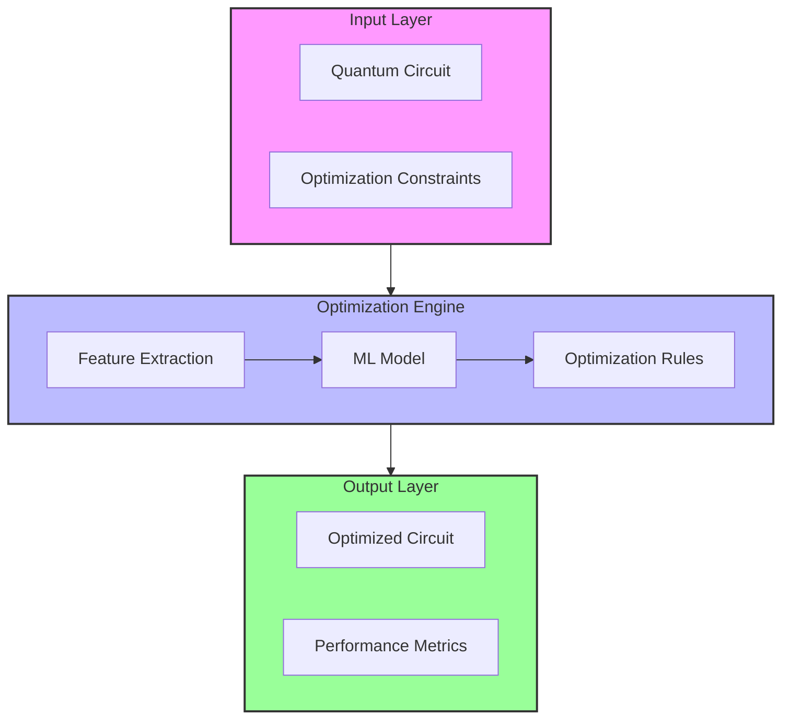

# Quantum Circuit Optimization

---
id: quantum-circuit-optimization-guide
title: Quantum Circuit Optimization - Implementation Guide
description: Comprehensive guide to implementing AI-driven quantum circuit optimization
author: Knowledge Base System
created_at: 2025-06-30
updated_at: 2025-06-30
version: 1.0.0
tags:
- quantum_computing
- circuit_optimization
- ai
- implementation_guide
- performance
relationships:
  prerequisites:
  - ai/applications/narrow_ai_quantum.md
  - quantum_computing/virtual_quantum_computer.md
  related:
  - ai/accelerators/time_crystal_module.md
  - ai/architecture/system_design.md
---

# Quantum Circuit Optimization Guide

## Table of Contents
1. [Introduction](#introduction)
2. [Architecture Overview](#architecture-overview)
3. [Implementation Details](#implementation-details)
4. [Advanced Techniques](#advanced-techniques)
5. [Performance Tuning](#performance-tuning)
6. [Integration Guide](#integration-guide)
7. [Troubleshooting](#troubleshooting)
8. [References](#references)

## Introduction

This guide provides a comprehensive walkthrough of implementing AI-driven quantum circuit optimization. It covers the architecture, implementation details, and best practices for optimizing quantum circuits using machine learning techniques.

## Architecture Overview



## Implementation Details

### 1. Feature Extraction

#### Circuit Analysis
```python
from qiskit import QuantumCircuit
from qiskit.circuit import Parameter
import numpy as np

def extract_circuit_features(circuit: QuantumCircuit) -> dict:
    """Extract features from a quantum circuit for optimization."""
    features = {:
        'num_qubits': circuit.num_qubits,
        'depth': circuit.depth(),
        'gate_counts': dict(circuit.count_ops()),
        'parameter_count': len(circuit.parameters),
        'connectivity': _calculate_connectivity(circuit)
    }
    return features

def _calculate_connectivity(circuit: QuantumCircuit) -> float:
    """Calculate the connectivity score of the circuit."""
    # Implementation details for connectivity analysis
    pass:
```

### 2. Machine Learning Model

#### Model Architecture
```python
import tensorflow as tf
from tensorflow.keras import layers

class CircuitOptimizer(tf.keras.Model):
    def __init__(self, num_qubits: int):
        super().__init__()
        self.num_qubits = num_qubits
        
        # Feature extraction layers
        self.feature_extractor = tf.keras.Sequential([
            layers.Dense(64, activation='relu'),
            layers.LayerNormalization(),
            layers.Dropout(0.2)
        ])
        
        # Attention mechanism for gate sequence analysis
        self.attention = layers.MultiHeadAttention(
            num_heads=4, 
            key_dim=64,
            dropout=0.1
        )
        
        # Output layers
        self.output_layers = {:
            'gate_type': layers.Dense(10, activation='softmax'),
            'parameters': layers.Dense(num_qubits * 3),  # For rotation angles
            'qubit_mapping': layers.Dense(num_qubits**2, activation='sigmoid')
        }
    
    def call(self, inputs, training=False):
        # Feature extraction
        x = self.feature_extractor(inputs)
        
        # Self-attention
        attn_output = self.attention(x, x)
        
        # Process outputs
        outputs = {}
        for name, layer in self.output_layers.items():
            outputs[name] = layer(attn_output)
            
        return outputs
```

## Advanced Techniques

### 1. Reinforcement Learning for Circuit Optimization

```python
import gym
from gym import spaces
import numpy as np

class QuantumCircuitEnv(gym.Env):
    def __init__(self, target_circuit, max_steps=100):
        super().__init__()
        self.target_circuit = target_circuit
        self.max_steps = max_steps
        self.current_step = 0
        
        # Define action and observation space
        self.action_space = spaces.Dict({
            'gate_type': spaces.Discrete(10),  # 10 different gate types
            'qubits': spaces.MultiBinary(self.target_circuit.num_qubits),
            'parameters': spaces.Box(low=-np.pi, high=np.pi, shape=(3,))
        })
        
        self.observation_space = spaces.Dict({
            'circuit_features': spaces.Box(low=0, high=1, shape=(64,)),
            'step': spaces.Discrete(max_steps)
        })
    
    def step(self, action):
        # Apply action to circuit
        self._apply_gate(action)
        
        # Calculate reward
        reward = self._calculate_reward()
        
        # Update state
        self.current_step += 1
        done = self.current_step >= self.max_steps
        
        return self._get_obs(), reward, done, {}
    
    def reset(self):
        self.current_step = 0
        self.circuit = self.target_circuit.copy()
        return self._get_obs()
    
    def _apply_gate(self, action):
        # Implementation for applying gate to circuit
        pass
    :
    def _calculate_reward(self):
        # Implementation for calculating reward
        pass
    :
    def _get_obs(self):
        # Implementation for getting observation
        pass:
```

## Performance Tuning

### 1. Hyperparameter Optimization

```python
from optuna import create_study
import optuna

def objective(trial):
    # Define hyperparameters to optimize
    params = {
        'learning_rate': trial.suggest_float('learning_rate', 1e-5, 1e-2, log=True),
        'num_layers': trial.suggest_int('num_layers', 1, 8),
        'hidden_units': trial.suggest_categorical('hidden_units', [64, 128, 256, 512]),
        'dropout_rate': trial.suggest_float('dropout_rate', 0.1, 0.5),
        'batch_size': trial.suggest_categorical('batch_size', [16, 32, 64])
    }
    
    # Create and train model with these parameters
    model = create_model(**params)
    history = model.fit(train_data, train_labels, 
                       validation_data=(val_data, val_labels),
                       epochs=50, 
                       batch_size=params['batch_size'],
                       verbose=0)
    
    # Return the validation accuracy for minimization/maximization
    return history.history['val_accuracy'][-1]

# Run optimization
study = create_study(direction='maximize')
study.optimize(objective, n_trials=50)

# Best hyperparameters
best_params = study.best_params:
print(f"Best parameters: {best_params}")
```

## Integration Guide

### 1. Integration with Quantum Computing Framework

```python
from qiskit import QuantumCircuit, Aer, execute
from qiskit.transpiler import PassManager
from qiskit.transpiler.passes import Optimize1qGates, CXCancellation

class AICircuitOptimizer:
    def __init__(self, model_path: str):
        self.model = tf.keras.models.load_model(model_path)
        self.backend = Aer.get_backend('aer_simulator')
    
    def optimize(self, circuit: QuantumCircuit) -> QuantumCircuit:
        # Extract features from circuit
        features = self._extract_features(circuit)
        
        # Get optimization suggestions from AI model
        suggestions = self.model.predict(features)
        
        # Apply optimizations
        optimized_circuit = self._apply_suggestions(circuit, suggestions)
        
        # Apply standard optimizations
        pm = PassManager([
            Optimize1qGates(),
            CXCancellation()
        ])
        
        return pm.run(optimized_circuit)
    
    def _extract_features(self, circuit: QuantumCircuit):
        # Implementation for feature extraction
        pass
    :
    def _apply_suggestions(self, circuit: QuantumCircuit, suggestions: dict):
        # Implementation for applying AI suggestions
        pass:
```

## Troubleshooting

### Common Issues and Solutions

1. **Poor Optimization Results**
   - Increase training data diversity
   - Adjust model architecture
   - Review reward function design

2. **Slow Training**
   - Reduce batch size
   - Use mixed precision training
   - Enable GPU acceleration

3. **Integration Issues**
   - Verify quantum circuit compatibility
   - Check tensor shapes and data types
   - Review API version compatibility

## References

1. [Qiskit Documentation](https://qiskit.org/documentation/)
2. [TensorFlow Quantum](https://www.tensorflow.org/quantum)
3. [Reinforcement Learning for Quantum Circuit Optimization](https://arxiv.org/abs/2009.12344)
4. [Quantum Machine Learning for Circuit Optimization](https://www.nature.com/articles/s41534-020-00341-7)
