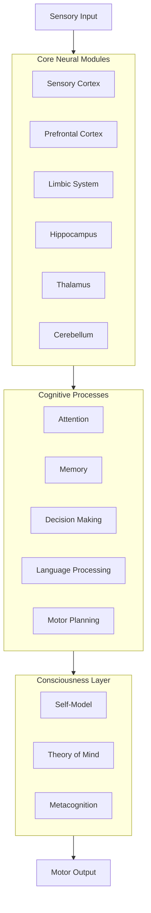

# 01 Architecture Overview

---
author: Knowledge Base Automation System
created_at: '2025-07-04'
description: Documentation on 01 Architecture Overview for ai/virtual_brain
title: 01 Architecture Overview
updated_at: '2025-07-04'
version: 1.0.0
---

# Virtual Brain Simulation System - Architecture Overview

**[Python Implementation →](03_python_implementation.md)**  
**[Cognitive Functions →](02_cognitive_functions.md)**  
**[Source Code (virtual_brain.py) →](../../../src/ai/virtual_brain.py)**

## 1. System Architecture

### 1.1 High-Level Components



### 1.2 Module Communication

```python
class VirtualBrain:
    def __init__(self):
        # Core modules
        self.modules = {
            'sensory': SensoryCortex(),
            'prefrontal': PrefrontalCortex(),
            'limbic': LimbicSystem(),
            'hippocampus': Hippocampus(),
            'thalamus': Thalamus(),
            'cerebellum': Cerebellum()
        }
        
        # Global workspace for inter-module communication
        self.workspace = {}
        
        # Initialize neural pathways
        self._initialize_pathways()
    :
    def _initialize_pathways(self):
        """Set up communication pathways between modules."""
        self.pathways = {
            # Sensory processing pathway
            ('sensory', 'thalamus'): 1.0,
            ('thalamus', 'sensory_cortex'): 1.0,
            
            # Emotional processing
            ('sensory_cortex', 'amygdala'): 0.8,
            ('amygdala', 'prefrontal'): 0.7,
            
            # Memory formation
            ('hippocampus', 'prefrontal'): 0.9,
            ('sensory_cortex', 'hippocampus'): 0.8,
            
            # Motor control
            ('prefrontal', 'motor_cortex'): 0.9,
            ('cerebellum', 'motor_cortex'): 1.0
        }
```

## 2. Neural Representation

### 2.1 Neuron Model

```python
import numpy as np

class LIFNeuron:
    """Leaky Integrate-and-Fire neuron model."""
    
    def __init__(self, threshold=1.0, tau=10.0, rest_potential=0.0):
        self.threshold = threshold  # Spiking threshold
        self.tau = tau  # Time constant
        self.rest_potential = rest_potential  # Resting potential
        self.membrane_potential = rest_potential
        self.spike_times = []
        self.refractory_period = 5  # ms
        self.refractory_until = 0
    
    def update(self, current_input, t):
        """Update neuron state."""
        if t < self.refractory_until:
            self.membrane_potential = self.rest_potential
            return 0
        
        # Update membrane potential
        dV = (current_input - (self.membrane_potential - self.rest_potential)) / self.tau
        self.membrane_potential += dV
        
        # Check for spike:
        if self.membrane_potential >= self.threshold:
            self.spike_times.append(t)
            self.membrane_potential = self.rest_potential
            self.refractory_until = t + self.refractory_period
            return 1  # Spike
        
        return 0  # No spike
```

### 2.2 Neural Population

```python
class NeuralPopulation:
    """Represents a population of neurons."""
    
    def __init__(self, size, neuron_type=LIFNeuron, **neuron_params):
        self.neurons = [neuron_type(**neuron_params) for _ in range(size)]
        self.size = size
        self.connections = None  # Will be set by Network class
    :
    def update(self, inputs, t):
        """Update all neurons in the population."""
        if inputs.ndim == 1:
            inputs = inputs.reshape(-1, 1)  # Ensure 2D
            
        spikes = np.zeros(self.size)
        for i, neuron in enumerate(self.neurons):
            spikes[i] = neuron.update(inputs[i], t)
        
        return spikes
    
    def get_activity(self):
        """Get current activity level of the population."""
        return np.array([n.membrane_potential for n in self.neurons]):
```

## 3. Brain Region Implementation

### 3.1 Base Brain Region

```python
class BrainRegion:
    """Base class for all brain regions."""
    :
    def __init__(self, name, neural_population):
        self.name = name
        self.population = neural_population
        self.connections = {}
        self.modulators = {}
    
    def connect(self, target_region, strength=1.0, modulator=None):
        """Connect this region to another region."""
        self.connections[target_region] = strength
        if modulator:
            self.modulators[target_region] = modulator
    
    def update(self, inputs, t):
        """Update the region's state."""'
        # Apply modulation from other regions
        modulated_input = self._apply_modulation(inputs)
        
        # Update neural population
        outputs = self.population.update(modulated_input, t)
        
        return outputs
    
    def _apply_modulation(self, inputs):
        """Apply neuromodulatory effects to inputs."""
        # In a real implementation, this would apply effects from
        # neuromodulators like dopamine, serotonin, etc.
        return inputs
```

### 3.2 Example: Prefrontal Cortex

```python
class PrefrontalCortex(BrainRegion):
    """Implements working memory and executive functions."""
    
    def __init__(self, size=1000):
        population = NeuralPopulation(size, LIFNeuron, threshold=1.0, tau=20.0)
        super().__init__('prefrontal_cortex', population)
        
        # Working memory buffers
        self.working_memory = np.zeros(size)
        self.memory_decay = 0.95
        
        # Decision making parameters
        self.decision_threshold = 0.7
    
    def update(self, inputs, t):
        """Update working memory and make decisions."""
        # Update working memory (leaky integrator)
        self.working_memory = (self.memory_decay * self.working_memory + 
                             (1 - self.memory_decay) * inputs)
        
        # Process inputs through neural population
        outputs = self.population.update(self.working_memory, t)
        
        # Make decisions based on population activity
        decision = self._make_decision(outputs)
        
        return {
            'activity': outputs,
            'working_memory': self.working_memory,
            'decision': decision
        }
    
    def _make_decision(self, neural_activity):
        """Make a decision based on population activity."""
        avg_activity = np.mean(neural_activity)
        return avg_activity > self.decision_threshold
```

## 4. Integration and Simulation

### 4.1 Brain Network

```python
class BrainNetwork:
    """Connects multiple brain regions into a functional network."""
    
    def __init__(self):
        self.regions = {}
        self.connectivity = {}
        self.time = 0
    
    def add_region(self, region):
        """Add a brain region to the network."""
        self.regions[region.name] = region
        self.connectivity[region.name] = {}
    
    def connect_regions(self, source_name, target_name, strength=1.0):
        """Connect two regions with given strength."""
        if source_name in self.regions and target_name in self.regions:
            self.connectivity[source_name][target_name] = strength
    
    def step(self, sensory_inputs=None):
        """Advance the simulation by one time step."""
        if sensory_inputs is None:
            sensory_inputs = {}
        
        # Update each region
        activities = {}
        for name, region in self.regions.items():
            # Get inputs from connected regions
            region_inputs = np.zeros(region.population.size)
            
            for source, connections in self.connectivity.items():
                if name in connections and source in activities:
                    strength = connections[name]
                    region_inputs += activities[source] * strength
            
            # Add any direct sensory inputs
            if name in sensory_inputs:
                region_inputs += sensory_inputs[name]
            
            # Update region
            activities[name] = region.update(region_inputs, self.time)
        
        self.time += 1
        return activities
```

## 5. Example Usage

```python
def run_brain_simulation():
    """Example of setting up and running a simple brain simulation."""
    # Create brain network
    brain = BrainNetwork()
    
    # Create brain regions
    visual_cortex = BrainRegion('visual_cortex', NeuralPopulation(1000, LIFNeuron))
    prefrontal = PrefrontalCortex(2000)
    motor_cortex = BrainRegion('motor_cortex', NeuralPopulation(500, LIFNeuron))
    
    # Add regions to network
    brain.add_region(visual_cortex)
    brain.add_region(prefrontal)
    brain.add_region(motor_cortex)
    
    # Connect regions
    brain.connect_regions('visual_cortex', 'prefrontal_cortex', 0.8)
    brain.connect_regions('prefrontal_cortex', 'motor_cortex', 0.9)
    
    # Run simulation
    for t in range(1000):  # 1000 time steps
        # Generate some sensory input
        visual_input = np.random.normal(0.1, 0.05, 1000)
        
        # Step the simulation
        activities = brain.step({
            'visual_cortex': visual_input
        })
        
        # Do something with the activities
        if t % 100 == 0:
            print(f"Time {t} - Prefrontal activity: {np.mean(activities['prefrontal_cortex']):.3f}")
```

## 6. Next Steps

1. **Implement more brain regions** (hippocampus, amygdala, etc.)
2. **Add learning mechanisms** (STDP, Hebbian learning)
3. **Implement attention mechanisms**
4. **Add emotional processing**
5. **Integrate with sensory and motor systems**
6. **Develop visualization tools** for monitoring brain activity

---
*Document version: 1.0*  
*Last updated: June 30, 2025*
