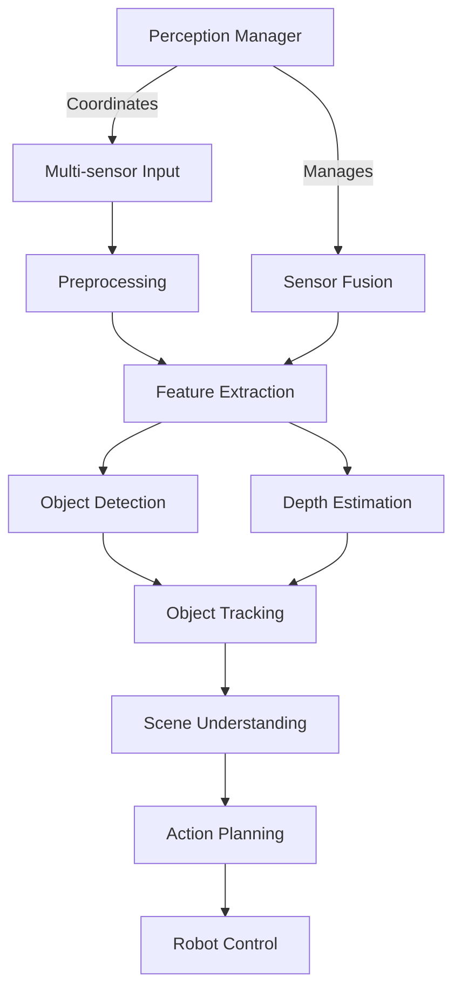

# Readme

---
author: Knowledge Base Automation System
created_at: '2025-07-06'
description: Comprehensive robotics perception and sensing systems documentation
title: Advanced Robotic Perception System
updated_at: '2025-07-06'
version: 2.0.0
---

# Advanced Robotic Perception System

This document provides comprehensive coverage of robotic perception and sensing systems, including computer vision, sensor fusion, environmental understanding, and intelligent decision-making based on sensory input for advanced robotic platforms.

## System Architecture



## Core Perception Modalities

### Visual Perception

- **Computer Vision**: Object detection, recognition, and tracking
- **Depth Perception**: Stereo vision, structured light, time-of-flight
- **Visual SLAM**: Simultaneous localization and mapping
- **Scene Understanding**: Semantic segmentation and spatial reasoning

### Spatial Perception

- **LiDAR Systems**: 3D point cloud processing and analysis
- **Ultrasonic Sensing**: Proximity detection and collision avoidance
- **Radar Systems**: Long-range detection and velocity measurement
- **Spatial Mapping**: Environmental reconstruction and navigation

### Tactile and Force Perception

- **Force/Torque Sensors**: Contact force measurement and control
- **Tactile Arrays**: Surface texture and material identification
- **Proprioception**: Joint position and movement sensing
- **Haptic Feedback**: Touch-based interaction systems

### Audio Perception

- **Sound Localization**: Direction and distance estimation
- **Speech Recognition**: Natural language processing
- **Environmental Audio**: Sound classification and analysis
- **Acoustic Sensing**: Ultrasonic ranging and communication

## Advanced Perception Technologies

### Multi-Modal Sensor Fusion

- **Kalman Filtering**: State estimation with uncertainty
- **Particle Filters**: Non-linear state estimation
- **Bayesian Networks**: Probabilistic reasoning
- **Deep Learning Fusion**: Neural network-based integration

### Machine Learning for Perception

- **Convolutional Neural Networks**: Image and pattern recognition
- **Recurrent Neural Networks**: Temporal sequence processing
- **Transformer Networks**: Attention-based perception
- **Reinforcement Learning**: Adaptive perception strategies

### Real-Time Processing

- **Edge Computing**: On-device inference and processing
- **GPU Acceleration**: Parallel processing for computer vision
- **FPGA Implementation**: Hardware-accelerated algorithms
- **Distributed Processing**: Multi-node computation systems

## Implementation Framework

### Sensor Management System

```python
class PerceptionManager:
    def __init__(self):
        self.sensors = {}
        self.fusion_engine = SensorFusion()
        self.processing_pipeline = ProcessingPipeline()
        self.world_model = WorldModel()
    
    def register_sensor(self, sensor_id, sensor_config):
        """Register a new sensor with the perception system"""
        sensor = self.create_sensor(sensor_config)
        self.sensors[sensor_id] = sensor
        return sensor
    
    def process_sensor_data(self, sensor_id, raw_data):
        """Process raw sensor data through the perception pipeline"""
        processed_data = self.processing_pipeline.process(
            sensor_id, raw_data
        )
        fused_data = self.fusion_engine.integrate(
            sensor_id, processed_data
        )
        self.world_model.update(fused_data)
        return fused_data
    
    def get_world_state(self):
        """Get current understanding of the world"""
        return self.world_model.get_current_state()
```

### Computer Vision Pipeline

```python
class VisionProcessor:
    def __init__(self, model_config):
        self.detector = ObjectDetector(model_config)
        self.tracker = ObjectTracker()
        self.depth_estimator = DepthEstimator()
        self.scene_analyzer = SceneAnalyzer()
    
    def process_frame(self, image_frame):
        """Process a single camera frame"""
        # Object detection
        detections = self.detector.detect(image_frame)
        
        # Object tracking
        tracked_objects = self.tracker.update(detections)
        
        # Depth estimation
        depth_map = self.depth_estimator.estimate(image_frame)
        
        # Scene analysis
        scene_info = self.scene_analyzer.analyze(
            image_frame, detections, depth_map
        )
        
        return {
            'objects': tracked_objects,
            'depth': depth_map,
            'scene': scene_info,
            'timestamp': time.time()
        }
```

### LiDAR Processing System

```python
class LiDARProcessor:
    def __init__(self):
        self.point_cloud_filter = PointCloudFilter()
        self.segmentation = SemanticSegmentation()
        self.object_extractor = ObjectExtractor()
        self.slam_system = LiDARSLAM()
    
    def process_scan(self, point_cloud):
        """Process LiDAR point cloud data"""
        # Filter and clean point cloud
        filtered_cloud = self.point_cloud_filter.filter(point_cloud)
        
        # Semantic segmentation
        segmented_cloud = self.segmentation.segment(filtered_cloud)
        
        # Extract objects
        objects = self.object_extractor.extract(segmented_cloud)
        
        # Update SLAM
        pose_update = self.slam_system.update(filtered_cloud)
        
        return {
            'objects': objects,
            'pose': pose_update,
            'map_update': self.slam_system.get_map_update(),
            'timestamp': time.time()
        }
```

## Perception Applications

### Autonomous Navigation
- **Obstacle Detection**: Static and dynamic obstacle identification
- **Path Planning**: Safe trajectory generation
- **Localization**: Precise position estimation
- **Mapping**: Environmental map construction

### Human-Robot Interaction
- **Gesture Recognition**: Hand and body gesture interpretation
- **Facial Expression**: Emotion and intention recognition
- **Gaze Tracking**: Attention and focus detection
- **Social Cues**: Non-verbal communication understanding

### Manipulation Tasks
- **Object Recognition**: Target identification and classification
- **Pose Estimation**: 6D object pose determination
- **Grasp Planning**: Optimal grip point calculation
- **Force Control**: Contact-based manipulation

### Surveillance and Security
- **Person Detection**: Human presence identification
- **Activity Recognition**: Behavior analysis and classification
- **Anomaly Detection**: Unusual event identification
- **Perimeter Monitoring**: Boundary security systems

## Quality Assurance

### Accuracy Metrics
- **Detection Accuracy**: True/false positive rates
- **Localization Precision**: Position estimation errors
- **Classification Performance**: Category recognition rates
- **Temporal Consistency**: Frame-to-frame stability

### Testing Protocols
- **Synthetic Data Testing**: Simulation-based validation
- **Real-World Scenarios**: Diverse environment testing
- **Stress Testing**: High-load and edge case evaluation
- **Long-Term Reliability**: Extended operation validation

### Calibration Procedures
- **Camera Calibration**: Intrinsic and extrinsic parameters
- **Multi-Sensor Calibration**: Cross-sensor alignment
- **Temporal Synchronization**: Precise timing across sensors
- **Performance Validation**: Regular accuracy verification

## Future Directions

### Emerging Technologies
- **Neuromorphic Vision**: Event-based sensing and processing
- **Quantum Sensing**: Enhanced measurement precision
- **Bio-inspired Perception**: Biomimetic sensor systems
- **Edge AI**: On-device intelligence and learning

### Research Frontiers
- **Self-supervised Learning**: Reducing annotation requirements
- **Continual Learning**: Lifelong adaptation to new environments
- **Explainable AI**: Interpretable perception systems
- **Multimodal Foundation Models**: Unified perception architectures
- **Embodied AI**: Perception-action integration

## Cross-references

- [Robotics Control Systems](../control/README.md)
- [Robotics Navigation](../navigation/README.md)
- [Robotics AI](../ai/README.md)
- [Depth Estimation](./depth_estimation.md)
- [Sensor Fusion](./sensor_fusion.md)

## Next Steps
- Integrate semantic segmentation and 3D scene understanding
- Add performance metrics and benchmarks
- Expand sensor fusion to include radar, GPS, and additional modalities
- Provide troubleshooting and debugging guides

---
_Last updated: 2025-07-06_

*Version: 2.0.0*