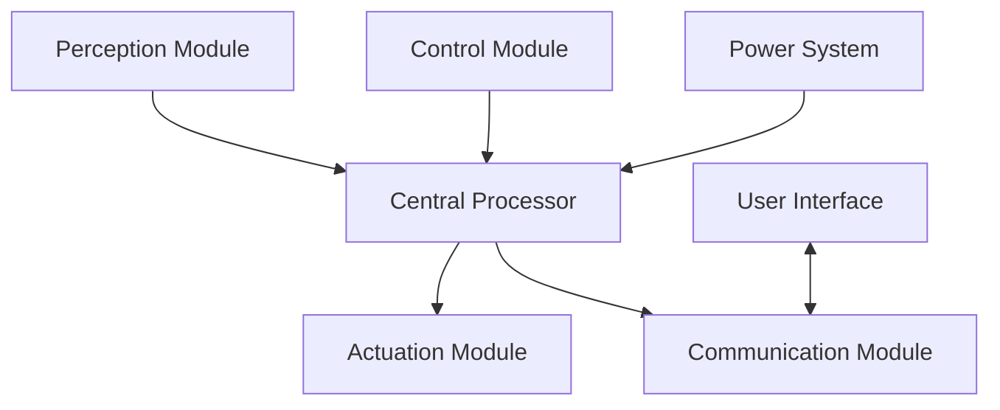

# Architecture

---
author: Knowledge Base Automation System
created_at: '2025-07-04'
description: Documentation on Architecture for robotics/architecture.md
title: Architecture
updated_at: '2025-07-04'
version: 1.0.0
---

# Robotic System Architecture

This document outlines the high-level architecture of the advanced robotic system, designed for comprehensive environmental interaction and complex task execution.

## System Overview

## Core Components

### 1. Perception System
- **Visual Sensors**: Multi-spectral cameras, depth sensors
- **Environmental Sensors**: Temperature, humidity, gas sensors
- **Tactile Sensors**: Force-sensitive resistors, pressure sensors
- **Audio Sensors**: Microphone arrays for sound localization

### 2. Processing Unit
- **Main Controller**: High-performance computing unit
- **Co-processors**: Dedicated units for vision, audio, and motor control
- **Neural Processing Unit (NPU)**: For AI/ML acceleration

### 3. Actuation System
- **Servo Motors**: For precise joint control
- **Linear Actuators**: For extension/retraction movements
- **Grippers**: For object manipulation
- **Mobility System**: Wheels, tracks, or legs for movement

### 4. Power Management
- **Battery System**: High-capacity lithium-ion batteries
- **Power Distribution**: Regulated power delivery to all components
- **Energy Harvesting**: Solar panels, kinetic energy recovery

### 5. Communication System
- **Wireless**: Wi-Fi, Bluetooth, 5G
- **Wired**: Ethernet, USB, CAN bus
- **Inter-Component Communication**: I2C, SPI, UART

## Software Architecture

### 1. Operating System
- Real-time OS for critical control systems
- Linux-based OS for high-level processing

### 2. Middleware
- Robot Operating System (ROS) for component communication
- Device drivers for hardware abstraction

### 3. Application Layer
- Task planning and execution
- Sensor fusion and perception processing
- Motion planning and control
- Human-robot interaction

## Data Flow

1. **Perception Layer**: Raw sensor data collection
2. **Processing Layer**: Data fusion and interpretation
3. **Decision Layer**: Task planning and decision making
4. **Action Layer**: Motor control and actuation
5. **Feedback Loop**: Continuous monitoring and adjustment

## System Specifications

| Component | Specification |
|-----------|---------------|
| Processing | 8-core CPU, 16GB RAM |
| Storage | 1TB SSD + 8TB HDD |
| Vision | 4K @ 60fps, IR-capable |
| Battery Life | 8-12 hours (standard operation) |
| Weight | ~50kg |
| Operating Temp | -10°C to 50°C |
| IP Rating | IP65 (dust tight, water resistant) |

## Integration Points

1. **Hardware Interfaces**
   - Standardized connectors for sensors and actuators
   - Hot-swappable component support

2. **Software APIs**
   - REST API for high-level control
   - ROS packages for robotic functions
   - SDK for custom application development

3. **Cloud Services**
   - Remote monitoring and control
   - Data analytics and machine learning
   - Firmware updates and maintenance

## Safety Systems

1. **Emergency Stop**: Hardware-level kill switch
2. **Collision Avoidance**: LIDAR and proximity sensors
3. **Thermal Management**: Active cooling and temperature monitoring
4. **Power Protection**: Overcurrent and overvoltage protection
5. **Redundancy**: Critical system redundancy for fail-safe operation

## Development and Testing

1. **Simulation Environment**:
   - Gazebo for physics simulation
   - RViz for visualization
   - Custom test scenarios

2. **Hardware-in-the-Loop Testing**:
   - Component-level validation
   - System integration testing
   - Field testing protocols

## Deployment

1. **Installation**:
   - Site assessment
   - Hardware setup
   - System calibration

2. **Commissioning**:
   - Functional testing
   - Performance validation
   - User training

## Maintenance

1. **Preventive Maintenance**:
   - Regular system checks
   - Component calibration
   - Software updates

2. **Diagnostics**:
   - Onboard diagnostic tools
   - Remote monitoring
   - Predictive maintenance

## Future Upgrades

1. **Modular Design**: Easy component upgrades
2. **AI/ML Capabilities**: Continuous learning and adaptation
3. **Expanded Sensor Suite**: Additional environmental sensors
4. **Enhanced Mobility**: Advanced locomotion systems
5. **Extended Battery Life**: Next-generation power solutions

## Compliance and Standards

- **Safety**: ISO 10218, ISO/TS 15066
- **EMC**: EN 61000-6-2, EN 61000-6-4
- **Wireless**: FCC, CE, RED
- **Environmental**: RoHS, REACH

## Support and Resources

- Technical documentation
- Developer forums
- Training materials
- Support ticketing system

## License

This documentation and associated software are licensed under the MIT License.
