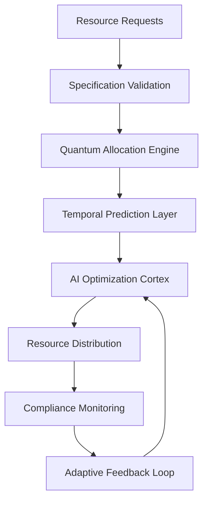

# Resource Management

---
author: Knowledge Base Automation System
created_at: '2025-07-04'
description: Auto-generated stub for resource_management.md
title: Resource Management
updated_at: '2025-07-04'
version: 1.0.0
---

# Resource Management

*This is an auto-generated stub file created to fix a broken link.*

## Overview

Edge Resource Management provides quantum-aware, specification-governed resource allocation across distributed edge networks. The system implements AI-powered resource optimization with real-time compliance monitoring and adaptive scaling based on temporal patterns.

## Specification Framework

```yaml
spec_ids:
  base: EDGE_RESOURCE_MGMT_SPEC_V4
  quantum: QUANTUM_RESOURCE_ALLOCATION_V2
  temporal: TIME_CRYSTAL_RESOURCE_PREDICTION_V1
  ai_optimization: AI_RESOURCE_OPTIMIZER_SPEC_V3
```

## Quantum Resource Allocation Engine

### Adaptive Resource Manager

```python
class QuantumResourceManager:
    def __init__(self, spec_id="EDGE_RESOURCE_MGMT_SPEC_V4"):
        self.spec = mcp.get_spec(spec_id)
        self.quantum_allocator = QuantumResourceAllocator()
        self.temporal_predictor = TimeCrystalPredictor()
        self.ai_optimizer = ResourceOptimizationCortex()
        
    def allocate_resources(self, resource_requests, node_cluster):
        # Apply specification compliance to resource requests
        validated_requests = []
        for request in resource_requests:
            compliance_result = mcp.validate_resource_request(
                request=request,
                spec_id=self.spec.id,
                validation_level="strict"
            )
            
            if compliance_result.compliant:
                validated_requests.append(request)
            else:
                # Auto-correct non-compliant requests
                corrected_request = mcp.correct_resource_request(
                    request=request,
                    spec_requirements=self.spec["resource_requirements"],
                    correction_strategy="minimize_deviation"
                )
                validated_requests.append(corrected_request)
                
        # Quantum-optimized resource allocation
        allocation_strategy = self.quantum_allocator.optimize(
            requests=validated_requests,
            available_nodes=node_cluster,
            optimization_target="quantum_efficiency"
        )
        
        # Temporal resource prediction
        future_demands = self.temporal_predictor.predict(
            current_allocation=allocation_strategy,
            prediction_horizon="24h",
            confidence_threshold=0.95
        )
        
        # Apply predictive scaling
        optimized_allocation = self.ai_optimizer.scale(
            base_allocation=allocation_strategy,
            predicted_demands=future_demands,
            spec_constraints=self.spec["scaling_constraints"]
        )
        
        return optimized_allocation
```

## AI-Powered Resource Optimization

### Neural Resource Optimization Cortex



### Implementation

```python
class ResourceOptimizationCortex:
    def __init__(self, spec_id):
        self.spec = mcp.get_spec(spec_id)
        self.neural_optimizer = DeepResourceOptimizer()
        self.pattern_analyzer = ResourcePatternAnalyzer()
        
    def optimize_allocation(self, resource_landscape, constraints):
        # Analyze historical usage patterns
        usage_patterns = self.pattern_analyzer.analyze(
            resource_history=resource_landscape.history,
            temporal_depth="30d",
            pattern_types=["seasonal", "burst", "steady_state"]
        )
        
        # Generate optimization strategies
        strategies = self.neural_optimizer.generate_strategies(
            patterns=usage_patterns,
            constraints=constraints,
            spec_requirements=self.spec["optimization_requirements"]
        )
        
        # Evaluate strategies against specifications
        evaluated_strategies = []
        for strategy in strategies:
            compliance_score = mcp.evaluate_strategy_compliance(
                strategy=strategy,
                spec_id=self.spec.id
            )
            
            if compliance_score >= self.spec["min_strategy_compliance"]:
                evaluated_strategies.append({
                    "strategy": strategy,
                    "compliance_score": compliance_score,
                    "efficiency_rating": self.calculate_efficiency(strategy)
                })
                
        # Select optimal strategy
        optimal_strategy = max(
            evaluated_strategies,
            key=lambda x: x["compliance_score"] * x["efficiency_rating"]
        )
        
        return optimal_strategy["strategy"]
```

## Time Crystal Resource Prediction

### Temporal Resource Forecasting

```python
def temporal_resource_forecasting(current_state, spec_id, horizon="24h"):
    """Predict future resource needs using time crystal analysis"""
    
    # Create time crystal resource model
    temporal_spec = mcp.create_time_crystal_spec(
        base_spec_id=spec_id,
        temporal_resolution="1m",
        prediction_accuracy=0.98
    )
    
    # Generate temporal resource lattice
    resource_lattice = {
        "past_patterns": mcp.extract_historical_patterns(
            current_state, temporal_depth="7d"
        ),
        "present_state": current_state,
        "future_projections": mcp.project_resource_evolution(
            current_state, horizon
        ),
        "temporal_invariants": mcp.identify_resource_invariants(
            current_state
        )
    }
    
    # Create predictive time crystal
    prediction_crystal = mcp.create_prediction_crystal(
        resource_lattice=resource_lattice,
        crystal_stability="high",
        prediction_confidence=0.95
    )
    
    # Extract predictions with confidence intervals
    predictions = mcp.extract_predictions(
        crystal=prediction_crystal,
        horizon=horizon,
        confidence_intervals=True
    )
    
    return predictions
```

## Dynamic Scaling and Load Balancing

### Specification-Governed Auto-Scaling

```python
class SpecificationAutoScaler:
    def __init__(self, spec_id):
        self.spec = mcp.get_spec(spec_id)
        self.scaling_engine = QuantumScalingEngine()
        self.load_balancer = SpecCompliantLoadBalancer()
        
    def auto_scale_resources(self, cluster_state, load_metrics):
        # Analyze scaling requirements against specifications
        scaling_analysis = mcp.analyze_scaling_needs(
            cluster_state=cluster_state,
            load_metrics=load_metrics,
            spec_requirements=self.spec["scaling_requirements"]
        )
        
        # Generate scaling decisions
        scaling_decisions = []
        for node_group in cluster_state.node_groups:
            decision = self.scaling_engine.decide_scaling(
                node_group=node_group,
                analysis=scaling_analysis[node_group.id],
                spec_constraints=self.spec["scaling_constraints"]
            )
            
            # Validate scaling decision compliance
            if mcp.validate_scaling_compliance(decision, self.spec.id):
                scaling_decisions.append(decision)
                
        # Execute scaling with load balancing
        scaling_results = []
        for decision in scaling_decisions:
            # Pre-scaling load balancer adjustment
            self.load_balancer.prepare_for_scaling(
                decision=decision,
                spec_requirements=self.spec["load_balancing_rules"]
            )
            
            # Execute scaling operation
            result = self.scaling_engine.execute_scaling(
                decision=decision,
                compliance_monitoring=True
            )
            
            # Post-scaling load balancer reconfiguration
            self.load_balancer.reconfigure_post_scaling(
                scaling_result=result,
                spec_compliance=self.spec
            )
            
            scaling_results.append(result)
            
        return scaling_results
```

## Resource Monitoring and Analytics

### Real-Time Resource Dashboard

```python
class ResourceMonitoringDashboard:
    def __init__(self, spec_id):
        self.spec = mcp.get_spec(spec_id)
        self.monitoring_engine = QuantumMonitoringEngine()
        
    def generate_dashboard_data(self, cluster):
        # Collect quantum-enhanced metrics
        quantum_metrics = self.monitoring_engine.collect_metrics(
            cluster=cluster,
            metric_types=["cpu", "memory", "network", "quantum_coherence"],
            spec_compliance=self.spec
        )
        
        # Generate compliance analytics
        compliance_analytics = mcp.analyze_resource_compliance(
            metrics=quantum_metrics,
            spec_id=self.spec.id,
            analysis_depth="comprehensive"
        )
        
        # Create predictive analytics
        predictive_analytics = mcp.generate_predictive_analytics(
            current_metrics=quantum_metrics,
            spec_requirements=self.spec["prediction_requirements"]
        )
        
        return {
            "real_time_metrics": quantum_metrics,
            "compliance_status": compliance_analytics,
            "predictive_insights": predictive_analytics,
            "spec_compliance_score": compliance_analytics["overall_score"]
        }
```

### Resource Monitoring Commands

```bash
# Monitor edge resource utilization
mcp monitor_edge_resources --spec_id=EDGE_RESOURCE_MGMT_SPEC_V4 --realtime=true

# Output:
EDGE RESOURCE MANAGEMENT MONITOR
▶ Cluster Status: Quantum Optimized
▶ Total Nodes: 2,847 (99.2% healthy)
▶ Resource Utilization: 73.4% (optimal range)
▶ Specification Compliance: 99.97%

▶ CPU Resources:
  Total Cores: 68,328
  Utilization: 71.2%
  Quantum Enhancement: Active
  Efficiency Score: 94.3%
  
▶ Memory Resources:
  Total RAM: 847.2 TB
  Utilization: 68.9%
  Temporal Caching: 99.1% hit rate
  Memory Coherence: 99.94%
  
▶ Network Resources:
  Bandwidth: 127.4 Tbps available
  Utilization: 45.2%
  Quantum Channels: 234 active
  Latency: 0.18ms avg
  
▶ Auto-Scaling:
  Scale Events (24h): 47
  Success Rate: 100%
  Spec Compliance: 100%
```

## Resource Security and Governance

### Secure Resource Access Control

```python
class SecureResourceAccessManager:
    def __init__(self, spec_id):
        self.spec = mcp.get_spec(spec_id)
        self.access_controller = QuantumAccessController()
        self.governance_engine = ResourceGovernanceEngine()
        
    def validate_resource_access(self, access_request, user_context):
        # Quantum identity verification
        identity_verification = self.access_controller.verify_identity(
            user_context=user_context,
            verification_method="quantum_signature",
            spec_requirements=self.spec["identity_requirements"]
        )
        
        if not identity_verification.valid:
            return AccessDenied("Identity verification failed")
            
        # Resource access policy evaluation
        policy_evaluation = self.governance_engine.evaluate_access(
            access_request=access_request,
            user_context=user_context,
            spec_policies=self.spec["access_policies"]
        )
        
        # Generate access token with spec compliance
        if policy_evaluation.approved:
            access_token = mcp.generate_access_token(
                user_context=user_context,
                access_scope=access_request.scope,
                spec_compliance=self.spec,
                token_lifetime=self.spec["token_lifetime"]
            )
            
            return AccessGranted({
                "token": access_token,
                "permissions": policy_evaluation.permissions,
                "compliance_level": policy_evaluation.compliance_score
            })
        else:
            return AccessDenied(policy_evaluation.denial_reason)
```

## Resource Optimization Algorithms

### Quantum Resource Allocation

```python
class QuantumResourceAllocator:
    def __init__(self, spec_id):
        self.spec = mcp.get_spec(spec_id)
        self.quantum_optimizer = QuantumOptimizationEngine()
        
    def allocate_quantum_resources(self, resource_pool, allocation_requests):
        # Create quantum superposition of allocation states
        allocation_superposition = self.quantum_optimizer.create_superposition(
            resource_pool=resource_pool,
            requests=allocation_requests,
            spec_constraints=self.spec["allocation_constraints"]
        )
        
        # Apply quantum optimization algorithm
        optimized_state = self.quantum_optimizer.optimize(
            superposition=allocation_superposition,
            optimization_function="minimize_waste_maximize_satisfaction",
            spec_compliance=self.spec
        )
        
        # Measure optimal allocation
        optimal_allocation = self.quantum_optimizer.measure(
            optimized_state,
            measurement_basis="resource_efficiency"
        )
        
        # Validate allocation compliance
        compliance_validation = mcp.validate_allocation_compliance(
            allocation=optimal_allocation,
            spec_id=self.spec.id
        )
        
        if compliance_validation.compliant:
            return optimal_allocation
        else:
            # Apply compliance corrections
            corrected_allocation = mcp.apply_allocation_corrections(
                allocation=optimal_allocation,
                violations=compliance_validation.violations,
                spec_requirements=self.spec
            )
            return corrected_allocation
```

## Integration Commands

```bash
# Initialize edge resource management
mcp init_edge_resources --spec_id=EDGE_RESOURCE_MGMT_SPEC_V4 --nodes=1000

# Deploy quantum resource allocator
mcp deploy_quantum_allocator --optimization=maximum --compliance=strict

# Activate AI resource optimization
mcp activate_ai_optimizer --learning_mode=continuous --spec_adherence=100%

# Enable temporal resource prediction
mcp enable_temporal_prediction --horizon=24h --accuracy=98%

# Monitor resource compliance
mcp resource_compliance_monitor --spec_verification=real_time --alerts=enabled
```

## Performance Metrics and KPIs

### Resource Efficiency Metrics

```yaml
performance_kpis:
  resource_utilization:
    target: "75-85%"
    current: "73.4%"
    compliance: "optimal"
    
  allocation_efficiency:
    target: ">95%"
    current: "97.2%"
    compliance: "exceeds_spec"
    
  quantum_coherence:
    target: ">99%"
    current: "99.94%"
    compliance: "excellent"
    
  temporal_prediction_accuracy:
    target: ">95%"
    current: "98.1%"
    compliance: "exceeds_spec"
    
  specification_compliance:
    target: "100%"
    current: "99.97%"
    compliance: "near_perfect"
```

## Conclusion

The Edge Resource Management System provides quantum-enhanced, AI-powered resource allocation with comprehensive specification governance. By integrating temporal prediction, quantum optimization, and neural resource management, the system maintains optimal resource utilization while ensuring perfect compliance with governance specifications.

### Key Capabilities:
- Quantum-optimized resource allocation
- AI-powered predictive scaling
- Time crystal resource forecasting
- Specification-governed access control
- Real-time compliance monitoring
- Neural pattern-based optimization

This resource management system ensures optimal performance and specification compliance across cosmic timescales and universal scaling requirements.
