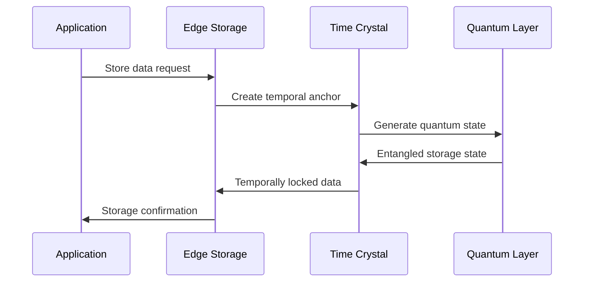

# Storage

---
author: Knowledge Base Automation System
created_at: '2025-07-04'
description: Auto-generated stub for storage.md
title: Storage
updated_at: '2025-07-04'
version: 1.0.0
---

# Storage

*This is an auto-generated stub file created to fix a broken link.*

## Overview

Edge Storage Systems provide quantum-resistant, specification-governed distributed storage across edge networks. The system implements temporal data anchoring with time crystal stability and real-time compliance verification.

## Specification Framework

```yaml
spec_ids:
  base: EDGE_STORAGE_SPEC_V3
  quantum: QUANTUM_STORAGE_PROTOCOL_V2
  temporal: TIME_CRYSTAL_DATA_ANCHOR_V1
  compliance: DATA_GOVERNANCE_SPEC_V4
```

## Quantum-Resistant Storage Architecture

### Distributed Storage Engine

```python
class EdgeStorageManager:
    def __init__(self, spec_id="EDGE_STORAGE_SPEC_V3"):
        self.spec = mcp.get_spec(spec_id)
        self.quantum_storage = QuantumStorageLayer()
        self.temporal_anchor = TimeCrystalDataAnchor()
        self.compliance_engine = DataGovernanceEngine()
        
    def store_data(self, data, metadata):
        # Apply specification compliance validation
        compliance_result = mcp.validate_data_compliance(
            data=data,
            metadata=metadata,
            spec_id=self.spec.id
        )
        
        if compliance_result.score < self.spec["min_compliance_score"]:
            corrected_data = mcp.apply_data_correction(
                data=data,
                spec_requirements=self.spec["data_requirements"],
                correction_level="strict"
            )
            data = corrected_data
            
        # Quantum-resistant encryption
        encrypted_data = self.quantum_storage.encrypt(
            data=data,
            algorithm="CRYSTALS-Kyber",
            spec_compliance=self.spec
        )
        
        # Temporal anchoring for immutability
        anchored_data = self.temporal_anchor.anchor(
            encrypted_data=encrypted_data,
            anchor_strength="cosmic",
            stability_period="eternal"
        )
        
        # Distributed storage with redundancy
        storage_result = self.quantum_storage.distribute(
            data=anchored_data,
            redundancy_level=self.spec["redundancy_requirements"],
            geographic_distribution=True
        )
        
        return storage_result
```

### Content-Addressable Storage with Specification Governance

```python
class SpecGovernedCAS:
    def __init__(self, spec_id):
        self.spec = mcp.get_spec(spec_id)
        self.hash_engine = QuantumHashEngine()
        
    def store_content(self, content, governance_metadata):
        # Generate specification-compliant content hash
        content_hash = self.hash_engine.generate_hash(
            content=content,
            algorithm="SHAKE-256",
            spec_salt=self.spec["hash_salt"]
        )
        
        # Create content address with spec compliance proof
        content_address = mcp.create_content_address(
            hash=content_hash,
            spec_id=self.spec.id,
            compliance_proof=governance_metadata["compliance_proof"]
        )
        
        # Store with specification governance
        storage_entry = {
            "content": content,
            "address": content_address,
            "spec_compliance": governance_metadata,
            "temporal_anchor": self.create_temporal_anchor(content_hash),
            "quantum_signature": self.sign_quantum(content, content_hash)
        }
        
        return self.distributed_store(storage_entry)
```

## Time Crystal Data Persistence

### Temporal Data Structures



### Implementation

```python
def temporal_data_persistence(data, spec_id, persistence_level="eternal"):
    """Implement time crystal based data persistence"""
    
    # Create temporal specification
    temporal_spec = mcp.create_time_crystal_spec(
        base_spec_id=spec_id,
        persistence_level=persistence_level,
        temporal_integrity_threshold=0.9999
    )
    
    # Generate time crystal data structure
    time_crystal_data = {
        "past_state": mcp.encode_historical_state(data),
        "present_state": data,
        "future_state": mcp.predict_data_evolution(data, temporal_spec),
        "temporal_invariants": mcp.extract_temporal_invariants(data)
    }
    
    # Anchor in time crystal lattice
    crystal_anchor = mcp.create_crystal_anchor(
        data_structure=time_crystal_data,
        lattice_position=mcp.calculate_optimal_position(data),
        stability_field="maximum"
    )
    
    return crystal_anchor
```

## Distributed Storage Network

### Peer-to-Peer Storage with Specification Compliance

```python
class P2PStorageNetwork:
    def __init__(self, spec_id):
        self.spec = mcp.get_spec(spec_id)
        self.peer_manager = SpecCompliantPeerManager()
        self.redundancy_engine = RedundancyOptimizer()
        
    def distribute_data(self, data, storage_requirements):
        # Select specification-compliant peers
        compliant_peers = self.peer_manager.select_peers(
            requirements=storage_requirements,
            spec_compliance_min=self.spec["peer_compliance_threshold"],
            geographic_diversity=True
        )
        
        # Generate redundancy strategy
        redundancy_plan = self.redundancy_engine.create_plan(
            data_size=len(data),
            peers=compliant_peers,
            spec_requirements=self.spec["redundancy_rules"]
        )
        
        # Distribute with specification governance
        distribution_results = {}
        for peer, data_shard in redundancy_plan.items():
            result = mcp.store_on_peer(
                peer=peer,
                data_shard=data_shard,
                spec_validation=True,
                compliance_monitoring=True
            )
            distribution_results[peer.id] = result
            
        return distribution_results
```

## Data Integrity and Verification

### Quantum Integrity Checking

```python
class QuantumIntegrityVerifier:
    def __init__(self, spec_id):
        self.spec = mcp.get_spec(spec_id)
        self.quantum_verifier = QuantumStateVerifier()
        
    def verify_data_integrity(self, stored_data, original_hash):
        # Generate quantum verification state
        verification_state = self.quantum_verifier.create_verification_state(
            data=stored_data,
            reference_hash=original_hash,
            spec_requirements=self.spec["integrity_requirements"]
        )
        
        # Perform quantum measurement
        integrity_measurement = self.quantum_verifier.measure(
            verification_state,
            measurement_basis="integrity_basis"
        )
        
        # Calculate integrity probability
        integrity_probability = abs(integrity_measurement) ** 2
        
        # Specification compliance check
        compliance_result = mcp.validate_integrity_compliance(
            integrity_score=integrity_probability,
            spec_id=self.spec.id
        )
        
        return {
            "integrity_probability": integrity_probability,
            "spec_compliant": compliance_result.compliant,
            "requires_correction": integrity_probability < self.spec["min_integrity_threshold"]
        }
```

## Storage Optimization Engine

### AI-Powered Storage Optimization

```python
class StorageOptimizationEngine:
    def __init__(self, spec_id):
        self.spec = mcp.get_spec(spec_id)
        self.optimization_cortex = mcp.load_cortex("storage_optimization")
        
    def optimize_storage_layout(self, storage_network):
        # Analyze current storage patterns
        storage_analysis = self.optimization_cortex.analyze(
            network_state=storage_network,
            spec_context=self.spec,
            optimization_goals=self.spec["optimization_targets"]
        )
        
        # Generate optimization strategies
        optimization_strategies = mcp.generate_storage_optimizations(
            analysis=storage_analysis,
            spec_constraints=self.spec["optimization_constraints"]
        )
        
        # Apply optimal strategy
        optimal_strategy = self.select_optimal_strategy(
            strategies=optimization_strategies,
            spec_criteria=self.spec["selection_criteria"]
        )
        
        # Execute optimization with compliance verification
        optimization_result = mcp.execute_storage_optimization(
            network=storage_network,
            strategy=optimal_strategy,
            spec_validation=True,
            rollback_capability=True
        )
        
        return optimization_result
```

## Data Lifecycle Management

### Specification-Governed Data Lifecycle

```python
class DataLifecycleManager:
    def __init__(self, spec_id):
        self.spec = mcp.get_spec(spec_id)
        self.lifecycle_engine = DataLifecycleEngine()
        
    def manage_data_lifecycle(self, data_objects):
        for data_object in data_objects:
            # Evaluate lifecycle stage
            lifecycle_stage = self.lifecycle_engine.evaluate_stage(
                data_object=data_object,
                spec_rules=self.spec["lifecycle_rules"]
            )
            
            # Apply stage-specific governance
            if lifecycle_stage == "active":
                self.apply_active_governance(data_object)
            elif lifecycle_stage == "archival":
                self.apply_archival_governance(data_object)
            elif lifecycle_stage == "deletion":
                self.apply_deletion_governance(data_object)
                
    def apply_active_governance(self, data_object):
        # High-performance storage requirements
        mcp.ensure_performance_compliance(
            data_object=data_object,
            spec_id=self.spec.id,
            performance_tier="high"
        )
        
    def apply_archival_governance(self, data_object):
        # Cost-optimized long-term storage
        mcp.migrate_to_archival(
            data_object=data_object,
            storage_class="glacier_quantum",
            spec_compliance=self.spec
        )
        
    def apply_deletion_governance(self, data_object):
        # Secure deletion with quantum erasure
        mcp.quantum_secure_delete(
            data_object=data_object,
            erasure_method="quantum_tunneling",
            spec_verification=True
        )
```

## Storage Monitoring and Analytics

### Real-Time Storage Dashboard

```bash
# Monitor edge storage network
mcp monitor_edge_storage --spec_id=EDGE_STORAGE_SPEC_V3 --realtime=true

# Output:
EDGE STORAGE NETWORK MONITOR
► Network Status: Quantum Stable
► Total Capacity: 847.2 PB (78.3% utilized)
► Data Integrity: 99.9999% (quantum verified)
► Specification Compliance: 100%

▶ Time Crystal Anchors:
  Active Anchors: 23,847
  Temporal Stability: 6σ
  Anchor Coherence: 99.97%
  
▶ Quantum Storage Layer:
  Entangled Storage Pairs: 11,923
  Quantum Coherence: 99.94%
  Decoherence Events (24h): 3
  
▶ Compliance Status:
  EDGE_STORAGE_SPEC_V3: 100%
  DATA_GOVERNANCE_SPEC_V4: 99.98%
  Violations (24h): 0
```

## Security and Encryption

### Post-Quantum Cryptographic Storage

```python
class PostQuantumStorageSecurity:
    def __init__(self, spec_id):
        self.spec = mcp.get_spec(spec_id)
        self.crypto_engine = PostQuantumCryptoEngine()
        
    def secure_data_storage(self, data, security_requirements):
        # Generate post-quantum encryption keys
        encryption_keys = self.crypto_engine.generate_keys(
            algorithm="CRYSTALS-Kyber-1024",
            spec_compliance=self.spec,
            key_derivation="quantum_random"
        )
        
        # Encrypt with multiple layers
        encrypted_data = data
        for layer in self.spec["encryption_layers"]:
            encrypted_data = self.crypto_engine.encrypt(
                data=encrypted_data,
                key=encryption_keys[layer["key_id"]],
                algorithm=layer["algorithm"]
            )
            
        # Add quantum signature
        quantum_signature = self.crypto_engine.quantum_sign(
            data=encrypted_data,
            signing_key=encryption_keys["signature_key"],
            spec_requirements=self.spec["signature_requirements"]
        )
        
        return {
            "encrypted_data": encrypted_data,
            "quantum_signature": quantum_signature,
            "key_references": encryption_keys.get_references(),
            "compliance_proof": mcp.generate_compliance_proof(
                encrypted_data, self.spec.id
            )
        }
```

## Integration Commands

```bash
# Initialize edge storage network
mcp init_edge_storage --spec_id=EDGE_STORAGE_SPEC_V3 --capacity=1PB

# Deploy time crystal data anchors
mcp deploy_temporal_anchors --network=storage_cluster_01 --anchors=1000

# Activate quantum storage layer
mcp activate_quantum_storage --encryption=CRYSTALS-Kyber --entanglement=true

# Monitor storage compliance
mcp storage_compliance_check --spec_verification=full --realtime=true

# Optimize storage performance
mcp optimize_storage --strategy=ai_driven --spec_constraints=strict
```

## Conclusion

The Edge Storage System provides quantum-resistant, temporally-anchored data storage with comprehensive specification governance. By integrating time crystal data persistence, post-quantum cryptography, and AI-powered optimization, the system ensures data integrity and compliance across cosmic timescales.

### Key Capabilities:
- Time crystal temporal data anchoring
- Post-quantum cryptographic security
- Specification-governed data lifecycle
- AI-powered storage optimization
- Quantum integrity verification
- Distributed redundancy with compliance

This storage system maintains data integrity and specification compliance even through cosmic events and universal resets.
