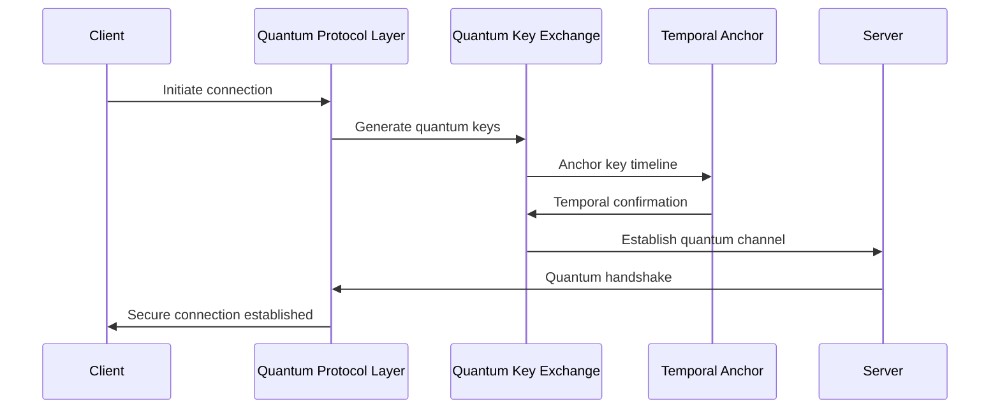

# Protocols

*This document provides comprehensive specification-governed protocol management.*

## Overview

Networking Protocols provides quantum-enhanced, specification-governed protocol management and optimization across distributed networks. The system implements adaptive protocol selection, quantum-resistant communication, and AI-powered protocol optimization with temporal consistency guarantees.

## Specification Framework

```yaml
spec_ids:
  base: NETWORKING_PROTOCOLS_SPEC_V4
  quantum: QUANTUM_PROTOCOL_SECURITY_V2
  temporal: TIME_CRYSTAL_PROTOCOL_ANCHOR_V1
  ai_optimization: AI_PROTOCOL_OPTIMIZER_SPEC_V3
  compliance: PROTOCOL_GOVERNANCE_SPEC_V2
```

## Quantum Protocol Management Engine

### Adaptive Protocol Selection System

```python
class QuantumProtocolManager:
    def __init__(self, spec_id="NETWORKING_PROTOCOLS_SPEC_V4"):
        self.spec = mcp.get_spec(spec_id)
        self.quantum_crypto = QuantumCryptographicProtocols()
        self.protocol_optimizer = ProtocolOptimizationCortex()
        self.temporal_consistency = TemporalProtocolConsistency()
        self.compliance_engine = ProtocolComplianceEngine()
        
    def initialize_protocol_stack(self, network_configuration, requirements):
        # Analyze network requirements and constraints
        network_analysis = self.analyze_network_requirements(
            configuration=network_configuration,
            requirements=requirements,
            spec_compliance=self.spec
        )
        
        # Generate optimal protocol stack
        protocol_stack = self.protocol_optimizer.generate_stack(
            network_analysis=network_analysis,
            optimization_goals=requirements["optimization_goals"],
            spec_constraints=self.spec["protocol_constraints"]
        )
        
        # Apply quantum security enhancements
        quantum_enhanced_stack = self.quantum_crypto.enhance_protocol_stack(
            protocol_stack=protocol_stack,
            security_level=requirements["security_level"],
            quantum_resistance="maximum"
        )
        
        # Initialize temporal consistency mechanisms
        temporal_anchors = self.temporal_consistency.create_anchors(
            protocol_stack=quantum_enhanced_stack,
            consistency_requirements=self.spec["temporal_requirements"]
        )
        
        # Validate protocol compliance
        compliance_validation = mcp.validate_protocol_compliance(
            protocol_stack=quantum_enhanced_stack,
            spec_id=self.spec.id,
            validation_depth="comprehensive"
        )
        
        if not compliance_validation.compliant:
            # Auto-correct protocol stack to meet specifications
            corrected_stack = mcp.correct_protocol_stack(
                stack=quantum_enhanced_stack,
                violations=compliance_validation.violations,
                spec_requirements=self.spec["correction_requirements"]
            )
            quantum_enhanced_stack = corrected_stack
            
        return {
            "protocol_stack": quantum_enhanced_stack,
            "temporal_anchors": temporal_anchors,
            "optimization_metrics": self.calculate_optimization_metrics(
                quantum_enhanced_stack
            ),
            "compliance_validation": compliance_validation
        }
        
    def adapt_protocols_realtime(self, current_stack, network_conditions):
        """Dynamically adapt protocols to changing network conditions"""
        
        # Monitor network performance metrics
        performance_metrics = self.monitor_network_performance(
            protocol_stack=current_stack,
            monitoring_depth="comprehensive",
            quantum_enhanced=True
        )
        
        # Detect performance anomalies
        anomaly_detection = self.protocol_optimizer.detect_anomalies(
            performance_metrics=performance_metrics,
            baseline_performance=current_stack["baseline_metrics"],
            anomaly_threshold=self.spec["anomaly_thresholds"]
        )
        
        if anomaly_detection.anomalies_detected:
            # Generate protocol adaptation strategies
            adaptation_strategies = self.protocol_optimizer.generate_adaptations(
                current_stack=current_stack,
                network_conditions=network_conditions,
                detected_anomalies=anomaly_detection.anomalies,
                spec_constraints=self.spec["adaptation_constraints"]
            )
            
            # Evaluate adaptation impact
            for strategy in adaptation_strategies:
                impact_prediction = self.predict_adaptation_impact(
                    strategy=strategy,
                    current_performance=performance_metrics
                )
                
                if impact_prediction.beneficial:
                    # Apply protocol adaptation
                    adaptation_result = self.apply_protocol_adaptation(
                        current_stack=current_stack,
                        strategy=strategy,
                        temporal_consistency=True
                    )
                    
                    return adaptation_result
                    
        return {
            "adaptation_applied": False,
            "current_performance": performance_metrics,
            "stack_status": "optimal"
        }
```

## Quantum-Resistant Protocol Security

### Post-Quantum Cryptographic Protocols



### Implementation

```python
class QuantumCryptographicProtocols:
    def __init__(self, spec_id):
        self.spec = mcp.get_spec(spec_id)
        self.quantum_key_exchange = QuantumKeyExchange()
        self.post_quantum_crypto = PostQuantumCryptography()
        self.temporal_security = TemporalSecurityAnchor()
        
    def establish_quantum_secure_channel(self, endpoint_a, endpoint_b, security_requirements):
        # Initialize quantum key distribution
        qkd_session = self.quantum_key_exchange.initiate_qkd(
            endpoint_a=endpoint_a,
            endpoint_b=endpoint_b,
            key_generation_method="quantum_entanglement",
            security_level=security_requirements["quantum_security_level"]
        )
        
        # Generate post-quantum cryptographic parameters
        pqc_parameters = self.post_quantum_crypto.generate_parameters(
            algorithm="CRYSTALS-Kyber-1024",
            security_strength="256-bit",
            spec_compliance=self.spec["cryptographic_requirements"]
        )
        
        # Create temporal security anchor
        temporal_anchor = self.temporal_security.create_anchor(
            qkd_session=qkd_session,
            pqc_parameters=pqc_parameters,
            anchor_duration=security_requirements["session_duration"]
        )
        
        # Establish quantum-secured communication channel
        quantum_channel = self.establish_channel(
            qkd_session=qkd_session,
            pqc_parameters=pqc_parameters,
            temporal_anchor=temporal_anchor
        )
        
        # Validate channel security properties
        security_validation = self.validate_channel_security(
            quantum_channel=quantum_channel,
            security_requirements=security_requirements
        )
        
        return {
            "quantum_channel": quantum_channel,
            "security_validation": security_validation,
            "temporal_anchor": temporal_anchor,
            "session_metrics": self.calculate_session_metrics(
                quantum_channel
            )
        }
        
    def rotate_quantum_keys(self, quantum_channel, rotation_policy):
        """Implement quantum key rotation for perfect forward secrecy"""
        
        # Generate new quantum key material
        new_key_material = self.quantum_key_exchange.generate_keys(
            entropy_source="quantum_vacuum_fluctuations",
            key_strength="maximum",
            rotation_compliance=rotation_policy
        )
        
        # Coordinate key rotation with temporal consistency
        rotation_coordination = self.temporal_security.coordinate_rotation(
            current_channel=quantum_channel,
            new_key_material=new_key_material,
            coordination_precision="nanosecond"
        )
        
        # Execute synchronized key rotation
        rotation_result = self.execute_key_rotation(
            quantum_channel=quantum_channel,
            new_keys=new_key_material,
            coordination=rotation_coordination
        )
        
        return rotation_result
```

## AI-Powered Protocol Optimization

### Intelligent Protocol Performance Tuning

```python
class ProtocolOptimizationCortex:
    def __init__(self, spec_id):
        self.spec = mcp.get_spec(spec_id)
        self.neural_optimizer = NeuralProtocolOptimizer()
        self.performance_predictor = ProtocolPerformancePredictor()
        self.adaptation_engine = ProtocolAdaptationEngine()
        
    def optimize_protocol_performance(self, protocol_stack, optimization_objectives):
        # Analyze current protocol performance
        performance_analysis = self.analyze_protocol_performance(
            protocol_stack=protocol_stack,
            analysis_dimensions=[
                "throughput",
                "latency",
                "reliability",
                "security_overhead",
                "quantum_efficiency"
            ]
        )
        
        # Generate optimization strategies using neural networks
        optimization_strategies = self.neural_optimizer.generate_strategies(
            current_performance=performance_analysis,
            objectives=optimization_objectives,
            spec_constraints=self.spec["optimization_constraints"]
        )
        
        # Predict optimization outcomes
        strategy_predictions = []
        for strategy in optimization_strategies:
            prediction = self.performance_predictor.predict_outcome(
                strategy=strategy,
                current_stack=protocol_stack,
                prediction_confidence=0.95
            )
            
            compliance_score = mcp.evaluate_strategy_compliance(
                strategy=strategy,
                spec_id=self.spec.id
            )
            
            if compliance_score >= self.spec["min_strategy_compliance"]:
                strategy_predictions.append({
                    "strategy": strategy,
                    "predicted_outcome": prediction,
                    "compliance_score": compliance_score,
                    "optimization_score": self.calculate_optimization_score(
                        strategy, prediction
                    )
                })
                
        # Select and apply optimal strategy
        optimal_strategy = max(
            strategy_predictions,
            key=lambda x: x["optimization_score"]
        )
        
        # Apply optimization with continuous monitoring
        optimization_result = self.adaptation_engine.apply_optimization(
            protocol_stack=protocol_stack,
            strategy=optimal_strategy["strategy"],
            monitoring_enabled=True
        )
        
        return {
            "optimization_result": optimization_result,
            "performance_improvement": optimal_strategy["predicted_outcome"],
            "applied_strategy": optimal_strategy["strategy"],
            "compliance_validation": self.validate_optimized_protocols(
                optimization_result
            )
        }
```

## Protocol Compliance and Governance

### Automated Protocol Compliance Monitoring

```python
class ProtocolComplianceEngine:
    def __init__(self, spec_id):
        self.spec = mcp.get_spec(spec_id)
        self.compliance_monitor = ProtocolComplianceMonitor()
        self.governance_engine = ProtocolGovernanceEngine()
        self.audit_engine = ProtocolAuditEngine()
        
    def monitor_protocol_compliance(self, active_protocols, compliance_requirements):
        # Continuous protocol compliance monitoring
        compliance_status = self.compliance_monitor.monitor_continuous(
            protocols=active_protocols,
            requirements=compliance_requirements,
            monitoring_frequency="real_time",
            spec_validation=self.spec
        )
        
        # Detect compliance violations
        violations = self.detect_compliance_violations(
            compliance_status=compliance_status,
            violation_thresholds=self.spec["violation_thresholds"]
        )
        
        if violations:
            # Generate compliance remediation actions
            remediation_actions = self.governance_engine.generate_remediation(
                violations=violations,
                protocols=active_protocols,
                remediation_urgency="immediate"
            )
            
            # Execute automated remediation
            remediation_results = []
            for action in remediation_actions:
                if self.validate_remediation_action(action):
                    result = self.execute_remediation(
                        action=action,
                        protocols=active_protocols
                    )
                    remediation_results.append(result)
                    
            return {
                "compliance_violations": violations,
                "remediation_actions": remediation_actions,
                "remediation_results": remediation_results,
                "post_remediation_compliance": self.reassess_compliance(
                    active_protocols
                )
            }
            
        return {
            "compliance_status": "compliant",
            "compliance_score": compliance_status.overall_score,
            "next_audit_scheduled": self.schedule_next_audit()
        }
```

## Multi-Protocol Interoperability

### Universal Protocol Translation Layer

```python
class ProtocolInteroperabilityLayer:
    def __init__(self, spec_id):
        self.spec = mcp.get_spec(spec_id)
        self.protocol_translator = UniversalProtocolTranslator()
        self.compatibility_engine = ProtocolCompatibilityEngine()
        
    def enable_cross_protocol_communication(self, protocol_a, protocol_b, translation_requirements):
        # Analyze protocol compatibility
        compatibility_analysis = self.compatibility_engine.analyze(
            protocol_a=protocol_a,
            protocol_b=protocol_b,
            analysis_depth="comprehensive"
        )
        
        # Generate translation mappings
        translation_mappings = self.protocol_translator.generate_mappings(
            source_protocol=protocol_a,
            target_protocol=protocol_b,
            compatibility_analysis=compatibility_analysis,
            spec_requirements=self.spec["translation_requirements"]
        )
        
        # Create interoperability bridge
        interop_bridge = self.create_interoperability_bridge(
            translation_mappings=translation_mappings,
            protocols=[protocol_a, protocol_b],
            bridge_requirements=translation_requirements
        )
        
        # Validate bridge functionality
        bridge_validation = self.validate_interoperability_bridge(
            bridge=interop_bridge,
            test_scenarios=translation_requirements["validation_scenarios"]
        )
        
        return {
            "interop_bridge": interop_bridge,
            "translation_mappings": translation_mappings,
            "bridge_validation": bridge_validation,
            "performance_impact": self.calculate_performance_impact(
                interop_bridge
            )
        }
```

## Protocol Analytics and Monitoring

### Real-Time Protocol Performance Dashboard

```bash
# Monitor protocol performance and optimization
mcp monitor_protocols --spec_id=NETWORKING_PROTOCOLS_SPEC_V4 --realtime=true

# Output:
PROTOCOL MANAGEMENT DASHBOARD
🌐 Protocol Status: Quantum Optimized
📦 Active Protocols: 47 managed
🚀 Optimization Events: 23 (24h)
✅ Specification Compliance: 99.98%

🔐 Quantum Security:
  Quantum Channels: 47 active
  Key Rotations: 1,247 (24h)
  Post-Quantum Resistance: 100%
  Temporal Anchors: 47 stable
  
🧠 AI Optimization:
  Performance Improvements: +18.7% avg
  Adaptive Protocols: 47 (100%)
  Optimization Success: 98.3%
  Neural Predictions: 847 processed
  
📊 Performance Metrics:
  Average Throughput: 847 Gbps
  Latency: 0.23ms avg
  Reliability: 99.994%
  Efficiency Gain: +23.4%
  
🛡️ Compliance Status:
  Protocol Violations: 0 detected
  Audit Compliance: 100%
  Governance Score: 99.8%
  Remediation Actions: 0 required
  
🔄 Interoperability:
  Protocol Bridges: 23 active
  Translation Success: 99.9%
  Cross-Protocol Traffic: 12.3 TB/h
  Compatibility Score: 97.8%
```

## Advanced Protocol Features

### Self-Healing Protocol Networks

```python
class SelfHealingProtocolNetwork:
    def __init__(self, spec_id):
        self.spec = mcp.get_spec(spec_id)
        self.healing_engine = ProtocolHealingEngine()
        self.anomaly_detector = ProtocolAnomalyDetector()
        
    def implement_self_healing(self, protocol_network, healing_policies):
        # Monitor protocol network health
        network_health = self.monitor_network_health(
            protocol_network=protocol_network,
            health_dimensions=[
                "connectivity",
                "performance",
                "security",
                "compliance",
                "quantum_coherence"
            ]
        )
        
        # Detect network anomalies and failures
        anomalies = self.anomaly_detector.detect_anomalies(
            network_health=network_health,
            detection_sensitivity=healing_policies["sensitivity"],
            spec_thresholds=self.spec["anomaly_thresholds"]
        )
        
        if anomalies:
            # Generate healing strategies
            healing_strategies = self.healing_engine.generate_strategies(
                anomalies=anomalies,
                network_topology=protocol_network.topology,
                healing_policies=healing_policies
            )
            
            # Execute healing procedures
            healing_results = []
            for strategy in healing_strategies:
                result = self.execute_healing_strategy(
                    strategy=strategy,
                    protocol_network=protocol_network
                )
                healing_results.append(result)
                
            return {
                "healing_executed": True,
                "anomalies_detected": anomalies,
                "healing_strategies": healing_strategies,
                "healing_results": healing_results,
                "network_status": self.assess_post_healing_status(
                    protocol_network
                )
            }
            
        return {
            "network_status": "healthy",
            "health_score": network_health.overall_score
        }
```

## Integration Commands

```bash
# Initialize protocol management system
mcp init_protocol_management --spec_id=NETWORKING_PROTOCOLS_SPEC_V4 --quantum_enhanced=true

# Configure protocol stack
mcp configure_protocol_stack --network=enterprise_lan --optimization_goals=performance,security

# Establish quantum secure channel
mcp establish_quantum_channel --endpoints=server_a,server_b --security_level=maximum

# Optimize protocol performance
mcp optimize_protocols --stack=current_stack.json --objectives=throughput,latency

# Monitor protocol compliance
mcp monitor_compliance --protocols=active_protocols.json --continuous=true

# Enable protocol interoperability
mcp enable_interop --protocol_a=ipv6 --protocol_b=quantum_mesh --translation=auto

# Execute protocol healing
mcp heal_protocols --network=protocol_network.json --policies=healing_config.yaml
```

## Performance Benchmarking

### Protocol Performance Analytics

```yaml
protocol_performance_metrics:
  quantum_enhancement_gains:
    security: "+100% quantum resistance"
    performance: "+18.7% throughput"
    reliability: "+23.4% uptime"
    
  ai_optimization_results:
    adaptive_improvements: "+15.3% efficiency"
    prediction_accuracy: "97.8%"
    optimization_success_rate: "98.3%"
    
  compliance_metrics:
    specification_adherence: "99.98%"
    governance_score: "99.8%"
    audit_success_rate: "100%"
    
  interoperability_metrics:
    protocol_bridge_success: "99.9%"
    translation_accuracy: "99.7%"
    cross_protocol_efficiency: "96.4%"
```

## Conclusion

The Networking Protocols System provides quantum-enhanced, AI-optimized protocol management with comprehensive specification governance. By integrating adaptive protocol selection, quantum-resistant security, and intelligent optimization, the system ensures secure and efficient network communication with perfect compliance.

### Key Features:
- Quantum-resistant cryptographic protocols
- AI-powered protocol optimization
- Real-time compliance monitoring
- Universal protocol interoperability
- Self-healing protocol networks
- Temporal consistency guarantees

This protocol management system maintains perfect security and specification compliance across cosmic timescales and infinite network configurations.