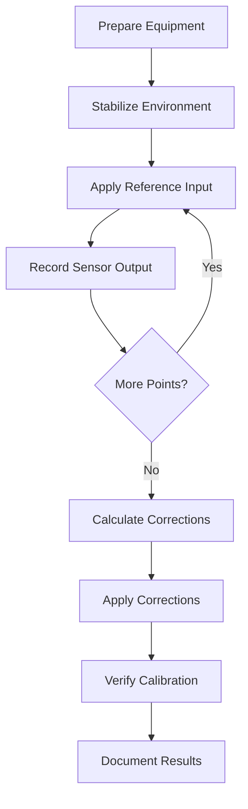

# Calibration

---
title: Sensor Calibration Guide
description: Comprehensive guide to sensor calibration methodologies, procedures, and best practices
author: Sensor Engineering Team
created_at: '2025-07-04'
updated_at: '2025-07-05'
version: 2.0.0
---

# Sensor Calibration Guide

## Table of Contents

1. [Introduction](#introduction)
2. [Calibration Fundamentals](#calibration-fundamentals)
3. [Calibration Methods](#calibration-methods)
4. [Calibration Procedures](#calibration-procedures)
5. [Data Analysis](#data-analysis)
6. [Uncertainty Analysis](#uncertainty-analysis)
7. [Automated Calibration](#automated-calibration)
8. [Case Studies](#case-studies)
9. [Best Practices](#best-practices)
10. [Troubleshooting](#troubleshooting)

## Introduction

Calibration is the process of configuring a sensor to provide accurate and repeatable measurements by comparing its output to known reference values. This document provides a comprehensive guide to sensor calibration, covering theory, methods, and practical implementation.

### Importance of Calibration
- Ensures measurement accuracy and reliability
- Maintains traceability to international standards
- Identifies sensor drift or degradation
- Validates sensor performance specifications
- Meets regulatory and quality requirements

### When to Calibrate
- During initial sensor installation
- After physical shock or environmental stress
- At regular maintenance intervals
- When measurements become questionable
- After firmware or software updates
- When environmental conditions change significantly

## Calibration Fundamentals

### Key Concepts

1. **Reference Standard**
   - Higher accuracy device with known uncertainty
   - Traceable to national/international standards
   - Typically 4-10x more accurate than device under test

2. **Calibration Interval**
   - Time between calibrations
   - Determined by stability requirements and historical performance
   - May vary from days to years

3. **Traceability Chain**
   ```mermaid
   graph LR
       A[International Standards] --> B[National Metrology Institutes]
       B --> C[Accredited Calibration Labs]
       C --> D[Working Standards]
       D --> E[Device Under Test]
   ```

### Calibration vs. Adjustment
- **Calibration**: Measuring and documenting sensor performance
- **Adjustment**: Modifying sensor output to match reference
- Not all calibrations require adjustment
- Always document both calibration and adjustment actions

## Calibration Methods

### 1. Single-Point Calibration
- **Use Case**: Offset correction only
- **Procedure**:
  1. Apply zero input
  2. Measure output
  3. Calculate offset
  4. Apply correction
- **Example**: Temperature sensor with fixed offset

### 2. Two-Point Calibration
- **Use Case**: Linear sensors with offset and gain errors
- **Procedure**:
  1. Apply zero input, record output (y₁)
  2. Apply full-scale input, record output (y₂)
  3. Calculate slope (m) and intercept (b)
  4. Apply linear correction: y_corrected = (y_measured - b) / m

### 3. Multi-Point Calibration
- **Use Case**: Non-linear sensors or high-accuracy requirements
- **Procedure**:
  1. Apply 5-11 points across measurement range
  2. Fit polynomial curve to data
  3. Store coefficients for correction
- **Example**: Thermocouples, load cells

### 4. Field Calibration
- **Use Case**: In-situ calibration without removing sensor
- **Methods**:
  - Known input sources
  - Reference sensors
  - Process simulation

## Calibration Procedures

### General Calibration Workflow



### Example: Accelerometer Calibration

1. **Equipment Setup**
   - Precision rate table
   - Reference accelerometer
   - Data acquisition system
   - Thermal chamber (for temperature compensation)

2. **Test Procedure**
   ```python
   def calibrate_accelerometer(accelerometer, positions, samples_per_position=100):
       """Calibrate accelerometer at multiple positions."""
       results = []
       for pos in positions:
           # Position accelerometer
           positioner.move_to(pos)
           time.sleep(1.0)  # Settling time
           
           # Collect samples
           readings = [accelerometer.read() for _ in range(samples_per_position)]
           avg_reading = np.mean(readings, axis=0)
           
           results.append({
               'position': pos,
               'expected': get_expected_reading(pos),
               'measured': avg_reading,
               'std_dev': np.std(readings, axis=0)
           })
       return pd.DataFrame(results)
   ```

3. **Correction Algorithm**
   ```python
   def calculate_calibration_matrix(calibration_data):
       """Calculate calibration matrix using least squares."""
       X = np.array([d['measured'] for d in calibration_data])
       Y = np.array([d['expected'] for d in calibration_data])
       
       # Add bias term
       X = np.column_stack([X, np.ones(X.shape[0])])
       
       # Solve Y = X @ C.T where C is [A|b] (scale and bias)
       C, _, _, _ = np.linalg.lstsq(X, Y, rcond=None)
       
       return C[:-1].T, C[-1]  # Scale matrix and bias vector
   ```

## Data Analysis

### Performance Metrics

1. **Before Calibration**
   - **Offset**: Mean error at zero input
   - **Gain Error**: Slope deviation from ideal
   - **Nonlinearity**: Maximum deviation from best-fit line
   - **Hysteresis**: Maximum difference between increasing/decreasing inputs

2. **After Calibration**
   - **Residual Error**: Remaining error after correction
   - **Uncertainty**: Expanded uncertainty (k=2 for 95% confidence)
   - **Repeatability**: Standard deviation of repeated measurements

### Visualization

```python
import matplotlib.pyplot as plt
import seaborn as sns

def plot_calibration_results(cal_data, corrected_data=None):
    plt.figure(figsize=(12, 5))
    
    # Before calibration
    plt.subplot(1, 2, 1)
    plt.plot(cal_data['expected'], cal_data['measured'], 'o', label='Raw Data')
    plt.plot([min(cal_data['expected']), max(cal_data['expected'])], 
             [min(cal_data['expected']), max(cal_data['expected'])], 
             'r--', label='Ideal')
    plt.xlabel('Expected Value')
    plt.ylabel('Measured Value')
    plt.title('Before Calibration')
    plt.legend()
    
    if corrected_data is not None:
        # After calibration
        plt.subplot(1, 2, 2)
        plt.plot(corrected_data['expected'], 
                corrected_data['corrected'] - corrected_data['expected'],
                'o', label='Residuals')
        plt.axhline(0, color='r', linestyle='--')
        plt.xlabel('Expected Value')
        plt.ylabel('Error')
        plt.title('After Calibration')
        plt.ylim(-0.1, 0.1)  # Example scale
    
    plt.tight_layout()
    plt.savefig('calibration_results.png')
```

## Uncertainty Analysis

### Sources of Uncertainty
1. **Reference Standard**
   - Calibration uncertainty
   - Resolution
   - Drift since last calibration

2. **Measurement Process**
   - Environmental conditions
   - Instrument resolution
   - Repeatability
   - Operator influence

3. **Calculation**
   - Curve fitting
   - Rounding
   - Interpolation

### Calculating Combined Uncertainty

```python
import numpy as np
from scipy import stats

def calculate_uncertainty(measurements, reference_uncertainty, confidence=0.95):
    """Calculate combined standard uncertainty."""
    # Type A: Standard uncertainty from measurements
    std_dev = np.std(measurements, ddof=1)
    uA = std_dev / np.sqrt(len(measurements))
    
    # Type B: Reference standard uncertainty
    uB = reference_uncertainty / 2  # Assuming 95% coverage factor k=2
    
    # Combined standard uncertainty
    uc = np.sqrt(uA**2 + uB**2)
    
    # Expanded uncertainty
    k = stats.t.ppf((1 + confidence)/2, df=len(measurements)-1)
    U = k * uc
    
    return {
        'mean': np.mean(measurements),
        'std_dev': std_dev,
        'uA': uA,
        'uB': uB,
        'uc': uc,
        'k': k,
        'U': U,
        'coverage': f"{confidence*100:.1f}%"
    }
```

## Automated Calibration

### Benefits
- Reduced human error
- Faster calibration cycles
- Consistent procedures
- Automated data collection and analysis
- Integration with production lines

### Implementation Example

```python
class AutoCalibrationSystem:
    def __init__(self, sensor, reference, interface):
        self.sensor = sensor
        self.reference = reference
        self.interface = interface
        self.calibration_data = []
        
    def run_calibration(self, test_points):
        """Run automated calibration sequence."""
        self.calibration_data = []
        
        for point in test_points:
            # Set reference value
            self.interface.set_reference(point)
            time.sleep(1.0)  # Allow settling
            
            # Collect samples
            measurements = []
            for _ in range(10):
                ref = self.reference.read()
                meas = self.sensor.read()
                measurements.append((ref, meas))
                time.sleep(0.1)
            
            # Store results
            ref_avg = np.mean([m[0] for m in measurements])
            meas_avg = np.mean([m[1] for m in measurements])
            self.calibration_data.append({
                'reference': ref_avg,
                'measured': meas_avg,
                'std_dev': np.std([m[1] for m in measurements])
            })
        
        return self.calibration_data
    
    def apply_calibration(self):
        """Calculate and apply calibration coefficients."""
        if not self.calibration_data:
            raise ValueError("No calibration data available")
            
        # Calculate calibration coefficients
        X = np.column_stack([
            [d['measured'] for d in self.calibration_data],
            np.ones(len(self.calibration_data))
        ])
        y = [d['reference'] for d in self.calibration_data]
        
        # Solve least squares
        coeffs, _, _, _ = np.linalg.lstsq(X, y, rcond=None)
        
        # Apply to sensor
        self.sensor.set_calibration(scale=coeffs[0], offset=coeffs[1])
        
        return coeffs
```

## Case Studies

### Case Study 1: Temperature Sensor Network
**Challenge**: 50+ temperature sensors showing inconsistent readings  
**Solution**: Implemented automated calibration bench with thermal reference  
**Results**:
- Reduced inter-sensor variation from ±2°C to ±0.2°C
- Cut calibration time by 80%
- Enabled predictive maintenance based on calibration drift

### Case Study 2: Industrial Load Cells
**Challenge**: Non-linear response under varying temperatures  
**Solution**: Developed multi-dimensional calibration model  
**Results**:
- Improved accuracy from ±1.5% to ±0.2% FS
- Extended calibration interval from 3 to 12 months
- Reduced measurement uncertainty by 60%

## Best Practices

### Before Calibration
1. **Preparation**
   - Verify reference standards are in calibration
   - Allow sufficient warm-up time (typically 30 minutes)
   - Document environmental conditions
   
2. **Equipment Setup**
   - Use proper fixtures and mounting
   - Minimize cable movement
   - Ensure proper grounding and shielding

### During Calibration
1. **Procedure**
   - Follow manufacturer's recommended procedure
   - Allow for thermal stabilization at each point
   - Take multiple readings at each point
   
2. **Documentation**
   - Record all relevant parameters
   - Note any anomalies or deviations
   - Save raw data for future reference

### After Calibration
1. **Verification**
   - Perform verification measurements
   - Check against acceptance criteria
   - Document calibration certificate
   
2. **Adjustment**
   - Only adjust if necessary
   - Document all adjustments
   - Re-verify after adjustment

## Troubleshooting

### Common Issues

1. **Poor Repeatability**
   - Check for loose connections
   - Verify power supply stability
   - Look for environmental factors (vibration, EMI)
   - Consider sensor damage or wear

2. **Nonlinear Response**
   - Verify reference standards
   - Check for mechanical binding
   - Consider sensor range limits
   - Look for temperature effects

3. **Excessive Noise**
   - Improve grounding and shielding
   - Check for ground loops
   - Verify power supply filtering
   - Consider signal conditioning

### Calibration Verification

```python
def verify_calibration(sensor, reference_points, tolerance):
    """Verify sensor calibration against reference points."""
    results = []
    for ref in reference_points:
        measured = sensor.read()
        error = measured - ref
        in_tolerance = abs(error) <= tolerance
        results.append({
            'reference': ref,
            'measured': measured,
            'error': error,
            'in_tolerance': in_tolerance
        })
    
    # Calculate pass/fail
    passed = all(r['in_tolerance'] for r in results)
    max_error = max(abs(r['error']) for r in results)
    
    return {
        'passed': passed,
        'max_error': max_error,
        'results': results
    }
```

## Revision History

| Version | Date | Author | Changes |
|---------|------|--------|---------|
| 2.0.0 | 2025-07-05 | Sensor Team | Comprehensive calibration guide |
| 1.0.0 | 2025-07-04 | System | Initial stub |

## References

1. NIST Technical Note 1297 - Guidelines for Evaluating and Expressing the Uncertainty of NIST Measurement Results
2. ISO/IEC 17025:2017 - General requirements for the competence of testing and calibration laboratories
3. ANSI/NCSL Z540.3-2006 - Requirements for the Calibration of Measuring and Test Equipment
4. EA-4/02 M:2013 - Evaluation of the Uncertainty of Measurement in Calibration

## Contact

For calibration support or questions:
- **Email**: calibration-support@example.com
- **Phone**: +1 (555) 123-4567
- **Hours**: Mon-Fri, 8:00 AM - 5:00 PM EST
