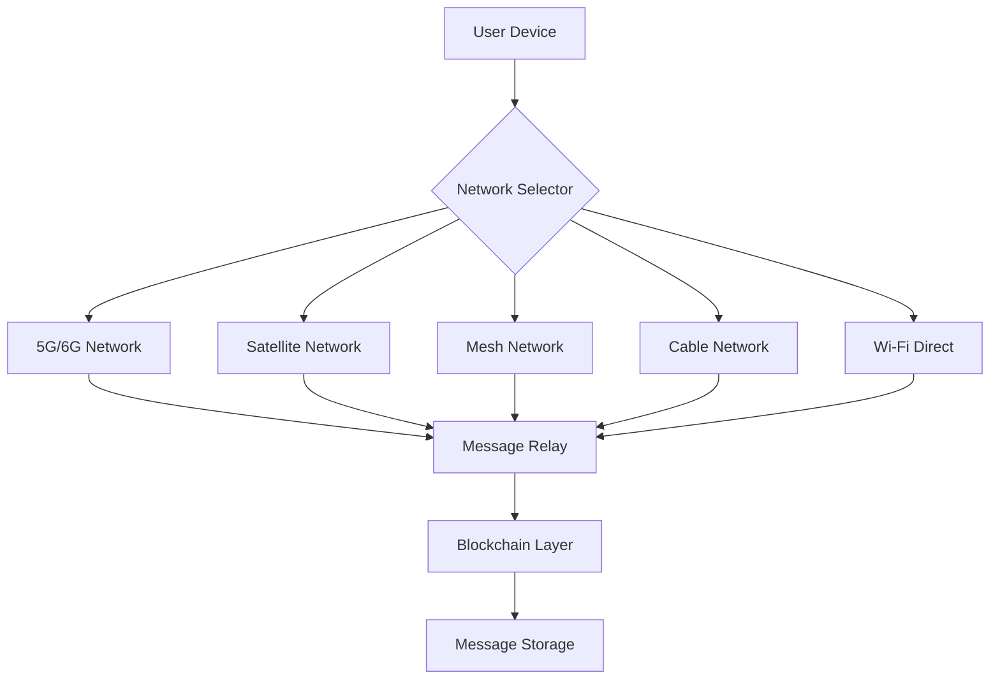

# Decentralized Messaging Architecture

> **Main Files Policy:** This file is part of the system requirements documentation. Any change to this file must be reflected in all other main files, both before and after any process. All main files are cross-linked and referenced. See [README.md](../../../README.md#main-files-policy-critical-requirement) for details.

> **Traceability:** All data inputs and amendments are timestamped for traceability and rollback. See also [universal_specification_governance.md](universal_specification_governance.md).

## Overview

This document outlines the architecture principles for building decentralized messaging platforms that integrate blockchain technology, cryptocurrency wallets, governance systems, and multi-protocol communication capabilities.

## Core Architecture Principles

### 1. Blockchain-Based Communication Layer

**End-to-End Encryption with Zero-Knowledge Proofs**
- Messages encrypted using quantum-resistant cryptography
- Zero-knowledge proofs for identity verification without revealing personal data
- On-chain message storage with immutable audit trails
- Support for multiple blockchain networks (Ethereum, Polkadot, Solana)

**Implementation Framework:**
```javascript
// Quantum-resistant message encryption
class QuantumResistantMessaging {
    constructor(blockchainNetwork) {
        this.network = blockchainNetwork;
        this.encryption = new LatticeBasedCrypto();
        this.zkProof = new ZKProofSystem();
    }
    
    async sendMessage(recipient, message) {
        const encryptedMessage = await this.encryption.encrypt(message);
        const proof = await this.zkProof.generateProof(encryptedMessage);
        return this.network.broadcast(encryptedMessage, proof);
    }
}
```

### 2. Multi-Protocol Communication Support

**Communication Protocols:**
- **VoIP (Voice over IP):** WebRTC-based encrypted voice and video calls
- **Satellite Communication:** LEO satellite integration for global reach
- **Mesh Networks:** Peer-to-peer communication for disaster recovery
- **Traditional Networks:** SMS bridge and PSTN integration
- **Cable Systems:** Integration with existing cable infrastructure

**Network Redundancy Architecture:**


### 3. Integrated Cryptocurrency Wallet System

**Wallet Features:**
- Multi-currency support (Bitcoin, Ethereum, stablecoins)
- Universal swap technology using DEX aggregators
- Fiat on/off-ramps with global payment providers
- Cross-border remittances with minimal fees
- Automated tax and capital gains tracking

**Financial Architecture Components:**
```python
class DecentralizedWallet:
    def __init__(self):
        self.chains = ['ethereum', 'bitcoin', 'solana']
        self.dex_aggregators = ['1inch', 'paraswap', 'zerox']
        self.fiat_providers = ['moonpay', 'wyre', 'ramp']
    
    def universal_swap(self, from_token, to_token, amount):
        """Enable cross-chain token swaps"""
        best_route = self.find_best_swap_route(from_token, to_token)
        return self.execute_swap(best_route, amount)
    
    def calculate_tax_implications(self, transaction):
        """Automatic tax calculation for compliance"""
        return TaxCalculator.process(transaction, self.jurisdiction)
```

### 4. Decentralized Governance and DAO Integration

**Governance Mechanisms:**
- Token-based voting with quadratic voting support
- Delegated democracy for technical decisions
- Amendment protocols for platform evolution
- Reputation systems for quality assurance

**DAO Framework:**
```solidity
// Smart contract for decentralized governance
contract MessagingDAO {
    struct Proposal {
        string description;
        uint256 votesFor;
        uint256 votesAgainst;
        mapping(address => bool) hasVoted;
        bool executed;
    }
    
    mapping(uint256 => Proposal) public proposals;
    uint256 public proposalCount;
    
    function submitProposal(string memory _description) public {
        proposals[proposalCount] = Proposal({
            description: _description,
            votesFor: 0,
            votesAgainst: 0,
            executed: false
        });
        proposalCount++;
    }
    
    function vote(uint256 _proposalId, bool _support) public {
        require(!proposals[_proposalId].hasVoted[msg.sender], "Already voted");
        
        uint256 voterWeight = getVotingWeight(msg.sender);
        
        if (_support) {
            proposals[_proposalId].votesFor += voterWeight;
        } else {
            proposals[_proposalId].votesAgainst += voterWeight;
        }
        
        proposals[_proposalId].hasVoted[msg.sender] = true;
    }
}
```

### 5. Gamification and Reward Systems

**Engagement Incentives:**
- Token rewards for platform interactions (messages, likes, shares)
- NFT achievements for milestones
- Staking rewards for network participation
- Creator monetization through smart contracts

**Gamification Implementation:**
```javascript
class GamificationEngine {
    constructor(tokenContract) {
        this.token = tokenContract;
        this.rewardRates = {
            message: 1,
            like: 0.5,
            share: 2,
            videoCall: 5,
            governance: 10
        };
    }
    
    async rewardUser(userId, action) {
        const reward = this.rewardRates[action] || 0;
        if (reward > 0) {
            await this.token.mint(userId, reward);
            this.updateLeaderboard(userId, reward);
        }
    }
}
```

## Security and Privacy Framework

### Quantum-Resistant Cryptography
- **Lattice-based encryption** for long-term security
- **Hash-based signatures** for authentication
- **Multivariate cryptography** for key exchange

### Privacy-Preserving Technologies
- **Homomorphic encryption** for encrypted data processing
- **Ring signatures** for anonymous transactions
- **Bulletproofs** for confidential transactions

### Identity Management
- **Self-sovereign identity (SSI)** for user control
- **Decentralized identifiers (DIDs)** for portable identity
- **Verifiable credentials** for attestations

## Scalability Solutions

### Layer 2 Integration
- **zkRollups** for high-throughput messaging
- **Optimistic Rollups** for cost-effective transactions
- **State channels** for real-time communication

### Cross-Chain Interoperability
- **Cosmos IBC** for blockchain communication
- **Polkadot parachains** for specialized functions
- **Atomic swaps** for trustless exchanges

## Implementation Phases

### Phase 1: Core Infrastructure (Months 1-6)
- [ ] Blockchain integration and smart contracts
- [ ] Basic messaging with encryption
- [ ] Multi-currency wallet implementation
- [ ] VoIP integration

### Phase 2: Advanced Features (Months 7-12)
- [ ] Satellite and mesh network support
- [ ] Governance and DAO implementation
- [ ] Gamification system
- [ ] Tax and compliance tools

### Phase 3: Scale and Optimize (Months 13-18)
- [ ] Layer 2 scaling solutions
- [ ] Cross-chain interoperability
- [ ] Metaverse integration
- [ ] AI-powered features

## References and Integration

- See [Blockchain Architecture](../../blockchain/architecture.md) for blockchain implementation details
- See [AI Integration](../../ai/integration.md) for AI-powered features
- See [Security Framework](../../security/framework.md) for comprehensive security measures
- See [Communication Protocols](../../systems/protocols/communication.md) for protocol specifications

---

*Last updated: 2025-07-21 15:37 UTC*
*Integration status: Core concepts documented, implementation pending*
