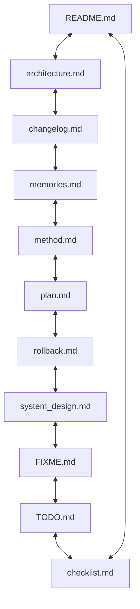
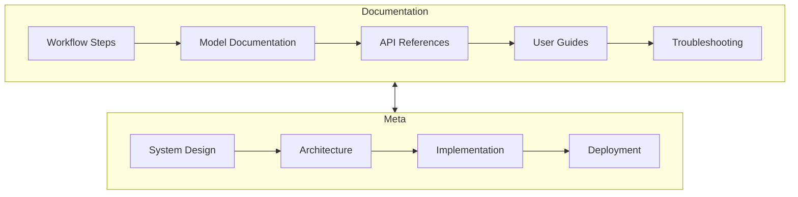

# Architecture

---
title: Knowledge Base Architecture
description: Comprehensive documentation of the knowledge base architecture, structure, and organization principles
author: Knowledge Base Team
created_at: '2025-07-05'
updated_at: '2025-07-05'
version: 2.0.0
---

# Knowledge Base Architecture

## Table of Contents

1. [Critical Files](#critical-files)
2. [System Overview](#system-overview)
3. [Directory Structure](#directory-structure)
4. [File Relationships](#file-relationships)
5. [Documentation Standards](#documentation-standards)
6. [Development Workflow](#development-workflow)
7. [Security & Compliance](#security--compliance)
8. [Maintenance & Operations](#maintenance--operations)
9. [Governance](#governance)
10. [References](#references)

## Critical Files {#critical-files}

> **IMPORTANT:** These files form the backbone of the knowledge base and must be kept in sync:



### File Descriptions

| File | Purpose | Update Frequency | Owner |
|------|---------|------------------|-------|
| README.md | Project overview and getting started guide | High | Core Team |
| architecture.md | This document - system architecture reference | Medium | Architects |
| changelog.md | Record of all notable changes | High | All Contributors |
| memories.md | Important decisions and context | Medium | Core Team |
| method.md | Development methodology | Low | Engineering Lead |
| plan.md | Project roadmap and tasks | High | Product Owner |
| rollback.md | Recovery procedures | Low | DevOps |
| system_design.md | Technical design specifications | Medium | Architects |
| FIXME.md | Known issues and bugs | High | All Contributors |
| TODO.md | Upcoming tasks and features | High | Product Team |
| checklist.md | Verification checklists | Medium | QA Team |

## System Overview {#system-overview}

The Knowledge Base is a sophisticated, multi-layered system designed for:

- **Scalability**: Handle growing content and user base
- **Maintainability**: Easy to update and extend
- **Security**: Robust access controls and data protection
- **Usability**: Intuitive navigation and search
- **Reliability**: High availability and fault tolerance

### Core Principles

1. **Documentation as Code**: All content is version-controlled and follows code-like workflows
2. **Single Source of Truth**: Each concept exists in exactly one place
3. **Progressive Enhancement**: Content is accessible in basic form but can be enhanced
4. **Machine-Readable**: Structured for both humans and automated tools
5. **Self-Documenting**: Clear structure and metadata for all components

## Directory Structure {#directory-structure}

```mermaid
graph TD
    root((/knowledge-base))
    
    %% Main directories
    docs[📁 /docs]
    templates[📁 /templates]
    process[📁 /process]
    automation[📁 /automation]
    assets[📁 /assets]
    scripts[📁 /scripts]
    anthropic[📁 /anthropic]
    mcp[📁 /mcp]
    
    %% Docs subdirectories
    workflow[📁 /workflow]
    models[📁 /models]
    concepts[📁 /concepts]
    
    %% Anthropic subdirectories
    anth_templates[📁 /templates]
    principles[📁 /principles]
    pipeline[📁 /pipeline]
    
    %% MCP subdirectories
    mcp_docs[📁 /docs]
    schemas[📁 /schemas]
    api[📁 /api]
    vectorization[📁 /vectorization]
    mcp_config[📁 /config]
    
    %% Root files
    readme[README.md]
    method[method.md]
    plan[plan.md]
    changes[changelog.md]
    design[system_design.md]
    arch[architecture.md]
    rollback[rollback.md]
    
    %% Relationships
    root --> docs & templates & process & automation & assets & scripts & anthropic & mcp
    docs --> workflow & models & concepts
    anthropic --> anth_templates & principles & pipeline
    mcp --> mcp_docs & schemas & api & vectorization & mcp_config
    root --> readme & method & plan & changes & design & arch & rollback
```



### Directory Descriptions

| Directory | Purpose | Owner |
|-----------|---------|-------|
| `/docs` | Core documentation files | Docs Team |
| `/templates` | Document templates | Core Team |
| `/process` | Process guides and workflows | Process Team |
| `/automation` | Automation scripts and tools | DevOps |
| `/assets` | Images, diagrams, and media | Design Team |
| `/scripts` | Utility and maintenance scripts | DevOps |
| `/anthropic` | AI-optimized content | AI Team |
| `/mcp` | Machine learning integration | ML Team |

### File Naming Conventions

- Use `kebab-case` for all filenames (e.g., `data-processing.md`)
- Prefix with numbers for ordered content (e.g., `01-getting-started.md`)
- Use descriptive, specific names (e.g., `user-authentication-flow.md` not `auth.md`)
- Keep filenames short but meaningful (max 5 words)
- Use consistent abbreviations (e.g., `api` not `application-programming-interface`)

## File Relationships {#file-relationships}

### Documentation Dependencies



### Key Relationships

1. **Content Flow**
   - Research → Documentation → Review → Publication
   - Requirements → Design → Implementation → Testing
   - Issues → Fixes → Verification → Release

2. **Cross-References**
   - Each document should link to related concepts
   - Use relative paths for internal links
   - Maintain bi-directional links where appropriate

3. **Templates and Standards**
   - All documents must use appropriate templates
   - Follow style guide for consistency
   - Include required metadata

## Documentation Standards {#documentation-standards}

### File Types

| Type | Format | Naming Convention | Example |
|------|--------|-------------------|---------|
| Documentation | Markdown | `kebab-case.md` | `user-guide.md` |
| Templates | Markdown | `type-template.md` | `api-template.md` |
| Configuration | YAML/JSON | `service.config.yml` | `database.config.yml` |
| Scripts | Python/Shell | `verb-noun.py` | `update-links.py` |
| Assets | Various | `descriptive-name.ext` | `login-flow-diagram.png` |

### Markdown Guidelines

1. **Structure**
   ```markdown
   # Title (H1)
   
   ## Overview (H2)
   
   ### Section (H3)
   
   #### Subsection (H4)
   ```

2. **Code Blocks**
   ```python
   def example():
       return "Use fenced code blocks with language specified"
   ```

3. **Links**
   ```markdown
   [Link Text](/relative/path/to/file.md)
   ```

4. **Images**
   ```markdown
   
   ```

### Metadata Requirements

All documentation files must include front matter:

```yaml
---
title: Document Title
description: Brief description of content
author: Name/Team
date: YYYY-MM-DD
version: 1.0.0
status: draft/review/published
---
```

### Version Control

- Use semantic versioning (MAJOR.MINOR.PATCH)
- Update version numbers for significant changes
- Document changes in CHANGELOG.md

## Development Workflow {#development-workflow}

### Creating Content

1. **Content Types**
   - 📝 Articles: `/docs/articles/`
   - 🛠️ Tutorials: `/docs/tutorials/`
   - 📚 References: `/docs/reference/`
   - 🔍 How-Tos: `/docs/how-to/`
   - ❓ FAQs: `/docs/faq/`

2. **Process**
   ```mermaid
   graph LR
       A[Identify Need] --> B[Create Branch]
       B --> C[Write Content]
       C --> D[Add Metadata]
       D --> E[Review]
       E --> F{Approved?}
       F -->|Yes| G[Merge to Main]
       F -->|No| H[Revise]
       H --> E
   ```

### Review Process

1. **Self-Review**
   - Check for typos and grammar
   - Verify all links work
   - Ensure consistent formatting

2. **Peer Review**
   - Request review from subject matter expert
   - Address all feedback
   - Update documentation as needed

3. **Approval**
   - Get sign-off from document owner
   - Update version number
   - Merge to main branch

## Security & Compliance {#security--compliance}

### Access Control

1. **Roles and Permissions**
   ```mermaid
   graph TD
       A[Public] -->|Read| B[Documentation]
       C[Contributor] -->|Write| D[Content]
       D[Content] -->|Review| E[Maintainer]
       E -->|Approve| F[Publication]
   ```

2. **Authentication**
   - SSO integration
   - Two-factor authentication
   - API key management

### Data Protection

- Encryption at rest and in transit
- Regular security audits
- Compliance with GDPR, CCPA, etc.
- Data retention policies

### Compliance Requirements

| Standard | Scope | Owner | Review Cycle |
|----------|-------|-------|--------------|
| GDPR | All user data | Legal | Annual |
| SOC 2 | System controls | Security | Bi-annual |
| HIPAA | Health data | Compliance | Annual |
| Accessibility | All content | UX | Quarterly |

## Maintenance & Operations {#maintenance--operations}

### Regular Tasks

1. **Content Updates**
   - Review and update outdated content
   - Remove deprecated information
   - Update cross-references

2. **Link Validation**
   ```bash
   # Run link checker
   python scripts/check_links.py
   ```

3. **Performance Optimization**
   - Optimize images and assets
   - Minify CSS/JS
   - Implement caching

### Monitoring

| Metric | Tool | Threshold | Owner |
|--------|------|-----------|-------|
| Uptime | StatusCake | 99.9% | DevOps |
| Broken Links | LinkChecker | 0 | Docs Team |
| Load Time | Google PageSpeed | < 2s | Web Team |
| Search Accuracy | Analytics | > 95% | Search Team |

### Backup Strategy

1. **Frequency**: Daily incremental, weekly full
2. **Retention**: 30 days
3. **Location**: Secure cloud storage
4. **Verification**: Monthly test restores

## Governance {#governance}

### Roles and Responsibilities

| Role | Responsibilities |
|------|------------------|
| **Documentation Lead** | Overall documentation strategy |
| **Content Authors** | Create and update documentation |
| **Reviewers** | Technical accuracy review |
| **Editors** | Style and consistency |
| **Publishers** | Final review and publication |

### Decision Making

1. **Proposal**: Document proposed changes
2. **Discussion**: Team review and feedback
3. **Approval**: Required from relevant stakeholders
4. **Implementation**: Changes made and tested
5. **Documentation**: Update relevant documentation

### Change Management

1. **Request**: Submit change request
2. **Impact Analysis**: Review potential effects
3. **Approval**: Get necessary sign-offs
4. **Implementation**: Make changes
5. **Verification**: Test changes
6. **Documentation**: Update all relevant docs

## References {#references}

### Internal Resources
- [Style Guide](/docs/contributing/style-guide.md)
- [Writing Guidelines](/docs/contributing/writing-guidelines.md)
- [Review Process](/process/review-process.md)

### External Standards
- [Google Developer Documentation Style Guide](https://developers.google.com/style)
- [Microsoft Writing Style Guide](https://docs.microsoft.com/en-us/style-guide/)
- [GitHub Markdown Guide](https://guides.github.com/features/mastering-markdown/)

### Tools
- [Markdown Lint](https://github.com/DavidAnson/markdownlint)
- [Vale](https://docs.errata.ai/vale/about)
- [MkDocs](https://www.mkdocs.org/)

## Revision History

| Version | Date | Author | Changes |
|---------|------|--------|---------|
| 2.0.0 | 2025-07-05 | Knowledge Base Team | Complete architecture overhaul |
| 1.0.0 | 2025-07-05 | Initial Author | Initial version |

## Approval

| Role | Name | Signature | Date |
|------|------|-----------|------|
| Architect | [Name] | | |
| Engineering | [Name] | | |
| Security | [Name] | | |
| Product | [Name] | | |

### auto_update_docs.py
- **Purpose**: Combined script to update both README.md and changelog.md
- **Location**: `/scripts/auto_update_docs.py`
- **Usage**: `python scripts/auto_update_docs.py [--commit] [--push]`

## Main Directory Update Points

After every process or major update, the following files must be reviewed and updated to maintain architectural integrity:
- [README.md](README.md)
- [architecture.md](architecture.md)
- [changelog.md](changelog.md)
- [memories.md](memories.md)
- [method.md](method.md)
- [plan.md](plan.md)
- [rollback.md](rollback.md)
- [system_design.md](system_design.md)
- [FIXME.md](FIXME.md)
- [TODO.md](TODO.md)
- [checklist.md](checklist.md)

See [plan.md](plan.md) and [checklist.md](checklist.md) for the update workflow and status tracking.

## References
- [System Design](system_design.md) - Conceptual system design
- [Plan](plan.md) - Current knowledge base plan
- [Changelog](changelog.md) - Record of changes to knowledge base
- [MCP Integration Guide](mcp/integration_guide.md) - MCP compatibility guidelines
- [MCP Configuration](mcp/config/README.md) - MCP server configuration guide
- [Anthropic Processing Pipeline](anthropic/processing_pipeline.md) - Anthropic data processing methodology
- [Automation Guide](automation/step_by_step_guide.md) - Step-by-step automation procedures
- [Rollback Procedures](rollback.md) - Recovery and rollback process
