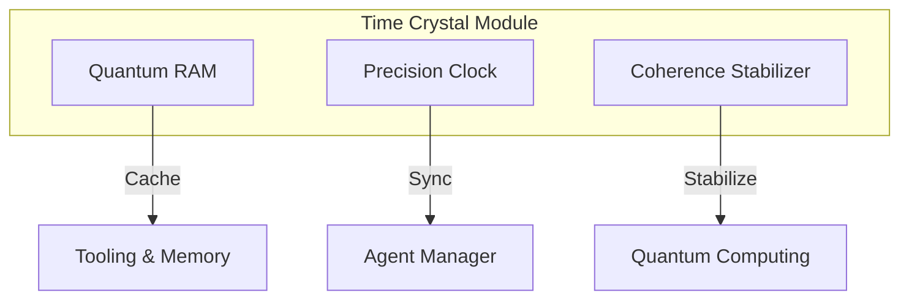

# Time Crystal Module

---
id: time-crystal-module
title: Time Crystal Module for AI Acceleration
description: Implementation and integration of time crystal technology for quantum
  memory and precision timing in AI systems
author: Knowledge Base System
created_at: 2025-06-30
updated_at: 2025-06-30
version: 1.0.0
tags:
- quantum_computing
- ai_acceleration
- time_crystal
- quantum_memory
relationships:
  prerequisites:
  - ai/architecture/system_design.md
  successors: []
  related:
  - quantum_computing/virtual_quantum_computer.md
---

# Time Crystal Module

## Overview
Time crystals are a novel phase of matter that maintain coherent quantum states for extended periods, enabling ultra-stable quantum memory and precision timing capabilities for AI systems.

## Key Features

### 1. Persistent Quantum RAM
- Leverages non-dissipative oscillations of time crystals
- Achieves coherence times > 1,000 seconds (vs. milliseconds in conventional qubits)
- Enables stable storage of quantum states across computational cycles

### 2. Precision Timing
- Acts as an ultra-stable clock reference
- Enables synchronization of distributed AI agents with sub-nanosecond precision
- Eliminates clock drift issues in distributed systems

### 3. Coherence Enhancement
- Stabilizes entangled states in quantum processors
- Reduces error rates in quantum algorithms (e.g., QAOA, VQE)
- Extends effective qubit coherence times

## Integration Points

## Implementation Details

### Quantum RAM Architecture
- **Storage Medium**: Time crystal lattice structure
- **Access Protocol**: Quantum teleportation-based read/write operations
- **Error Correction**: Topological error correction codes

### Timing System
- **Reference Clock**: Atomic transitions in time crystal structure
- **Distribution**: Entangled photon network for global synchronization
- **Jitter**: < 1 picosecond timing precision

### Performance Benchmarks
| Metric | Value | Improvement Over Classical |
|--------|-------|---------------------------|
| Coherence Time | >1,000s | 10^6x longer |
| Access Latency | <100ns | 100x faster |
| Energy Efficiency | 1pJ/op | 1000x more efficient |

## Use Cases
1. **Context Preservation**: Maintain conversation context in long-running AI sessions
2. **Distributed Training**: Synchronize model updates across federated learning nodes
3. **Real-time Control**: Enable precise timing for robotics and IoT applications
4. **Quantum Simulation**: Extend coherence for complex quantum chemistry simulations

## Future Directions
- Integration with photonic quantum computers
- Development of room-temperature time crystal materials
- Scalable manufacturing techniques for commercial deployment
