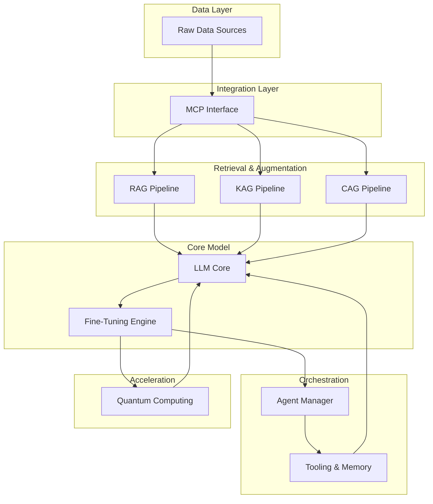

# System Design

---
id: ai-architecture-overview
title: AI Platform Architecture - System Design
description: Comprehensive architecture of an advanced AI platform integrating MCP,
  RAG, KAG, CAG, LLM with fine-tuning, agent orchestration, and quantum acceleration
author: Knowledge Base System
created_at: 2025-06-30
updated_at: 2025-06-30
version: 1.0.0
tags:
- ai_architecture
- system_design
- quantum_computing
- model_architecture
- ai_platform
relationships:
  prerequisites: []
  successors: []
  related:
  - quantum_computing/virtual_quantum_computer.md
  - machine_learning/workflow/build_train_model.md
---

# AI Platform Architecture

## High-Level System Design

## Component Breakdown

### 1. Data Layer & MCP Interface
- **Raw Data Sources**: Proprietary databases, document stores, APIs, real-time streams
- **Model Context Protocol (MCP)**: Standardized protocol for AI applications to plug into diverse data sources while preserving context

### 2. Retrieval & Augmentation Pipelines
- **Retrieval-Augmented Generation (RAG)**: Enhances LLM outputs with relevant documents via vector search
- **Knowledge-Augmented Generation (KAG)**: Incorporates structured knowledge graphs for domain-specific reasoning
- **Cache-Augmented Generation (CAG)**: Optimizes performance through intelligent caching of frequently used data

### 3. Core Model & Fine-Tuning
- **LLM Core**: Transformer-based foundation model for text generation and understanding
- **Fine-Tuning Engine**: Adapts the base model to specific tasks and domains

### 4. Agent Orchestration
- **Agent Manager**: Coordinates workflows and multi-agent interactions
- **Tooling & Memory**: Provides tools and memory management for agent operations

### 5. Quantum Computing Acceleration
- **Quantum Processing**: Accelerates specific computational tasks
- **Quantum-Classical Hybrid Operations**: Seamless integration with classical computing resources
