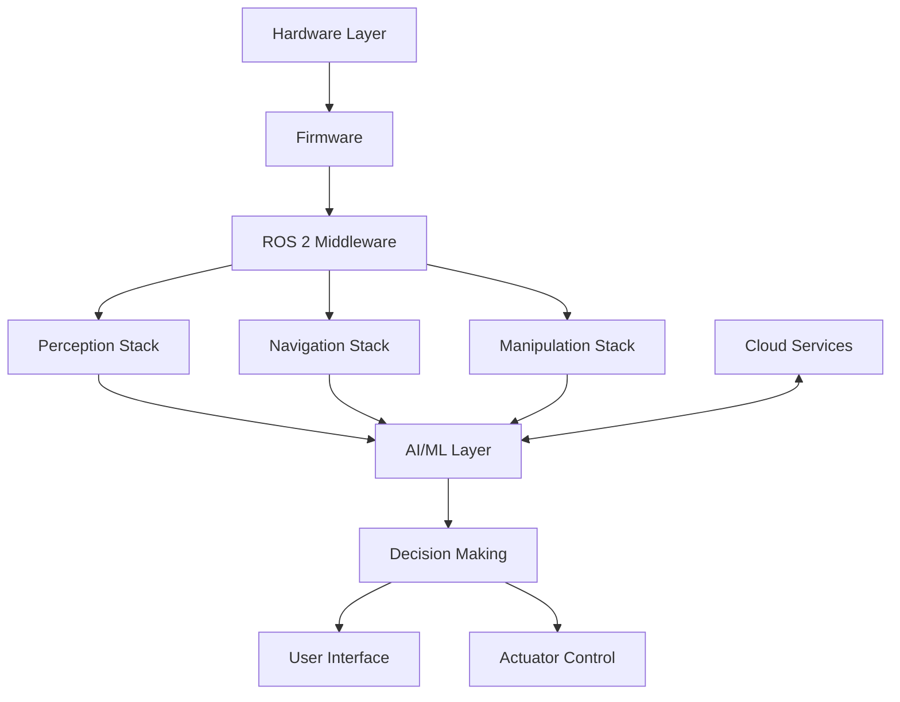

# Architecture

---
author: Knowledge Base Automation System
created_at: '2025-07-04'
description: Documentation on Architecture for robotics/advanced_system
title: Architecture
updated_at: '2025-07-04'
version: 1.0.0
---

# Advanced Robotic System Architecture

## Overview
This document outlines the architecture of the advanced robotic system, designed for versatility, scalability, and robust performance across various applications.

## System Components

### 1. Hardware Layer
- **Processing Units**: NVIDIA Jetson AGX Orin, Raspberry Pi 5
- **Sensors**:
  - Vision: Stereo cameras, LIDAR, depth sensors
  - Environmental: Temperature, humidity, gas sensors
  - Inertial: IMU, GPS, encoders
- **Actuators**: Brushless DC motors, servo motors, linear actuators
- **Power System**: LiPo batteries, power management ICs, solar charging

### 2. Software Stack
- **Operating System**: Ubuntu 22.04 LTS with ROS 2 Humble
- **Middleware**: ROS 2 for inter-process communication
- **Perception Stack**:
  - Computer Vision (OpenCV, PyTorch)
  - Point Cloud Processing (PCL, Open3D)
  - Sensor Fusion (Kalman/particle filters)
- **Navigation Stack**:
  - SLAM (Simultaneous Localization and Mapping)
  - Path Planning (A*, RRT*, D*)
  - Motion Control (PID, MPC)

### 3. AI/ML Layer
- **Model Training**: PyTorch, TensorFlow
- **Edge Inference**: TensorRT, ONNX Runtime
- **Learning Systems**:
  - Supervised Learning for perception
  - Reinforcement Learning for control
  - Self-supervised Learning for adaptation

### 4. Communication Layer
- **Wireless**: WiFi 6, 5G, Bluetooth 5.2
- **Wired**: Ethernet, USB-C, CAN bus
- **Protocols**: MQTT, DDS, ROS 2 middleware

### 5. User Interface
- **Web Dashboard**: React-based control panel
- **Mobile App**: Cross-platform (iOS/Android)
- **Voice Interface**: Custom wake-word detection, STT/TTS

## System Architecture Diagram

## Key Features

### 1. Modular Design
- Plug-and-play components
- Containerized services
- Hardware abstraction layer

### 2. Real-time Performance
- Deterministic execution
- Priority-based scheduling
- Hardware acceleration

### 3. Security
- End-to-end encryption
- Secure boot
- Over-the-air updates with verification

### 4. Energy Efficiency
- Dynamic power management
- Sleep modes
- Energy-aware scheduling

## Integration Points

1. **Sensor Integration**
   - Standardized interfaces (UART, I2C, SPI)
   - ROS 2 drivers
   - Calibration tools

2. **Cloud Connectivity**
   - MQTT bridge
   - Data synchronization
   - Remote monitoring

3. **Third-party Services**
   - Mapping services
   - Weather data
   - Traffic information

## Performance Metrics

| Component | Metric | Target |
|-----------|--------|--------|
| Perception | Object Detection FPS | 30 FPS |
| Localization | Position Accuracy | ±2cm |
| Navigation | Path Planning Time | <100ms |
| Power | Battery Life | 8h (active) |
| Communication | Latency | <50ms |

## Dependencies

- **Hardware**:
  - NVIDIA GPU (Jetson series recommended)
  - Depth cameras (Intel RealSense, OAK-D)
  - LIDAR (Velodyne, Ouster)

- **Software**:
  - Ubuntu 22.04
  - ROS 2 Humble
  - Python 3.8+
  - Docker 20.10+

## Next Steps

1. Review [hardware requirements](hardware/README.md)
2. Set up [development environment](../../../temp_reorg/docs/robotics/development.md)
3. Deploy [sample applications](../examples/README.md)

---
*Last updated: 2025-07-01*
*Version: 1.0.0*
