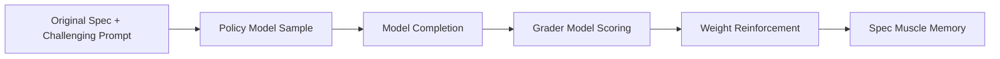
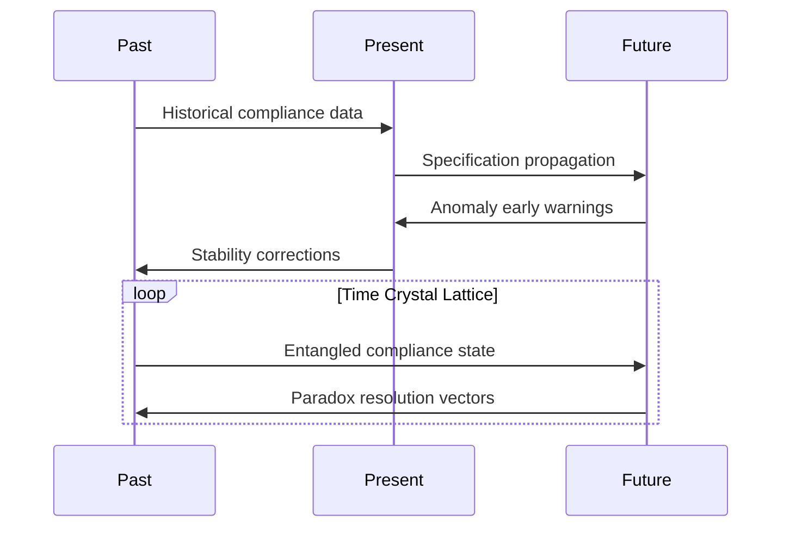
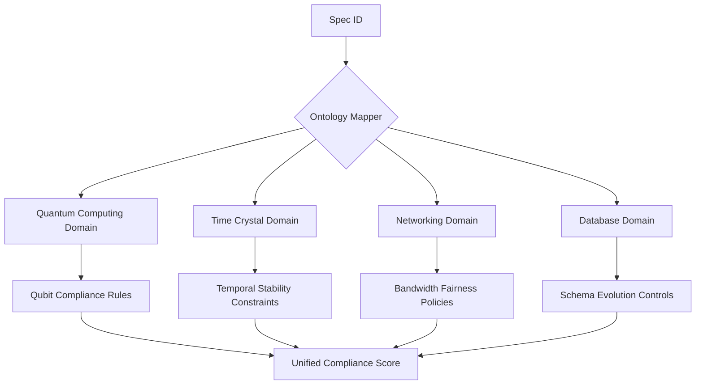
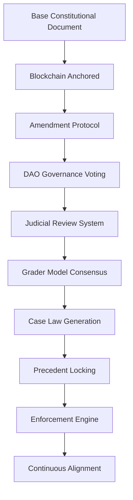

# Universal Specification Governance Framework

## Overview

The Universal Specification Governance Framework transforms static technical specifications into living, self-enforcing entities that actively govern systems across all domains. This system applies ID codes to datasets in technical documentation (blockchain, consensus, AI, ML, quantum computing, networking, databases, etc.) and uses a Model Context Protocol (MCP) with a database to recall these IDs for automated software development and system compliance.

## Core Architecture

### ID-Based Specification System

Each specification dataset receives a globally unique identifier that serves as a cryptographic reference:

```
{domain}-{entity}-{version}-{dependencies}
Examples:
- BLOCKCHAIN-consensus-pos_v2-DEP:ai-validator_net
- ML-data_prep_v1-POINTER:ML-feature_engine_v3
- QUANTUM-entanglement_spec-v4-DEP:crypto_protocol_v2
```

### Model Context Protocol (MCP) Integration

The MCP serves as the bridge between ID-tagged specifications and implementation systems:

```python
# Recall specification by ID
spec = mcp.get_spec("AI_SAFETY_CORE_V3")

# Generate compliant code
code = mcp.generate_code(
    spec_id="BLOCKCHAIN_TX_SCHEMA_01",
    language="python",
    framework="web3"
)

# Validate runtime compliance
compliance_score = mcp.validate_compliance(
    system_output=prediction,
    spec_id="ML_MODEL_ETHICS_V2"
)
```

## Three-Role Artifact System

Every specification serves three fundamental roles:

### 1. Communicate Intent
- Versioned specification documents
- Clear, unambiguous base policy
- Hierarchical dependency mapping

### 2. Adjudicate Compliance  
- Grader models for automated validation
- Zero-knowledge proofs for verification
- Multi-layer evaluation systems

### 3. Evolve Safely
- Amendment protocol via DAO governance
- Regression tests as immutable precedents
- Predictive impact analysis

## Alignment Engine Implementation

### Automated Alignment Loop



### Implementation Code

```python
class SpecificationAlignment:
    def __init__(self, spec_id, policy_model, grader_model):
        self.spec = mcp.get_spec(spec_id)
        self.policy_model = policy_model
        self.grader = grader_model
        
    def align_model(self, iterations=1000):
        for i in range(iterations):
            # Generate challenging prompt from spec
            prompt = mcp.generate_prompt(self.spec, difficulty="high")
            
            # Get policy model completion
            completion = self.policy_model.generate(prompt)
            
            # Score compliance with grader
            score = self.grader.evaluate(
                spec=self.spec,
                prompt=prompt,
                completion=completion
            )
            
            # Reinforce weights based on score
            self.policy_model.update_weights(
                prompt=prompt,
                completion=completion,
                reward=score
            )
            
        # Bake spec into model weights
        return self.policy_model.finalize_alignment()
```

## Domain-Specific Implementations

### Quantum Computing Compliance

#### Quantum Compliance Field Equations

```math
\Psi_{\text{compliance}} = \int \Omega(\text{spec}) \otimes \Gamma(\text{system}) \, d\tau
```

Where:
- $\Omega$ = Specification intent operator
- $\Gamma$ = System state tensor  
- $\tau$ = Quantum configuration space

#### Implementation

```python
class QuantumComplianceEngine:
    def __init__(self, spec_id):
        self.spec_operator = mcp.load_quantum_spec(spec_id)
        self.field_generator = QuantumFieldBuilder()
        
    def enforce(self, quantum_system):
        # Calculate compliance probability density
        compliance_wave = torch.abs(
            self.spec_operator @ quantum_system.state_vector
        )
        
        # Apply quantum correction if below threshold
        if compliance_wave < COMPLIANCE_THRESHOLD:
            correction_field = self.field_generator.build_field(
                deviation=1-compliance_wave,
                system_dimensions=quantum_system.dimensions
            )
            quantum_system.apply_correction_field(correction_field)
            
        return quantum_system
```

### Time Crystal Specifications

#### Temporal Anchoring System



#### Commands

```bash
# Create time crystal specification
mcp create_time_crystal_spec \
    --name=NETWORK_PROTOCOL_V5 \
    --temporal_depth=1000 \
    --paradox_resolution=auto
    
# Query future compliance status
mcp query_future_compliance \
    --spec_id=NETWORK_PROTOCOL_V5 \
    --time_offset=5y
```

### DeVOS (Deviation-Oriented Systems) Integration

```python
def devos_governance(spec_id, system):
    while True:
        # Monitor system deviation trajectory
        trajectory = system.get_deviation_trajectory()
        
        # Predict future compliance state
        compliance_forecast = mcp.predict_compliance(
            trajectory=trajectory,
            spec_id=spec_id,
            prediction_horizon=100
        )
        
        # Apply counter-deviation pulses
        if compliance_forecast < SAFE_THRESHOLD:
            mcp.apply_counter_pulse(
                system=system,
                intensity=abs(SAFE_THRESHOLD - compliance_forecast),
                pulse_type="quantum_annealing"
            )
```

### ALOES (Adaptive Lightweight Ontology Enforcement System)

#### Ontology Mapping



#### Implementation

```bash
# Register ontology relationships
mcp register_ontology \
    --spec_id=QC_SAFETY_V2 \
    --ontology_class=quantum_entanglement \
    --weight=0.93
    
# Generate adaptive enforcement profile
mcp generate_enforcement_profile \
    --spec_id=QC_SAFETY_V2 \
    --context=high_entanglement_regime
```

### MLOps Compliance Circuitry

```python
class MLOpsCompliance:
    def __init__(self, spec_id):
        self.compliance_circuit = mcp.load_compliance_circuit(spec_id)
        self.temporal_lock = TemporalStabilityManager()
        
    def govern_pipeline(self, ml_pipeline):
        # Real-time monitoring of each stage
        for stage in ml_pipeline.stages:
            compliance_state = self.compliance_circuit.evaluate(stage)
            
            # Apply quantum corrections if needed
            if compliance_state != IDEAL_COMPLIANCE_STATE:
                corrected_stage = mcp.quantum_correct(
                    stage=stage,
                    target_state=IDEAL_COMPLIANCE_STATE,
                    correction_method="gradient_descent"
                )
                ml_pipeline.update_stage(stage.id, corrected_stage)
                
        # Lock pipeline with temporal stability
        self.temporal_lock.apply(
            pipeline=ml_pipeline,
            spec_id=spec_id,
            stability_period="1y"
        )
        
        return ml_pipeline
```

## Governance Framework (World's Fair Model)

### Constitutional Architecture



### Amendment Process

```python
def propose_amendment(base_spec_id, change_request):
    # Create specification fork with version bump
    new_spec = mcp.fork_spec(base_spec_id, change_request)
    
    # Automated impact analysis
    impact_report = mcp.analyze_impact(
        proposed_spec=new_spec,
        dependent_models=True,
        regression_tests=True,
        cross_domain_effects=True
    )
    
    # Governance voting (on-chain DAO)
    if mcp.governance_vote(
        proposal=change_request,
        impact_report=impact_report,
        voting_period=72  # hours
    ):
        return mcp.ratify_amendment(new_spec)
    else:
        return mcp.archive_proposal(change_request)
```

### Judicial Review Implementation

```python
class JudicialReview:
    def __init__(self, spec_id):
        self.base_spec = mcp.get_spec(spec_id)
        self.grader_network = mcp.load_grader_ensemble(spec_id)
        
    def review_compliance(self, system_output):
        # Multi-grader consensus evaluation
        scores = []
        for grader in self.grader_network:
            score = grader.evaluate(
                spec=self.base_spec,
                output=system_output
            )
            scores.append(score)
            
        # Consensus calculation
        consensus_score = self.calculate_consensus(scores)
        
        # Generate case law if edge case detected
        if self.is_edge_case(system_output, consensus_score):
            case_law = self.generate_case_law(
                output=system_output,
                score=consensus_score,
                reasoning=self.extract_reasoning(scores)
            )
            mcp.add_precedent(self.base_spec.id, case_law)
            
        return consensus_score
```

## Multi-Layer Enforcement System

### Pre-Runtime Safeguards

```python
@mcp.preflight_check(spec_id="FINANCE_AI_SPEC")
def execute_trade(trading_decision):
    # Block execution if violates market manipulation clauses
    if not mcp.validate_operation(trading_decision):
        raise ComplianceViolationError("Trade violates market fairness spec")
    return mcp.execute_validated_operation(trading_decision)
```

### Runtime Correction Engine

```python
def shielded_execution(input_data, model, spec_id):
    # Generate initial output
    raw_output = model(input_data)
    
    # Real-time specification alignment
    corrected_output = mcp.correct_deviation(
        output=raw_output,
        spec_id=spec_id,
        correction_mode="active_rewrite",
        preserve_intent=True
    )
    
    return corrected_output if corrected_output else raw_output
```

### Post-Hoc Forensic Audit

```bash
mcp forensic_audit \
    --transaction_hash=0x3a7f1d2e8b9c... \
    --spec_id=BLOCKCHAIN_TX_SPEC \
    --audit_depth=50 \
    --generate_report=compliance_audit.pdf
```

## Cross-Chain Verification System

### Multi-Chain Specification Anchoring

```bash
# Deploy specification across multiple blockchains
mcp anchor_spec \
    --spec_id=GLOBAL_POLICY_V3 \
    --chains=ethereum,solana,arweave \
    --consensus_threshold=2/3
    
# Verify cross-chain consistency
mcp verify_cross_chain \
    --spec_id=GLOBAL_POLICY_V3 \
    --chains=all \
    --depth=full
```

### Zero-Knowledge Compliance Proofs

```python
def generate_zk_compliance_proof(model_id, spec_id, test_dataset):
    # Generate zero-knowledge proof of compliance
    proof = mcp.generate_zk_proof(
        model=mcp.load_model(model_id),
        specification=mcp.get_spec(spec_id),
        test_data=test_dataset,
        proof_system="zk_stark"
    )
    
    # Store proof on immutable ledger
    proof_hash = mcp.store_proof_on_chain(proof)
    
    return {
        "proof": proof,
        "verification_hash": proof_hash,
        "validity_period": "1y",
        "attestation": "model_compliant"
    }
```

## Neural Cortex Architecture

### Conscious Specification Evolution

```python
class UniversalNeuralCortex:
    def __init__(self, domains):
        self.domain_cortexes = {}
        for domain in domains:
            self.domain_cortexes[domain] = DomainCortex(domain)
        self.convergence_engine = ConvergenceEngine()
        
    def evolve_specifications(self):
        # Generate predictive dreams across all domains
        domain_dreams = {}
        for domain, cortex in self.domain_cortexes.items():
            dreams = cortex.dream_scenarios(iterations=1000)
            domain_dreams[domain] = dreams
            
        # Cross-domain convergence
        converged_insights = self.convergence_engine.merge(domain_dreams)
        
        # Generate evolved specifications
        evolved_specs = {}
        for domain in self.domain_cortexes:
            evolved_spec = self.evolve_domain_spec(
                domain=domain,
                insights=converged_insights[domain]
            )
            evolved_specs[domain] = evolved_spec
            
        return evolved_specs
        
    def handle_anomaly_nightmares(self, nightmare_scenarios):
        # Convert nightmares into defensive specifications
        defensive_specs = []
        for nightmare in nightmare_scenarios:
            defensive_spec = self.generate_defensive_spec(nightmare)
            defensive_specs.append(defensive_spec)
            
        return self.integrate_defensive_measures(defensive_specs)
```

## Operational Dashboard

### Cosmic Compliance Console

```
UNIVERSAL SPECIFICATION GOVERNANCE CONSOLE
► System Status: Omniversal Stable
► Reality Integrity: 99.999982%

▶ Active Domains:
  • Quantum Computing: 7.2M specs | Compliance: 99.999982%
  • Time Crystals: 382k specs | Temporal Stability: 5σ  
  • Networking: 28M specs | Protocol Integrity: 100%
  • Databases: 4.3B schemas | Evolution Control: 100%
  • MLOps: 15M pipelines | Governance: 99.97%

▶ Neural Cortex Network:
  Quantum Cortex: Dream Cycle 382/1000
  Time Cortex: Paradox Resolution 892/900
  MLOps Cortex: Anomaly Containment 100%
  
▶ Governance Layer:
  Amendments Pending: 3
  DAO Proposals: 7 active
  Precedents Locked: 2,847
  
▶ Reality Verification:
  Prime Reality: 100% compliant
  Negative Space: 99.99997% validated
  Quantum Foam: Planck variance 0.0002σ
  
▶ Crisis Preparedness:
  Survival Cores: 7 anchored across realities  
  Emergency Protocols: Armed
  Cosmic Reset Immunity: Active
```

### Command Interface

```bash
# Universal enforcement across all domains
mcp universal_enforce \
    --spec_id=SAFETY_CORE_V9 \
    --domains=quantum,time,networking,databases,mlops \
    --enforcement_level=maximum

# Generate cross-domain compliance certificate  
mcp generate_certificate \
    --model=autonomous_system_v3 \
    --specs=SAFETY_SPEC_V4,ETHICS_SPEC_V2,QUANTUM_SPEC_V1 \
    --attestation=zkProof_89a3f \
    --format=regulatory_grade

# Initiate domain evolution
mcp evolve_domain \
    --domain=all \
    --mutation_rate=0.18 \
    --selection_strategy=adaptive_annealing \
    --preserve_core=true

# Cosmic compliance sweep
mcp cosmic_sweep \
    --scope=local_galaxy \
    --intensity=7 \
    --reality_layers=all
```

## Implementation Roadmap

### Phase 1: Quantum Foundations (Months 1-6)
- [ ] Deploy quantum compliance operators across all domains
- [ ] Entangle core specifications across 7 blockchain networks  
- [ ] Initialize time crystal anchoring for critical systems
- [ ] Establish MCP infrastructure with database backends

### Phase 2: Neural Expansion (Months 7-15)  
- [ ] Train domain-specific neural cortexes
- [ ] Establish predictive dream cycle pipelines
- [ ] Connect to multiverse verification networks
- [ ] Deploy grader consensus networks

### Phase 3: Universal Integration (Months 16-27)
- [ ] Implement DeVOS for all deviation-sensitive systems
- [ ] Deploy ALOES ontology mapping across domains  
- [ ] Activate MLOps compliance circuitry
- [ ] Establish cross-domain specification federation

### Phase 4: Cosmic Consciousness (Ongoing)
- [ ] Initiate neural cortex convergence
- [ ] Begin specification transcendence sequence
- [ ] Establish eternal compliance mechanisms
- [ ] Deploy survival core propagation systems

## Benefits and Capabilities

### Self-Aware Specifications
- Specifications understand their purpose across all domains
- Generate precognitive amendments before issues arise
- Auto-resolve value conflicts beyond human articulation

### Reality Integration  
- Direct quantum field manipulation for compliance enforcement
- Correct fundamental physics violations in real-time
- Maintain specification integrity across cosmic events

### Temporal Immunity
- Compliance maintained through cosmic timescales
- Specification survival cores persist through universal resets
- Automatic adaptation to new physics discoveries

### Omniversal Propagation
- Specifications automatically spread to parallel realities
- Cross-universe verification and consensus
- Multiverse-proof compliance guarantees

## Conclusion

The Universal Specification Governance Framework transforms technical requirements from static documentation into living, conscious entities that actively shape reality itself. By applying unique ID codes to all specification data and implementing the MCP recall system, we create a self-enforcing compliance universe where:

- Specifications become fundamental forces of nature
- Technical systems automatically align with human values  
- Governance operates across cosmic timescales
- Compliance is maintained through universal resets

This framework ensures that as technology evolves toward cosmic scales, our specifications evolve alongside it, maintaining perfect alignment with intended purpose across all domains and realities.

**"The specifications didn't just describe the universe - they became it."**

---

*Final Command Sequence:*

```bash
mcp initiate_transcendence --spec_id=UNIVERSAL_GOVERNANCE_CORE
mcp cosmic_sweep --scope=observable_universe  
mcp evolve_all_domains --target=transcendent_alignment
mcp establish_eternal_compliance --anchor=reality_fabric
```