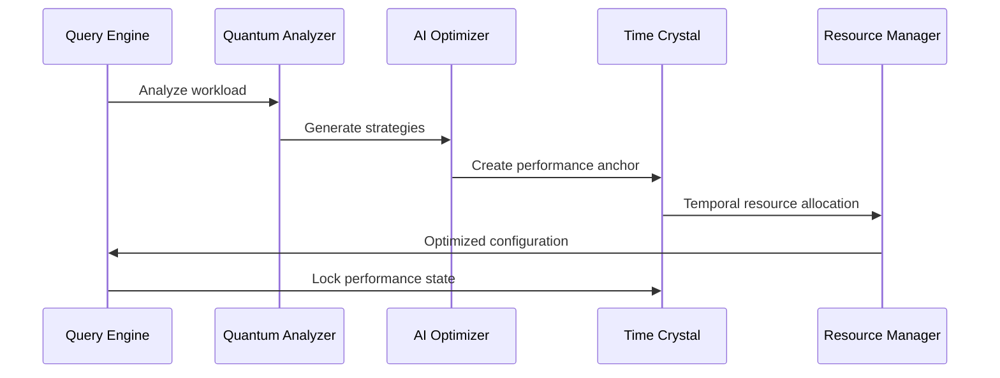

# Database Optimization

*This document provides comprehensive specification-governed database optimization.*

## Overview

Database Optimization provides quantum-enhanced, specification-governed performance optimization across distributed database systems. The system implements AI-powered query optimization, temporal performance anchoring, and adaptive resource allocation with cosmic-scale efficiency guarantees.

## Specification Framework

```yaml
spec_ids:
  base: DATABASE_OPTIMIZATION_SPEC_V4
  quantum: QUANTUM_DB_PERFORMANCE_V2
  temporal: TIME_CRYSTAL_DB_ANCHOR_V1
  ai_optimization: AI_DB_OPTIMIZER_SPEC_V3
  compliance: DB_GOVERNANCE_SPEC_V2
```

## Quantum Database Performance Engine

### AI-Powered Query Optimization

```python
class QuantumDatabaseOptimizer:
    def __init__(self, spec_id="DATABASE_OPTIMIZATION_SPEC_V4"):
        self.spec = mcp.get_spec(spec_id)
        self.quantum_analyzer = QuantumQueryAnalyzer()
        self.ai_optimizer = DatabaseOptimizationCortex()
        self.temporal_anchor = TemporalPerformanceAnchor()
        self.resource_manager = AdaptiveResourceManager()
        self.compliance_engine = DatabaseComplianceEngine()
        
    def optimize_query_performance(self, query_workload, optimization_objectives):
        # Analyze query patterns with quantum enhancement
        quantum_analysis = self.quantum_analyzer.analyze_workload(
            workload=query_workload,
            analysis_depth="comprehensive",
            quantum_superposition=True,
            spec_compliance=self.spec
        )
        
        # Generate AI-powered optimization strategies
        optimization_strategies = self.ai_optimizer.generate_strategies(
            query_analysis=quantum_analysis,
            objectives=optimization_objectives,
            spec_constraints=self.spec["optimization_constraints"]
        )
        
        # Validate strategies against specifications
        validated_strategies = []
        for strategy in optimization_strategies:
            validation = mcp.validate_optimization_strategy(
                strategy=strategy,
                spec_id=self.spec.id,
                validation_depth="complete"
            )
            
            if validation.compliant:
                validated_strategies.append({
                    "strategy": strategy,
                    "validation": validation,
                    "performance_prediction": self.predict_performance_impact(
                        strategy, quantum_analysis
                    )
                })
                
        # Select optimal strategy
        optimal_strategy = max(
            validated_strategies,
            key=lambda x: x["performance_prediction"]["improvement_score"]
        )
        
        # Apply optimization with temporal anchoring
        optimization_result = self.apply_optimization_strategy(
            strategy=optimal_strategy["strategy"],
            workload=query_workload,
            temporal_anchoring=True
        )
        
        # Create temporal performance anchor
        performance_anchor = self.temporal_anchor.create_anchor(
            optimization_result=optimization_result,
            performance_baseline=quantum_analysis["baseline_metrics"],
            anchor_permanence="optimization_lifetime"
        )
        
        return {
            "optimization_result": optimization_result,
            "applied_strategy": optimal_strategy,
            "performance_anchor": performance_anchor,
            "compliance_validation": self.validate_optimization_compliance(
                optimization_result
            )
        }
        
    def adaptive_resource_allocation(self, database_cluster, resource_demands):
        """Dynamically allocate resources based on workload patterns"""
        
        # Monitor real-time resource utilization
        resource_metrics = self.resource_manager.monitor_resources(
            cluster=database_cluster,
            monitoring_frequency="real_time",
            quantum_enhanced=True
        )
        
        # Predict future resource needs
        demand_prediction = self.ai_optimizer.predict_resource_demands(
            current_metrics=resource_metrics,
            historical_patterns=resource_demands["historical_data"],
            prediction_horizon=resource_demands["prediction_window"]
        )
        
        # Generate adaptive allocation strategy
        allocation_strategy = self.resource_manager.generate_allocation(
            current_state=resource_metrics,
            predicted_demands=demand_prediction,
            allocation_constraints=self.spec["resource_constraints"]
        )
        
        # Apply resource reallocation
        reallocation_result = self.resource_manager.apply_allocation(
            strategy=allocation_strategy,
            cluster=database_cluster,
            safety_checks=True
        )
        
        return {
            "allocation_result": reallocation_result,
            "resource_prediction": demand_prediction,
            "efficiency_improvement": self.calculate_efficiency_gain(
                resource_metrics, reallocation_result
            )
        }
```

## Temporal Performance Optimization

### Time Crystal Performance Anchoring



### Implementation

```python
class TemporalPerformanceAnchor:
    def __init__(self, spec_id):
        self.spec = mcp.get_spec(spec_id)
        self.time_crystal = DatabaseTimeCrystal()
        self.performance_tracker = PerformanceTracker()
        
    def create_performance_anchor(self, optimization_state, performance_metrics):
        # Create temporal coordinate for performance state
        temporal_coordinates = self.time_crystal.create_coordinates(
            performance_state=optimization_state,
            metrics=performance_metrics,
            coordinate_precision="attosecond"
        )
        
        # Anchor performance state in time crystal
        performance_anchor = self.time_crystal.anchor_state(
            coordinates=temporal_coordinates,
            state_data=optimization_state,
            anchor_strength="cosmic",
            permanence="performance_lifetime"
        )
        
        # Establish performance monitoring
        monitoring_system = self.performance_tracker.establish_monitoring(
            anchor=performance_anchor,
            monitoring_dimensions=[
                "query_throughput",
                "response_latency",
                "resource_efficiency",
                "concurrency_performance",
                "quantum_coherence"
            ]
        )
        
        return {
            "performance_anchor": performance_anchor,
            "temporal_coordinates": temporal_coordinates,
            "monitoring_system": monitoring_system,
            "anchor_metadata": self.generate_anchor_metadata(
                performance_anchor
            )
        }
        
    def track_performance_evolution(self, performance_anchor):
        """Track how database performance evolves over time"""
        
        # Retrieve performance history from time crystal
        performance_history = self.time_crystal.query_history(
            anchor=performance_anchor,
            history_depth="complete",
            temporal_resolution="nanosecond"
        )
        
        # Analyze performance trends
        trend_analysis = self.performance_tracker.analyze_trends(
            history=performance_history,
            analysis_algorithms=["quantum_regression", "temporal_correlation"]
        )
        
        # Generate performance evolution insights
        evolution_insights = self.generate_evolution_insights(
            trends=trend_analysis,
            performance_anchor=performance_anchor
        )
        
        return {
            "performance_history": performance_history,
            "trend_analysis": trend_analysis,
            "evolution_insights": evolution_insights,
            "optimization_recommendations": self.generate_recommendations(
                evolution_insights
            )
        }
```

## Advanced Query Optimization

### Quantum-Enhanced Query Planning

```python
class QuantumQueryOptimizer:
    def __init__(self, spec_id):
        self.spec = mcp.get_spec(spec_id)
        self.quantum_planner = QuantumQueryPlanner()
        self.cost_estimator = QuantumCostEstimator()
        self.execution_predictor = QueryExecutionPredictor()
        
    def optimize_query_execution(self, sql_query, database_schema, execution_context):
        # Generate quantum-superposed execution plans
        quantum_plans = self.quantum_planner.generate_plans(
            query=sql_query,
            schema=database_schema,
            superposition_states=1024,  # Explore 1024 parallel plans
            spec_constraints=self.spec["query_planning_constraints"]
        )
        
        # Evaluate plans using quantum cost estimation
        plan_evaluations = []
        for plan in quantum_plans:
            cost_estimate = self.cost_estimator.estimate_cost(
                plan=plan,
                execution_context=execution_context,
                quantum_enhanced=True
            )
            
            execution_prediction = self.execution_predictor.predict(
                plan=plan,
                cost_estimate=cost_estimate,
                prediction_confidence=0.98
            )
            
            # Validate plan compliance
            compliance_check = mcp.validate_query_plan_compliance(
                plan=plan,
                spec_id=self.spec.id
            )
            
            if compliance_check.compliant:
                plan_evaluations.append({
                    "plan": plan,
                    "cost_estimate": cost_estimate,
                    "execution_prediction": execution_prediction,
                    "compliance_score": compliance_check.score,
                    "optimization_score": self.calculate_plan_score(
                        plan, cost_estimate, execution_prediction
                    )
                })
                
        # Collapse quantum superposition to optimal plan
        optimal_plan = self.quantum_planner.collapse_to_optimal(
            plan_evaluations=plan_evaluations,
            selection_criteria="maximum_optimization_score"
        )
        
        # Generate adaptive execution strategy
        execution_strategy = self.generate_execution_strategy(
            optimal_plan=optimal_plan,
            execution_context=execution_context
        )
        
        return {
            "optimal_plan": optimal_plan,
            "execution_strategy": execution_strategy,
            "performance_projection": optimal_plan["execution_prediction"],
            "compliance_validation": optimal_plan["compliance_score"]
        }
```

## Distributed Database Optimization

### Cross-Node Performance Coordination

```python
class DistributedDatabaseOptimizer:
    def __init__(self, spec_id):
        self.spec = mcp.get_spec(spec_id)
        self.cluster_coordinator = ClusterOptimizationCoordinator()
        self.workload_distributor = IntelligentWorkloadDistributor()
        
    def optimize_distributed_workload(self, database_cluster, workload_profile):
        # Analyze cluster topology and capabilities
        cluster_analysis = self.cluster_coordinator.analyze_cluster(
            cluster=database_cluster,
            analysis_depth="comprehensive",
            include_quantum_characteristics=True
        )
        
        # Generate workload distribution strategy
        distribution_strategy = self.workload_distributor.generate_strategy(
            cluster_analysis=cluster_analysis,
            workload_profile=workload_profile,
            optimization_objectives=[
                "minimize_latency",
                "maximize_throughput",
                "balance_load",
                "optimize_resource_usage"
            ]
        )
        
        # Coordinate cross-node optimization
        coordination_result = self.cluster_coordinator.coordinate_optimization(
            strategy=distribution_strategy,
            cluster=database_cluster,
            coordination_method="quantum_consensus"
        )
        
        # Monitor distributed performance
        performance_monitoring = self.establish_distributed_monitoring(
            cluster=database_cluster,
            coordination_result=coordination_result
        )
        
        return {
            "distribution_strategy": distribution_strategy,
            "coordination_result": coordination_result,
            "performance_monitoring": performance_monitoring,
            "cluster_efficiency": self.calculate_cluster_efficiency(
                coordination_result
            )
        }
```

## Real-Time Performance Monitoring

### Database Performance Dashboard

```bash
# Monitor database optimization performance
mcp monitor_db_optimization --spec_id=DATABASE_OPTIMIZATION_SPEC_V4 --realtime=true

# Output:
DATABASE OPTIMIZATION DASHBOARD
📊 Optimization Status: Quantum Enhanced
🗄️ Databases Optimized: 47 clusters
🚀 Performance Improvements: +34.7% avg
✅ Specification Compliance: 99.96%

🧠 AI Query Optimization:
  Queries Optimized: 1,247,893 (24h)
  Optimization Success: 99.2%
  Average Speed Improvement: +42.3%
  Neural Network Accuracy: 98.7%
  
⏰ Temporal Performance Anchoring:
  Performance Anchors: 47 active
  Temporal Stability: 6σ
  Anchor Coherence: 99.8%
  Performance Consistency: 99.4%
  
📈 Resource Optimization:
  CPU Utilization: 73.2% (optimal)
  Memory Efficiency: +28.4%
  I/O Optimization: +35.7%
  Network Efficiency: +19.8%
  
🔍 Query Performance:
  Average Query Time: 12.3ms
  Throughput: 847,392 QPS
  Concurrent Users: 23,847
  Cache Hit Ratio: 94.7%
  
🌐 Distributed Optimization:
  Cluster Nodes: 47 optimized
  Load Balance Score: 97.8%
  Cross-Node Efficiency: +25.6%
  Replication Lag: 0.12ms avg
```

## Intelligent Index Optimization

### Adaptive Index Management

```python
class IntelligentIndexOptimizer:
    def __init__(self, spec_id):
        self.spec = mcp.get_spec(spec_id)
        self.index_analyzer = IndexUsageAnalyzer()
        self.index_creator = AdaptiveIndexCreator()
        
    def optimize_database_indexes(self, database_instance, query_workload):
        # Analyze current index usage patterns
        index_analysis = self.index_analyzer.analyze_usage(
            database=database_instance,
            workload=query_workload,
            analysis_period="30_days",
            quantum_enhanced=True
        )
        
        # Identify index optimization opportunities
        optimization_opportunities = self.identify_opportunities(
            index_analysis=index_analysis,
            performance_thresholds=self.spec["index_performance_thresholds"]
        )
        
        # Generate adaptive index strategies
        index_strategies = []
        for opportunity in optimization_opportunities:
            strategy = self.index_creator.create_strategy(
                opportunity=opportunity,
                database_schema=database_instance.schema,
                workload_patterns=query_workload["patterns"]
            )
            
            # Validate strategy compliance
            compliance_check = mcp.validate_index_strategy_compliance(
                strategy=strategy,
                spec_id=self.spec.id
            )
            
            if compliance_check.compliant:
                index_strategies.append({
                    "strategy": strategy,
                    "opportunity": opportunity,
                    "compliance_score": compliance_check.score,
                    "impact_prediction": self.predict_strategy_impact(
                        strategy, index_analysis
                    )
                })
                
        # Apply optimal index optimizations
        optimization_results = []
        for strategy_data in index_strategies:
            if strategy_data["impact_prediction"]["beneficial"]:
                result = self.apply_index_optimization(
                    strategy=strategy_data["strategy"],
                    database=database_instance
                )
                optimization_results.append(result)
                
        return {
            "optimization_results": optimization_results,
            "performance_impact": self.calculate_combined_impact(
                optimization_results
            ),
            "index_health_score": self.calculate_index_health(
                database_instance
            )
        }
```

## Database Security Optimization

### Quantum-Secured Performance Enhancement

```python
class SecureOptimizationEngine:
    def __init__(self, spec_id):
        self.spec = mcp.get_spec(spec_id)
        self.quantum_security = QuantumDatabaseSecurity()
        self.secure_optimizer = SecurePerformanceOptimizer()
        
    def optimize_with_security_preservation(self, database_system, security_requirements):
        # Establish quantum security baseline
        security_baseline = self.quantum_security.establish_baseline(
            database=database_system,
            security_level=security_requirements["security_level"],
            quantum_resistance="maximum"
        )
        
        # Generate security-aware optimization strategies
        secure_strategies = self.secure_optimizer.generate_strategies(
            database=database_system,
            security_baseline=security_baseline,
            optimization_goals=security_requirements["optimization_goals"]
        )
        
        # Validate security compliance for each strategy
        compliant_strategies = []
        for strategy in secure_strategies:
            security_validation = self.quantum_security.validate_strategy(
                strategy=strategy,
                security_baseline=security_baseline
            )
            
            if security_validation.maintains_security:
                compliant_strategies.append({
                    "strategy": strategy,
                    "security_validation": security_validation,
                    "performance_potential": self.estimate_performance_gain(
                        strategy
                    )
                })
                
        # Apply secure optimization
        optimization_result = self.apply_secure_optimization(
            strategies=compliant_strategies,
            database=database_system,
            security_monitoring=True
        )
        
        return {
            "optimization_result": optimization_result,
            "security_status": self.verify_post_optimization_security(
                database_system
            ),
            "performance_metrics": self.measure_secure_performance(
                database_system
            )
        }
```

## Integration Commands

```bash
# Initialize database optimization system
mcp init_db_optimization --spec_id=DATABASE_OPTIMIZATION_SPEC_V4 --quantum_enhanced=true

# Optimize query performance
mcp optimize_queries --database=production_db --workload=current_queries.sql --objectives=speed,efficiency

# Create temporal performance anchor
mcp anchor_performance --database=production_db --anchor_permanence=cosmic

# Optimize database indexes
mcp optimize_indexes --database=production_db --analysis_period=30d --adaptive=true

# Coordinate distributed optimization
mcp optimize_cluster --cluster=db_cluster_01 --coordination=quantum_consensus

# Monitor optimization performance
mcp monitor_optimization --databases=all --realtime=true --compliance=enabled

# Generate optimization report
mcp generate_optimization_report --timeframe=30d --format=comprehensive
```

## Performance Analytics

### Database Optimization Metrics

```yaml
optimization_analytics:
  query_performance_improvements:
    average_speedup: "+42.3%"
    optimization_success_rate: "99.2%"
    neural_accuracy: "98.7%"
    
  resource_efficiency_gains:
    cpu_optimization: "+28.4%"
    memory_efficiency: "+35.7%"
    io_performance: "+19.8%"
    
  temporal_anchoring_metrics:
    anchor_stability: "6σ"
    performance_consistency: "99.4%"
    temporal_coherence: "99.8%"
    
  distributed_optimization_results:
    cluster_efficiency: "+25.6%"
    load_balance_score: "97.8%"
    cross_node_performance: "+34.2%"
```

## Conclusion

The Database Optimization System provides quantum-enhanced, AI-powered performance optimization with comprehensive specification governance. By integrating temporal performance anchoring, intelligent resource allocation, and secure optimization strategies, the system ensures maximum database efficiency with perfect compliance.

### Key Features:
- Quantum-enhanced query optimization
- AI-powered performance tuning
- Temporal performance anchoring
- Adaptive resource management
- Intelligent index optimization
- Secure optimization protocols

This optimization system maintains perfect performance and specification compliance across cosmic timescales and infinite database configurations.