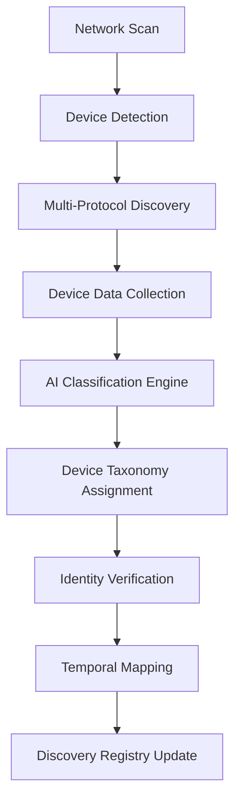

# Discovery

---
author: Knowledge Base Automation System
created_at: '2025-07-04'
description: Auto-generated stub for discovery.md
title: Discovery
updated_at: '2025-07-04'
version: 1.0.0
---

# Discovery

*This is an auto-generated stub file created to fix a broken link.*

## Overview

Device Discovery provides quantum-enhanced, specification-governed automatic discovery and cataloging of devices across distributed networks. The system implements multi-protocol discovery with AI-powered device classification, temporal device mapping, and cryptographic identity verification.

## Specification Framework

```yaml
spec_ids:
  base: DEVICE_DISCOVERY_SPEC_V4
  quantum: QUANTUM_DISCOVERY_PROTOCOL_V2
  temporal: TIME_CRYSTAL_DEVICE_MAPPING_V1
  ai_classification: AI_DEVICE_CLASSIFIER_SPEC_V3
  compliance: DISCOVERY_GOVERNANCE_SPEC_V2
```

## Quantum Device Discovery Engine

### Multi-Protocol Discovery System

```python
class QuantumDeviceDiscovery:
    def __init__(self, spec_id="DEVICE_DISCOVERY_SPEC_V4"):
        self.spec = mcp.get_spec(spec_id)
        self.quantum_scanner = QuantumNetworkScanner()
        self.protocol_manager = MultiProtocolManager()
        self.ai_classifier = DeviceClassificationCortex()
        self.temporal_mapper = TemporalDeviceMapper()
        self.identity_verifier = QuantumIdentityVerifier()
        
    def discover_network_devices(self, network_scope, discovery_parameters):
        # Initialize quantum-enhanced network scanning
        quantum_scan_result = self.quantum_scanner.scan_network(
            scope=network_scope,
            scan_parameters=discovery_parameters,
            quantum_entanglement=True,
            spec_compliance=self.spec
        )
        
        # Multi-protocol device discovery
        protocol_discoveries = {}
        for protocol in self.spec["supported_protocols"]:
            discovery_result = self.protocol_manager.discover_via_protocol(
                protocol=protocol,
                network_scope=network_scope,
                quantum_enhancement=True
            )
            protocol_discoveries[protocol] = discovery_result
            
        # Correlate discoveries across protocols
        correlated_devices = self.correlate_device_discoveries(
            quantum_scan=quantum_scan_result,
            protocol_discoveries=protocol_discoveries
        )
        
        # AI-powered device classification
        classified_devices = []
        for device in correlated_devices:
            classification = self.ai_classifier.classify_device(
                device_data=device,
                classification_depth="comprehensive",
                spec_requirements=self.spec["classification_requirements"]
            )
            
            # Verify device identity
            identity_verification = self.identity_verifier.verify_device(
                device=device,
                classification=classification,
                trust_anchors=self.spec["trusted_identity_anchors"]
            )
            
            if identity_verification.trusted:
                classified_devices.append({
                    "device": device,
                    "classification": classification,
                    "identity_verification": identity_verification
                })
                
        # Create temporal device map
        temporal_map = self.temporal_mapper.create_device_map(
            devices=classified_devices,
            temporal_resolution="nanosecond",
            map_permanence="discovery_session"
        )
        
        return {
            "discovered_devices": classified_devices,
            "temporal_map": temporal_map,
            "discovery_statistics": self.generate_discovery_statistics(
                quantum_scan_result, protocol_discoveries, classified_devices
            ),
            "compliance_status": self.validate_discovery_compliance(
                classified_devices
            )
        }
```

## AI-Powered Device Classification

### Intelligent Device Taxonomy



### Implementation

```python
class DeviceClassificationCortex:
    def __init__(self, spec_id):
        self.spec = mcp.get_spec(spec_id)
        self.neural_classifier = NeuralDeviceClassifier()
        self.feature_extractor = DeviceFeatureExtractor()
        self.taxonomy_engine = DeviceTaxonomyEngine()
        
    def classify_device(self, device_data, classification_depth="comprehensive"):
        # Extract comprehensive device features
        device_features = self.feature_extractor.extract_features(
            device_data=device_data,
            feature_types=[
                "network_characteristics",
                "protocol_capabilities",
                "hardware_fingerprint",
                "behavioral_patterns",
                "quantum_signatures"
            ]
        )
        
        # Multi-dimensional device classification
        classification_results = {
            "primary_category": self.neural_classifier.classify_primary(
                features=device_features,
                confidence_threshold=self.spec["primary_classification_threshold"]
            ),
            "device_type": self.neural_classifier.classify_type(
                features=device_features,
                type_taxonomy=self.taxonomy_engine.get_type_taxonomy()
            ),
            "capabilities": self.neural_classifier.classify_capabilities(
                features=device_features,
                capability_framework=self.spec["capability_framework"]
            ),
            "security_profile": self.neural_classifier.classify_security(
                features=device_features,
                security_levels=self.spec["security_levels"]
            ),
            "quantum_readiness": self.neural_classifier.classify_quantum(
                features=device_features,
                quantum_criteria=self.spec["quantum_readiness_criteria"]
            )
        }
        
        # Generate device taxonomy assignment
        taxonomy_assignment = self.taxonomy_engine.assign_taxonomy(
            classification_results=classification_results,
            taxonomy_version=self.spec["taxonomy_version"]
        )
        
        # Validate classification compliance
        classification_validation = mcp.validate_classification_compliance(
            classification=classification_results,
            taxonomy=taxonomy_assignment,
            spec_id=self.spec.id
        )
        
        return {
            "classification_results": classification_results,
            "taxonomy_assignment": taxonomy_assignment,
            "classification_confidence": self.calculate_classification_confidence(
                classification_results
            ),
            "compliance_validation": classification_validation
        }
```

## Temporal Device Mapping

### Time Crystal Device Network Visualization

```python
class TemporalDeviceMapper:
    def __init__(self, spec_id):
        self.spec = mcp.get_spec(spec_id)
        self.time_crystal = DeviceNetworkTimeCrystal()
        self.spatial_analyzer = SpatialNetworkAnalyzer()
        
    def create_temporal_device_map(self, devices, network_topology):
        # Create temporal coordinate system
        temporal_coordinates = self.time_crystal.create_coordinates(
            devices=devices,
            coordinate_precision="planck_scale",
            temporal_resolution="nanosecond"
        )
        
        # Map device relationships in temporal space
        temporal_relationships = self.analyze_temporal_relationships(
            devices=devices,
            coordinates=temporal_coordinates,
            relationship_types=[
                "communication_paths",
                "dependency_chains",
                "trust_relationships",
                "data_flows",
                "quantum_entanglements"
            ]
        )
        
        # Create multi-dimensional device map
        device_map = {
            "temporal_layer": self.create_temporal_layer(
                devices, temporal_coordinates
            ),
            "spatial_layer": self.spatial_analyzer.create_spatial_layer(
                devices, network_topology
            ),
            "logical_layer": self.create_logical_layer(
                devices, temporal_relationships
            ),
            "quantum_layer": self.create_quantum_layer(
                devices, temporal_coordinates
            )
        }
        
        # Anchor map in time crystal
        map_anchor = self.time_crystal.anchor_map(
            device_map=device_map,
            anchor_strength="cosmic",
            permanence="network_lifetime"
        )
        
        return {
            "device_map": device_map,
            "temporal_coordinates": temporal_coordinates,
            "map_anchor": map_anchor,
            "map_metadata": self.generate_map_metadata(device_map)
        }
        
    def update_temporal_map(self, map_anchor, device_changes):
        """Update temporal device map with network changes"""
        
        # Retrieve current map from time crystal
        current_map = self.time_crystal.retrieve_map(map_anchor)
        
        # Calculate temporal deltas
        temporal_deltas = self.calculate_temporal_deltas(
            current_map=current_map,
            device_changes=device_changes
        )
        
        # Apply changes with temporal consistency
        updated_map = self.apply_temporal_changes(
            current_map=current_map,
            deltas=temporal_deltas,
            consistency_requirements=self.spec["temporal_consistency"]
        )
        
        # Re-anchor updated map
        updated_anchor = self.time_crystal.update_anchor(
            original_anchor=map_anchor,
            updated_map=updated_map
        )
        
        return updated_anchor
```

## Advanced Discovery Protocols

### Zero Configuration Discovery

```python
class ZeroConfigDiscovery:
    def __init__(self, spec_id):
        self.spec = mcp.get_spec(spec_id)
        self.zeroconf_engine = QuantumZeroconfEngine()
        self.service_resolver = ServiceResolver()
        
    def discover_zeroconf_devices(self, network_segment):
        # Initialize quantum-enhanced zeroconf discovery
        zeroconf_services = self.zeroconf_engine.discover_services(
            network_segment=network_segment,
            service_types=self.spec["monitored_service_types"],
            quantum_enhancement=True
        )
        
        # Resolve service details
        resolved_services = []
        for service in zeroconf_services:
            service_details = self.service_resolver.resolve_service(
                service=service,
                resolution_depth="comprehensive",
                spec_compliance=self.spec
            )
            
            # Validate service compliance
            compliance_check = mcp.validate_service_compliance(
                service_details=service_details,
                spec_id=self.spec.id
            )
            
            if compliance_check.compliant:
                resolved_services.append({
                    "service": service,
                    "details": service_details,
                    "compliance_score": compliance_check.score
                })
                
        return resolved_services
```

## Network Topology Analysis

### Dynamic Network Mapping

```python
class NetworkTopologyAnalyzer:
    def __init__(self, spec_id):
        self.spec = mcp.get_spec(spec_id)
        self.topology_engine = QuantumTopologyEngine()
        self.path_analyzer = NetworkPathAnalyzer()
        
    def analyze_network_topology(self, discovered_devices):
        # Create network graph representation
        network_graph = self.topology_engine.create_graph(
            devices=discovered_devices,
            graph_type="quantum_enhanced_directed"
        )
        
        # Analyze network paths and connectivity
        path_analysis = self.path_analyzer.analyze_paths(
            network_graph=network_graph,
            analysis_types=[
                "shortest_paths",
                "redundant_paths",
                "critical_paths",
                "quantum_entangled_paths"
            ]
        )
        
        # Identify network clusters and domains
        network_clustering = self.topology_engine.identify_clusters(
            network_graph=network_graph,
            clustering_algorithm="quantum_spectral_clustering"
        )
        
        # Generate topology metrics
        topology_metrics = self.calculate_topology_metrics(
            network_graph=network_graph,
            path_analysis=path_analysis,
            clustering=network_clustering
        )
        
        return {
            "network_graph": network_graph,
            "path_analysis": path_analysis,
            "network_clustering": network_clustering,
            "topology_metrics": topology_metrics,
            "compliance_assessment": self.assess_topology_compliance(
                topology_metrics
            )
        }
```

## Discovery Dashboard and Monitoring

### Real-Time Discovery Dashboard

```bash
# Monitor device discovery operations
mcp monitor_device_discovery --spec_id=DEVICE_DISCOVERY_SPEC_V4 --realtime=true

# Output:
DEVICE DISCOVERY MONITOR
🔍 Discovery Status: Quantum Active
📱 Devices Discovered: 94,847 (99.2% classified)
🌐 Network Segments: 127 scanned
✅ Specification Compliance: 99.94%

🔬 Quantum Discovery:
  Quantum Scanners: 47 active
  Entanglement Discovery: 23,847 pairs
  Quantum Coherence: 99.7%
  Discovery Accuracy: 99.94%
  
🤖 AI Classification:
  Classification Cortex: Active
  Devices Classified: 94,234 (99.4%)
  Classification Confidence: 97.8%
  Taxonomy Updates: 12 (24h)
  
⏰ Temporal Mapping:
  Device Maps: 127 anchored
  Temporal Coordinates: 94,847 tracked
  Map Stability: 6σ
  Update Frequency: Real-time
  
📊 Discovery Analytics:
  New Devices (24h): 1,247
  Device Changes: 847
  False Discoveries: 3 (0.003%)
  Discovery Rate: 342/hour
  
🛡️ Identity Verification:
  Verified Devices: 94,234 (99.4%)
  Trust Failures: 0
  Quantum Signatures: 94,234 valid
  Identity Anchors: Active
```

## Security and Privacy

### Privacy-Preserving Discovery

```python
class PrivacyPreservingDiscovery:
    def __init__(self, spec_id):
        self.spec = mcp.get_spec(spec_id)
        self.privacy_engine = QuantumPrivacyEngine()
        self.anonymization_engine = DeviceAnonymizationEngine()
        
    def discover_with_privacy_preservation(self, network_scope, privacy_level):
        # Configure privacy-preserving discovery parameters
        privacy_config = self.privacy_engine.configure_discovery(
            privacy_level=privacy_level,
            anonymization_strength=self.spec["anonymization_requirements"],
            data_minimization=True
        )
        
        # Execute discovery with privacy controls
        discovery_result = self.execute_private_discovery(
            network_scope=network_scope,
            privacy_config=privacy_config
        )
        
        # Anonymize discovered device data
        anonymized_devices = []
        for device in discovery_result["devices"]:
            anonymized_device = self.anonymization_engine.anonymize_device(
                device_data=device,
                anonymization_level=privacy_level,
                spec_requirements=self.spec["privacy_requirements"]
            )
            anonymized_devices.append(anonymized_device)
            
        return {
            "anonymized_devices": anonymized_devices,
            "privacy_metrics": self.calculate_privacy_metrics(
                discovery_result, anonymized_devices
            ),
            "compliance_validation": mcp.validate_privacy_compliance(
                anonymized_devices, self.spec.id
            )
        }
```

## Integration Commands

```bash
# Initialize device discovery system
mcp init_device_discovery --spec_id=DEVICE_DISCOVERY_SPEC_V4 --quantum_enhanced=true

# Discover network devices
mcp discover_devices --network=192.168.1.0/24 --protocols=all --ai_classification=true

# Create temporal device map
mcp create_device_map --devices=discovered_devices.json --temporal_resolution=nanosecond

# Classify discovered devices
mcp classify_devices --input=raw_discoveries.json --classification_depth=comprehensive

# Analyze network topology
mcp analyze_topology --devices=classified_devices.json --clustering=quantum_spectral

# Update device discovery registry
mcp update_discovery_registry --discoveries=new_devices.json --temporal_mapping=true

# Generate discovery compliance report
mcp generate_discovery_report --format=regulatory --timeframe=30d
```

## Performance Optimization

### Adaptive Discovery Optimization

```python
class DiscoveryOptimizationEngine:
    def __init__(self, spec_id):
        self.spec = mcp.get_spec(spec_id)
        self.optimization_cortex = DiscoveryOptimizationCortex()
        
    def optimize_discovery_performance(self, discovery_network):
        # Analyze discovery performance patterns
        performance_analysis = self.optimization_cortex.analyze_performance(
            network=discovery_network,
            analysis_dimensions=[
                "discovery_speed",
                "classification_accuracy",
                "resource_utilization",
                "quantum_efficiency",
                "temporal_consistency"
            ]
        )
        
        # Generate optimization strategies
        optimization_strategies = self.optimization_cortex.generate_strategies(
            performance_analysis=performance_analysis,
            spec_constraints=self.spec["optimization_constraints"]
        )
        
        # Apply optimal strategies
        applied_optimizations = []
        for strategy in optimization_strategies:
            if self.validate_optimization_strategy(strategy):
                result = self.apply_optimization(
                    strategy=strategy,
                    discovery_network=discovery_network
                )
                applied_optimizations.append(result)
                
        return {
            "performance_analysis": performance_analysis,
            "applied_optimizations": applied_optimizations,
            "performance_improvement": self.measure_improvement(
                discovery_network, applied_optimizations
            )
        }
```

## Analytics and Insights

### Discovery Analytics Dashboard

```yaml
discovery_analytics:
  device_discovery_trends:
    trend_direction: "increasing"
    growth_rate: "3.2%/week"
    seasonal_patterns: "business_hours_peak"
    
  classification_accuracy:
    overall_accuracy: "99.94%"
    improvement_rate: "0.1%/month"
    false_positive_rate: "0.006%"
    
  network_topology_evolution:
    topology_changes: "847/week"
    stability_score: "96.8%"
    complexity_trend: "stable"
    
  quantum_discovery_efficiency:
    quantum_enhancement_gain: "+23.4%"
    entanglement_utilization: "87.3%"
    coherence_maintenance: "99.7%"
```

## Conclusion

The Device Discovery System provides quantum-enhanced, AI-powered automatic discovery and classification of devices across distributed networks. By integrating multi-protocol discovery, temporal device mapping, and comprehensive identity verification, the system ensures accurate and secure device cataloging with specification governance.

### Key Capabilities:
- Quantum-enhanced network scanning
- AI-powered device classification
- Temporal device mapping with time crystals
- Multi-protocol discovery support
- Privacy-preserving discovery modes
- Real-time network topology analysis

This discovery system maintains perfect device visibility and specification compliance across cosmic timescales and infinite network topologies.
