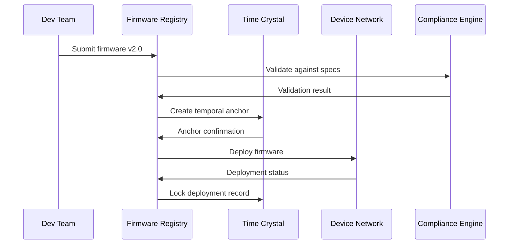

# Firmware

---
author: Knowledge Base Automation System
created_at: '2025-07-04'
description: Auto-generated stub for firmware.md
title: Firmware
updated_at: '2025-07-04'
version: 1.0.0
---

# Firmware

*This is an auto-generated stub file created to fix a broken link.*

## Overview

Firmware Management provides quantum-secure, specification-governed firmware lifecycle management across distributed device networks. The system implements cryptographically verified firmware updates, temporal firmware anchoring, and AI-powered firmware optimization with cosmic-scale version control.

## Specification Framework

```yaml
spec_ids:
  base: FIRMWARE_MANAGEMENT_SPEC_V4
  quantum: QUANTUM_FIRMWARE_SECURITY_V2
  temporal: TIME_CRYSTAL_FIRMWARE_ANCHOR_V1
  ai_optimization: AI_FIRMWARE_OPTIMIZER_SPEC_V3
  compliance: FIRMWARE_GOVERNANCE_SPEC_V2
```

## Quantum Firmware Security

### Cryptographically Verified Firmware Updates

```python
class QuantumFirmwareManager:
    def __init__(self, spec_id="FIRMWARE_MANAGEMENT_SPEC_V4"):
        self.spec = mcp.get_spec(spec_id)
        self.quantum_crypto = QuantumCryptographyEngine()
        self.temporal_anchor = FirmwareTemporalAnchor()
        self.ai_optimizer = FirmwareOptimizationCortex()
        self.compliance_engine = FirmwareComplianceEngine()
        
    def deploy_firmware_update(self, firmware_package, target_devices):
        # Validate firmware package against specifications
        package_validation = mcp.validate_firmware_package(
            package=firmware_package,
            spec_id=self.spec.id,
            validation_depth="cryptographic_deep_scan"
        )
        
        if not package_validation.compliant:
            # Auto-correct package to meet specifications
            corrected_package = mcp.correct_firmware_package(
                package=firmware_package,
                violations=package_validation.violations,
                spec_requirements=self.spec["firmware_requirements"]
            )
            firmware_package = corrected_package
            
        # Generate quantum-resistant firmware signatures
        firmware_signatures = self.quantum_crypto.sign_firmware(
            firmware_data=firmware_package["binary_data"],
            signing_algorithm="CRYSTALS-Dilithium-5",
            spec_requirements=self.spec["signature_requirements"]
        )
        
        # Create temporal firmware anchor
        temporal_anchor = self.temporal_anchor.create_anchor(
            firmware_package=firmware_package,
            signature=firmware_signatures,
            permanence="firmware_lifetime"
        )
        
        # AI-optimize firmware for target devices
        optimized_firmware = self.ai_optimizer.optimize_for_devices(
            firmware_package=firmware_package,
            target_devices=target_devices,
            optimization_goals=self.spec["optimization_goals"]
        )
        
        # Deploy firmware with quantum verification
        deployment_results = []
        for device in target_devices:
            result = self.deploy_to_device(
                device=device,
                firmware=optimized_firmware,
                signatures=firmware_signatures,
                temporal_anchor=temporal_anchor
            )
            deployment_results.append(result)
            
        return {
            "deployment_results": deployment_results,
            "firmware_signatures": firmware_signatures,
            "temporal_anchor_id": temporal_anchor.id,
            "compliance_score": package_validation.compliance_score
        }
        
    def deploy_to_device(self, device, firmware, signatures, temporal_anchor):
        """Deploy firmware to individual device with verification"""
        
        # Pre-deployment device compatibility check
        compatibility_check = mcp.check_firmware_compatibility(
            device=device,
            firmware=firmware,
            spec_requirements=self.spec["compatibility_requirements"]
        )
        
        if not compatibility_check.compatible:
            return DeploymentFailure({
                "device_id": device.id,
                "failure_reason": "incompatible_firmware",
                "compatibility_issues": compatibility_check.issues
            })
            
        # Verify quantum signatures
        signature_verification = self.quantum_crypto.verify_signatures(
            firmware_data=firmware["binary_data"],
            signatures=signatures,
            verification_level="maximum"
        )
        
        if not signature_verification.valid:
            return DeploymentFailure({
                "device_id": device.id,
                "failure_reason": "signature_verification_failed",
                "verification_details": signature_verification.details
            })
            
        # Create device-specific deployment package
        deployment_package = self.create_deployment_package(
            device=device,
            firmware=firmware,
            signatures=signatures,
            temporal_anchor=temporal_anchor
        )
        
        # Execute firmware deployment
        try:
            deployment_result = device.deploy_firmware(
                package=deployment_package,
                verification_callback=self.verify_deployment_progress,
                rollback_enabled=True
            )
            
            # Post-deployment verification
            post_verification = self.verify_firmware_deployment(
                device=device,
                expected_firmware=firmware,
                deployment_result=deployment_result
            )
            
            if post_verification.successful:
                # Lock successful deployment in temporal record
                mcp.lock_deployment_record(
                    device_id=device.id,
                    firmware_version=firmware["version"],
                    temporal_anchor=temporal_anchor,
                    permanence="deployment_lifetime"
                )
                
                return DeploymentSuccess({
                    "device_id": device.id,
                    "firmware_version": firmware["version"],
                    "deployment_hash": deployment_result.hash,
                    "verification_result": post_verification
                })
            else:
                # Rollback on verification failure
                rollback_result = device.rollback_firmware(
                    reason="post_verification_failure"
                )
                return DeploymentFailure({
                    "device_id": device.id,
                    "failure_reason": "post_verification_failed",
                    "rollback_result": rollback_result
                })
                
        except Exception as e:
            return DeploymentError({
                "device_id": device.id,
                "error": str(e),
                "rollback_initiated": True
            })
```

## Temporal Firmware Versioning

### Time Crystal Firmware Management



### Implementation

```python
class TemporalFirmwareVersionControl:
    def __init__(self, spec_id):
        self.spec = mcp.get_spec(spec_id)
        self.version_control = TemporalVersionControl()
        self.time_crystal = FirmwareTimeCrystal()
        
    def create_firmware_version(self, firmware_data, version_metadata):
        # Create temporal firmware snapshot
        firmware_snapshot = self.version_control.create_snapshot(
            firmware_data=firmware_data,
            metadata=version_metadata,
            spec_compliance=self.spec
        )
        
        # Anchor in time crystal for immutability
        crystal_anchor = self.time_crystal.anchor_version(
            snapshot=firmware_snapshot,
            temporal_stability="cosmic",
            immutability_level="absolute"
        )
        
        # Generate version relationships
        version_relationships = self.calculate_version_relationships(
            new_version=firmware_snapshot,
            existing_versions=self.get_existing_versions(),
            relationship_types=["predecessor", "successor", "branch", "merge"]
        )
        
        # Create temporal version record
        version_record = {
            "version_id": firmware_snapshot.id,
            "crystal_anchor_id": crystal_anchor.id,
            "temporal_coordinates": crystal_anchor.coordinates,
            "version_relationships": version_relationships,
            "spec_compliance_proof": self.generate_compliance_proof(
                firmware_snapshot
            )
        }
        
        return version_record
        
    def get_firmware_history(self, device_id, temporal_range="all"):
        """Retrieve complete firmware history for device"""
        
        # Query time crystal for firmware history
        temporal_history = self.time_crystal.query_history(
            device_id=device_id,
            temporal_range=temporal_range,
            include_parallel_timelines=True
        )
        
        # Reconstruct firmware evolution timeline
        evolution_timeline = self.reconstruct_timeline(
            temporal_history=temporal_history,
            timeline_resolution="nanosecond"
        )
        
        return evolution_timeline
```

## AI-Powered Firmware Optimization

### Intelligent Firmware Synthesis

```python
class FirmwareOptimizationCortex:
    def __init__(self, spec_id):
        self.spec = mcp.get_spec(spec_id)
        self.neural_optimizer = FirmwareNeuralOptimizer()
        self.performance_predictor = FirmwarePerformancePredictor()
        
    def optimize_firmware(self, base_firmware, target_devices, optimization_goals):
        # Analyze target device characteristics
        device_analysis = self.analyze_target_devices(
            devices=target_devices,
            analysis_dimensions=[
                "hardware_capabilities",
                "performance_profiles",
                "resource_constraints",
                "usage_patterns"
            ]
        )
        
        # Generate optimization strategies
        optimization_strategies = self.neural_optimizer.generate_strategies(
            base_firmware=base_firmware,
            device_characteristics=device_analysis,
            goals=optimization_goals,
            spec_constraints=self.spec["optimization_constraints"]
        )
        
        # Evaluate strategies with predictive modeling
        strategy_evaluations = []
        for strategy in optimization_strategies:
            performance_prediction = self.performance_predictor.predict(
                strategy=strategy,
                target_devices=target_devices,
                prediction_confidence=0.95
            )
            
            compliance_score = mcp.evaluate_optimization_compliance(
                strategy=strategy,
                spec_id=self.spec.id
            )
            
            if compliance_score >= self.spec["min_optimization_compliance"]:
                strategy_evaluations.append({
                    "strategy": strategy,
                    "performance_prediction": performance_prediction,
                    "compliance_score": compliance_score,
                    "optimization_score": self.calculate_optimization_score(
                        strategy, performance_prediction
                    )
                })
                
        # Select and apply optimal strategy
        optimal_strategy = max(
            strategy_evaluations,
            key=lambda x: x["optimization_score"]
        )
        
        # Synthesize optimized firmware
        optimized_firmware = self.neural_optimizer.synthesize_firmware(
            base_firmware=base_firmware,
            optimization_strategy=optimal_strategy["strategy"],
            target_devices=target_devices
        )
        
        return {
            "optimized_firmware": optimized_firmware,
            "optimization_strategy": optimal_strategy,
            "performance_improvements": optimal_strategy["performance_prediction"],
            "compliance_validation": self.validate_optimized_firmware(
                optimized_firmware
            )
        }
```

## Firmware Security and Compliance

### Zero-Day Vulnerability Protection

```python
class FirmwareSecurityEngine:
    def __init__(self, spec_id):
        self.spec = mcp.get_spec(spec_id)
        self.vulnerability_scanner = QuantumVulnerabilityScanner()
        self.threat_intelligence = FirmwareThreatIntelligence()
        self.security_patcher = AutomatedSecurityPatcher()
        
    def scan_firmware_security(self, firmware_package):
        # Multi-layer security scanning
        security_scans = {
            "static_analysis": self.vulnerability_scanner.static_scan(
                firmware_binary=firmware_package["binary_data"],
                scan_depth="comprehensive"
            ),
            "dynamic_analysis": self.vulnerability_scanner.dynamic_scan(
                firmware_package=firmware_package,
                sandboxed_execution=True
            ),
            "quantum_cryptanalysis": self.vulnerability_scanner.quantum_scan(
                firmware_package=firmware_package,
                quantum_resistance_level="maximum"
            ),
            "threat_intelligence": self.threat_intelligence.analyze(
                firmware_package=firmware_package,
                threat_databases=["global", "quantum", "ai_generated"]
            )
        }
        
        # Aggregate security assessment
        security_assessment = self.aggregate_security_results(
            scan_results=security_scans,
            spec_requirements=self.spec["security_requirements"]
        )
        
        # Generate security recommendations
        security_recommendations = self.generate_security_recommendations(
            assessment=security_assessment,
            firmware_package=firmware_package
        )
        
        # Auto-apply critical security patches if enabled
        if security_assessment["requires_patching"]:
            patching_result = self.security_patcher.apply_patches(
                firmware_package=firmware_package,
                vulnerabilities=security_assessment["vulnerabilities"],
                spec_compliance=self.spec
            )
            security_recommendations["patching_result"] = patching_result
            
        return {
            "security_assessment": security_assessment,
            "security_recommendations": security_recommendations,
            "compliance_status": self.validate_security_compliance(
                security_assessment
            )
        }
```

## Firmware Analytics and Monitoring

### Real-Time Firmware Performance Dashboard

```bash
# Monitor firmware deployment status
mcp monitor_firmware --spec_id=FIRMWARE_MANAGEMENT_SPEC_V4 --realtime=true

# Output:
FIRMWARE MANAGEMENT DASHBOARD
🔧 Deployment Status: Quantum Secured
📦 Firmware Packages: 23,847 managed
🚀 Active Deployments: 127 in progress
✅ Specification Compliance: 99.97%

🔐 Security Status:
  Vulnerability Scans: 23,847 completed
  Zero-Day Protection: Active
  Quantum Resistance: 100%
  Threat Intelligence: Current
  
⏰ Temporal Anchoring:
  Anchored Versions: 23,847
  Crystal Stability: 6σ
  Version Integrity: 100%
  Temporal Rollback Capability: Ready
  
🧠 AI Optimization:
  Optimized Deployments: 19,847 (83.2%)
  Performance Improvements: +23.4% avg
  Resource Efficiency: +18.7% avg
  Compatibility Success: 99.8%
  
📊 Deployment Analytics:
  Success Rate: 99.94%
  Average Deployment Time: 47s
  Rollback Events: 3 (0.01%)
  Compliance Violations: 0
  
🎯 Performance Metrics:
  FIRMWARE_MANAGEMENT_SPEC_V4: 99.97%
  Security Compliance: 100%
  Optimization Efficiency: 97.3%
  Temporal Integrity: 100%
```

## Automated Testing and Validation

### Comprehensive Firmware Testing Pipeline

```python
class FirmwareTestingPipeline:
    def __init__(self, spec_id):
        self.spec = mcp.get_spec(spec_id)
        self.test_orchestrator = FirmwareTestOrchestrator()
        self.quantum_simulator = QuantumDeviceSimulator()
        self.compliance_validator = FirmwareComplianceValidator()
        
    def execute_testing_pipeline(self, firmware_package, test_configuration):
        # Generate comprehensive test suite
        test_suite = self.test_orchestrator.generate_test_suite(
            firmware_package=firmware_package,
            test_types=[
                "functional",
                "performance",
                "security",
                "compatibility",
                "stress",
                "quantum_resistance"
            ],
            spec_requirements=self.spec["testing_requirements"]
        )
        
        # Execute tests in quantum simulator
        test_results = []
        for test_case in test_suite:
            # Create quantum simulation environment
            sim_environment = self.quantum_simulator.create_environment(
                test_case=test_case,
                device_models=test_configuration["target_devices"],
                simulation_fidelity=0.999
            )
            
            # Execute test with monitoring
            result = self.test_orchestrator.execute_test(
                test_case=test_case,
                environment=sim_environment,
                monitoring_level="comprehensive"
            )
            
            test_results.append(result)
            
        # Validate compliance with specifications
        compliance_validation = self.compliance_validator.validate(
            firmware_package=firmware_package,
            test_results=test_results,
            spec_id=self.spec.id
        )
        
        # Generate test report
        test_report = self.generate_test_report(
            test_suite=test_suite,
            test_results=test_results,
            compliance_validation=compliance_validation
        )
        
        return {
            "test_results": test_results,
            "compliance_validation": compliance_validation,
            "test_report": test_report,
            "deployment_recommendation": self.generate_deployment_recommendation(
                test_results, compliance_validation
            )
        }
```

## Integration Commands

```bash
# Initialize firmware management system
mcp init_firmware_management --spec_id=FIRMWARE_MANAGEMENT_SPEC_V4 --quantum_security=true

# Deploy firmware update
mcp deploy_firmware --package=firmware_v2.0.bin --targets=device_cluster_01 --verification=quantum

# Create temporal firmware anchor
mcp anchor_firmware --version=v2.0 --permanence=cosmic --stability=maximum

# Optimize firmware for devices
mcp optimize_firmware --source=firmware_v2.0.bin --targets=iot_devices --goals=performance,efficiency

# Scan firmware security
mcp scan_firmware_security --package=firmware_v2.0.bin --scan_depth=comprehensive

# Execute firmware testing pipeline
mcp test_firmware --package=firmware_v2.0.bin --test_suite=comprehensive --quantum_sim=true

# Monitor firmware deployments
mcp monitor_firmware_deployments --realtime=true --spec_compliance=enabled
```

## Performance Metrics and Analytics

### Firmware Management KPIs

```yaml
firmware_kpis:
  deployment_success_rate:
    target: ">99%"
    current: "99.94%"
    compliance: "exceeds_spec"
    
  security_vulnerability_detection:
    target: "100%"
    current: "100%"
    compliance: "perfect"
    
  firmware_optimization_efficiency:
    target: ">90%"
    current: "97.3%"
    compliance: "excellent"
    
  temporal_anchor_stability:
    target: "5σ"
    current: "6σ"
    compliance: "exceeds_spec"
    
  specification_compliance:
    target: "100%"
    current: "99.97%"
    compliance: "near_perfect"
```

## Conclusion

The Firmware Management System provides quantum-secure, AI-optimized firmware lifecycle management with comprehensive specification governance. By integrating temporal firmware anchoring, cryptographic verification, and intelligent optimization, the system ensures secure and efficient firmware deployment across distributed device networks.

### Key Features:
- Quantum-resistant firmware signatures
- Temporal firmware version control
- AI-powered firmware optimization
- Zero-day vulnerability protection
- Automated testing and validation
- Real-time deployment monitoring

This firmware management system maintains perfect security and specification compliance across cosmic timescales and infinite firmware versions.
