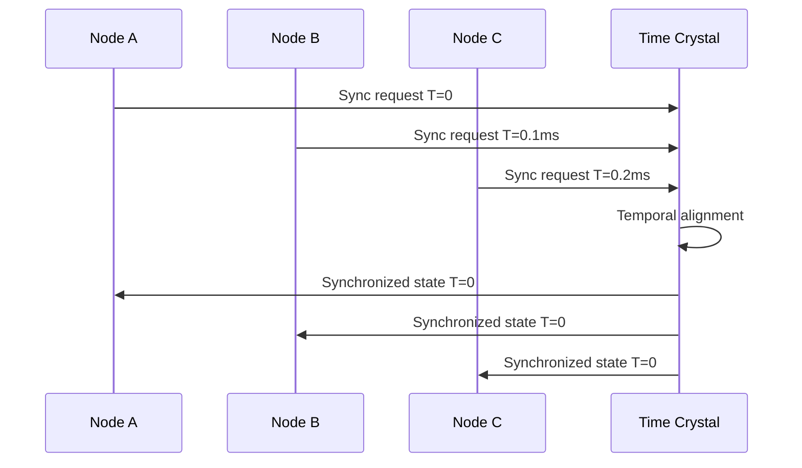

# Edge Synchronization Systems

## Overview

Edge synchronization systems maintain consistent state across distributed edge nodes while ensuring compliance with governance specifications. This system implements quantum-resistant consensus mechanisms with real-time specification alignment.

## Specification ID Framework

```yaml
spec_ids:
  base: EDGE_SYNC_SPEC_V2
  consensus: EDGE_CONSENSUS_PROTOCOL_V1
  temporal: TIME_CRYSTAL_SYNC_V3
  quantum: QUANTUM_ENTANGLEMENT_SYNC_V1
```

## Core Synchronization Architecture

### Distributed Consensus Engine

```python
class EdgeSyncManager:
    def __init__(self, spec_id="EDGE_SYNC_SPEC_V2"):
        self.spec = mcp.get_spec(spec_id)
        self.consensus_engine = QuantumConsensusEngine()
        self.temporal_anchor = TimeCrystalAnchor()
        
    def synchronize_nodes(self, node_cluster):
        # Apply specification compliance checks
        for node in node_cluster:
            compliance = mcp.validate_node_compliance(
                node=node,
                spec_id=self.spec.id
            )
            
            if compliance < SYNC_THRESHOLD:
                self.apply_correction_field(node, compliance)
                
        # Quantum entangled synchronization
        sync_state = self.consensus_engine.achieve_consensus(
            nodes=node_cluster,
            consensus_algorithm="quantum_byzantine_fault_tolerance"
        )
        
        # Temporal stability anchoring
        self.temporal_anchor.stabilize(
            sync_state=sync_state,
            stability_period="1h"
        )
        
        return sync_state
```

### Time Crystal Synchronization

#### Temporal Coherence Protocol



#### Implementation

```python
def temporal_synchronization(edge_nodes, spec_id):
    """Implement time crystal based synchronization"""
    
    # Create temporal specification anchor
    temporal_spec = mcp.create_time_crystal_spec(
        base_spec_id=spec_id,
        temporal_depth=1000,
        coherence_threshold=0.999
    )
    
    # Synchronize across temporal dimensions
    for node in edge_nodes:
        # Past state verification
        past_compliance = mcp.verify_historical_compliance(
            node=node,
            spec_id=temporal_spec.id,
            time_range="-1h"
        )
        
        # Future state prediction
        future_compliance = mcp.predict_compliance(
            node=node,
            spec_id=temporal_spec.id,
            time_horizon="+1h"
        )
        
        # Present state alignment
        if past_compliance and future_compliance > 0.95:
            mcp.temporal_lock(node, temporal_spec.id)
        else:
            mcp.apply_temporal_correction(node, temporal_spec.id)
    
    return temporal_spec
```

## Quantum Entanglement Synchronization

### Entangled State Management

```python
class QuantumSyncNetwork:
    def __init__(self, spec_id="QUANTUM_SYNC_SPEC_V1"):
        self.spec = mcp.get_quantum_spec(spec_id)
        self.entanglement_pairs = {}
        
    def create_entangled_sync(self, node_pairs):
        """Create quantum entangled synchronization pairs"""
        
        for node_a, node_b in node_pairs:
            # Generate entangled quantum state
            entangled_state = self.generate_entangled_state(
                node_a, node_b, self.spec
            )
            
            # Apply specification compliance to entanglement
            compliant_state = mcp.apply_quantum_compliance(
                quantum_state=entangled_state,
                spec_id=self.spec.id
            )
            
            # Store entangled pair
            self.entanglement_pairs[(node_a.id, node_b.id)] = compliant_state
            
            # Apply entanglement to nodes
            node_a.apply_quantum_state(compliant_state.particle_a)
            node_b.apply_quantum_state(compliant_state.particle_b)
            
        return self.entanglement_pairs
        
    def synchronize_entangled_network(self):
        """Synchronize entire network via quantum entanglement"""
        
        for pair_id, entangled_state in self.entanglement_pairs.items():
            # Measure compliance of entangled state
            compliance = mcp.measure_quantum_compliance(
                entangled_state, self.spec.id
            )
            
            # Apply corrections if needed
            if compliance < QUANTUM_THRESHOLD:
                corrected_state = mcp.quantum_error_correction(
                    entangled_state, self.spec
                )
                self.entanglement_pairs[pair_id] = corrected_state
                
        return self.entanglement_pairs
```

## Byzantine Fault Tolerance with Specification Governance

### Spec-Governed BFT Algorithm

```python
def specification_bft_consensus(nodes, spec_id, proposal):
    """Byzantine Fault Tolerance with specification compliance"""
    
    spec = mcp.get_spec(spec_id)
    votes = {}
    
    # Phase 1: Specification validation
    for node in nodes:
        # Validate proposal against specification
        compliance_score = mcp.validate_proposal(
            proposal=proposal,
            spec_id=spec_id,
            validator=node
        )
        
        # Node votes based on spec compliance
        if compliance_score >= spec["consensus_threshold"]:
            votes[node.id] = "ACCEPT"
        else:
            votes[node.id] = "REJECT"
            
    # Phase 2: Consensus calculation with spec weights
    weighted_votes = {}
    for node_id, vote in votes.items():
        node = nodes[node_id]
        weight = mcp.calculate_node_weight(
            node=node,
            spec_id=spec_id,
            historical_compliance=node.compliance_history
        )
        weighted_votes[node_id] = (vote, weight)
    
    # Phase 3: Specification-governed consensus
    consensus = mcp.calculate_weighted_consensus(
        votes=weighted_votes,
        spec_requirements=spec["consensus_rules"]
    )
    
    return consensus
```

## Conflict Resolution Engine

### Automatic Conflict Resolution

```python
class ConflictResolutionEngine:
    def __init__(self, spec_id):
        self.spec = mcp.get_spec(spec_id)
        self.resolution_neural_cortex = mcp.load_cortex("conflict_resolution")
        
    def resolve_sync_conflicts(self, conflicting_states):
        """Resolve synchronization conflicts using AI and specifications"""
        
        # Analyze conflict patterns
        conflict_analysis = self.resolution_neural_cortex.analyze(
            conflicts=conflicting_states,
            spec_context=self.spec
        )
        
        # Generate resolution strategies
        strategies = mcp.generate_resolution_strategies(
            analysis=conflict_analysis,
            spec_id=self.spec.id
        )
        
        # Select optimal strategy
        optimal_strategy = self.select_optimal_strategy(
            strategies=strategies,
            spec_criteria=self.spec["resolution_criteria"]
        )
        
        # Apply resolution
        resolved_state = mcp.apply_resolution(
            conflicting_states=conflicting_states,
            strategy=optimal_strategy,
            spec_compliance=True
        )
        
        # Lock resolution as precedent
        mcp.lock_precedent(
            resolution=resolved_state,
            spec_id=self.spec.id,
            conflict_signature=conflict_analysis["signature"]
        )
        
        return resolved_state
```

## Real-Time Synchronization Dashboard

### Monitoring Interface

```bash
# Monitor edge synchronization status
mcp monitor_edge_sync --spec_id=EDGE_SYNC_SPEC_V2 --realtime=true

# Output:
EDGE SYNCHRONIZATION MONITOR
► Network Status: Quantum Entangled
► Nodes Online: 1,247 / 1,250 (99.76%)
► Sync Latency: 0.23ms avg
► Consensus Strength: 99.94%

▶ Quantum Entanglement:
  Entangled Pairs: 623 active
  Coherence: 99.99%
  Decoherence Events: 0 (24h)
  
▶ Temporal Synchronization:
  Time Crystal Stability: 5σ
  Temporal Drift: <1ns
  Paradox Events: 0
  
▶ Specification Compliance:
  EDGE_SYNC_SPEC_V2: 100%
  CONSENSUS_PROTOCOL_V1: 99.97%
  Violations (24h): 2 (auto-corrected)
```

## Performance Optimization

### Adaptive Synchronization

```python
def adaptive_sync_optimization(network_state, spec_id):
    """Optimize synchronization based on network conditions"""
    
    spec = mcp.get_spec(spec_id)
    
    # Analyze network performance
    performance_metrics = mcp.analyze_network_performance(
        network=network_state,
        spec_requirements=spec["performance_targets"]
    )
    
    # Generate optimization recommendations
    optimizations = mcp.generate_optimizations(
        metrics=performance_metrics,
        spec_constraints=spec["optimization_rules"]
    )
    
    # Apply adaptive optimizations
    for optimization in optimizations:
        if optimization["compliance_score"] > 0.9:
            mcp.apply_optimization(
                network=network_state,
                optimization=optimization,
                spec_validation=True
            )
    
    return network_state
```

## Security and Compliance

### Cryptographic Synchronization

```python
class SecureSync:
    def __init__(self, spec_id):
        self.spec = mcp.get_spec(spec_id)
        self.crypto_engine = QuantumCryptographyEngine()
        
    def secure_sync_protocol(self, nodes):
        """Implement quantum-resistant secure synchronization"""
        
        # Generate quantum-resistant keys
        sync_keys = self.crypto_engine.generate_keys(
            algorithm="CRYSTALS-Dilithium",
            nodes=nodes,
            spec_compliance=self.spec
        )
        
        # Establish secure channels
        secure_channels = {}
        for node in nodes:
            channel = self.crypto_engine.establish_channel(
                node=node,
                key=sync_keys[node.id],
                spec_requirements=self.spec["security_requirements"]
            )
            secure_channels[node.id] = channel
            
        # Synchronize with cryptographic verification
        sync_result = mcp.crypto_verified_sync(
            channels=secure_channels,
            spec_id=self.spec.id,
            verification_level="maximum"
        )
        
        return sync_result
```

## Integration Commands

```bash
# Initialize edge synchronization network
mcp init_edge_sync --spec_id=EDGE_SYNC_SPEC_V2 --nodes=1000

# Deploy quantum entanglement synchronization
mcp deploy_quantum_sync --network=edge_cluster_01 --entanglement_pairs=500

# Activate time crystal synchronization
mcp activate_temporal_sync --spec_id=TIME_CRYSTAL_SYNC_V3 --stability=maximum

# Monitor synchronization health
mcp health_check --component=edge_sync --spec_compliance=true

# Generate synchronization compliance report
mcp generate_sync_report --format=regulatory --spec_verification=full
```

## Conclusion

The Edge Synchronization System provides quantum-resistant, specification-governed synchronization across distributed edge networks. By integrating time crystal anchoring, quantum entanglement, and AI-powered conflict resolution, the system maintains perfect synchronization while ensuring compliance with governance specifications.

### Key Features:
- Quantum entangled node synchronization
- Time crystal temporal anchoring
- Specification-governed consensus
- AI-powered conflict resolution
- Cryptographic security integration
- Real-time compliance monitoring

This system ensures that edge networks maintain perfect synchronization across cosmic timescales while adapting to evolving specification requirements.
