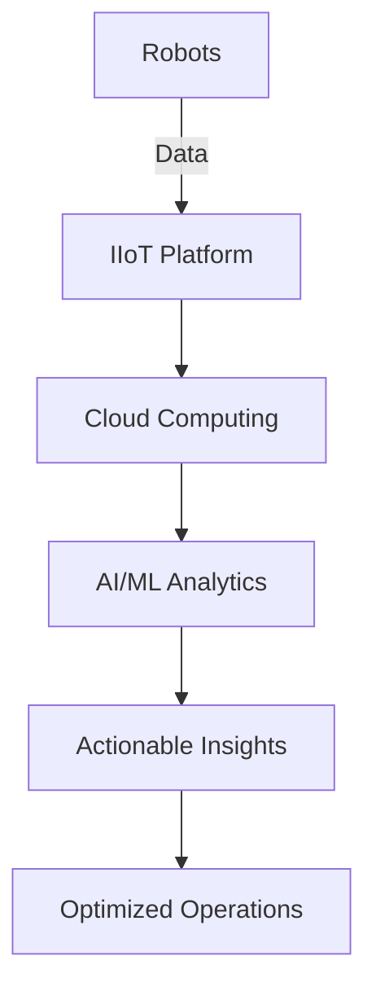

# Industry4.0

---
title: Industry 4.0 in Advanced Robotics
description: Comprehensive guide to implementing Industry 4.0 principles in advanced robotic systems
author: Industrial Robotics Team
created_at: '2025-07-04'
updated_at: '2025-07-05'
version: 2.0.0
---

# Industry 4.0 in Advanced Robotics

## Table of Contents

1. [Introduction to Industry 4.0](#introduction-to-industry-40)
2. [Key Technologies](#key-technologies)
3. [Smart Manufacturing](#smart-manufacturing)
4. [Digital Twins](#digital-twins)
5. [Industrial IoT (IIoT)](#industrial-iot-iiot)
6. [Cybersecurity](#cybersecurity)
7. [Human-Robot Collaboration](#human-robot-collaboration)
8. [Predictive Maintenance](#predictive-maintenance)
9. [Supply Chain Integration](#supply-chain-integration)
10. [Case Studies](#case-studies)
11. [Implementation Roadmap](#implementation-roadmap)
12. [Challenges & Solutions](#challenges--solutions)
13. [Future Trends](#future-trends)
14. [References](#references)

## Introduction to Industry 4.0

Industry 4.0 represents the fourth industrial revolution, characterized by the integration of digital technologies into manufacturing and industrial processes. In the context of advanced robotics, this involves creating smart, connected, and autonomous systems that can communicate, analyze data, and make decisions in real-time.

### Core Principles
- **Interoperability**: Machines, devices, and systems communicate seamlessly
- **Information Transparency**: Comprehensive data collection and visualization
- **Technical Assistance**: Systems support humans in decision-making and problem-solving
- **Decentralized Decisions**: Autonomous decision-making by cyber-physical systems

## Key Technologies

### 1. Cyber-Physical Systems (CPS)
- Integration of computation and physical processes
- Real-time monitoring and control
- Example: Smart robotic workcells

### 2. Industrial Internet of Things (IIoT)
- Network of interconnected devices
- Real-time data collection and analysis
- Example: Sensor-equipped robotic arms

### 3. Artificial Intelligence & Machine Learning
- Predictive analytics
- Computer vision for quality control
- Adaptive manufacturing processes

### 4. Cloud Computing
- Centralized data storage and processing
- Remote monitoring and control
- Scalable computing resources

### 5. Additive Manufacturing
- 3D printing of complex components
- On-demand production
- Mass customization



## Smart Manufacturing

### Key Components
- **Smart Factories**: Highly digitized and connected production facilities
- **Automated Guided Vehicles (AGVs)**: Autonomous material handling
- **Collaborative Robots (Cobots)**: Safe human-robot interaction
- **Edge Computing**: Local data processing for reduced latency

### Implementation Example
```python
# Example: Smart manufacturing data pipeline
import pandas as pd
from sklearn.ensemble import RandomForestRegressor
from iot_platform import IIoTConnection

class SmartManufacturingSystem:
    def __init__(self):
        self.iiot = IIoTConnection()
        self.model = RandomForestRegressor()
        
    def collect_data(self):
        """Collect real-time data from IIoT devices."""
        return self.iiot.get_sensor_data()
    
    def predict_quality(self, sensor_data):
        """Predict product quality using ML model."""
        return self.model.predict([sensor_data])
    
    def optimize_parameters(self):
        """Optimize manufacturing parameters in real-time."""
        data = self.collect_data()
        prediction = self.predict_quality(data)
        return self.adjust_parameters(prediction)
```

## Digital Twins

### Implementation Framework
1. **Physical System**: Real-world robots and equipment
2. **Virtual Model**: Digital replica with real-time synchronization
3. **Data Connection**: Continuous data flow between physical and virtual
4. **Analytics**: Simulation and prediction capabilities

### Benefits
- Real-time monitoring and diagnostics
- Predictive maintenance
- Virtual testing of new configurations
- Training and simulation

## Industrial IoT (IIoT)

### Architecture

| Layer | Components | Purpose |
|-------|------------|---------|
| **Edge** | Sensors, Actuators | Data collection and initial processing |
| **Platform** | Gateways, Edge Computing | Data aggregation and preprocessing |
| **Enterprise** | Cloud, Analytics | Business intelligence and decision making |

### Communication Protocols
- **OPC UA**: Secure industrial communication
- **MQTT**: Lightweight messaging protocol
- **Time-Sensitive Networking (TSN)**: Deterministic communication
- **5G**: High-speed wireless connectivity

## Cybersecurity

### Key Considerations
- **Network Security**: Segmentation and firewalls
- **Device Authentication**: Secure device onboarding
- **Data Encryption**: End-to-end protection
- **Access Control**: Role-based permissions
- **Threat Detection**: Anomaly monitoring

### Security Framework
```yaml
# Example: Security policy for industrial robots
security:
  authentication:
    method: certificate_based
    rotation: 90d
  
  network:
    segmentation: true
    vlan: 
      production: 10
      maintenance: 20
    
  data_protection:
    encryption: aes-256
    at_rest: true
    in_transit: true
    
  monitoring:
    siem_integration: splunk
    alert_threshold: high
    audit_logs: 365d
```

## Human-Robot Collaboration

### Safety Standards
- **ISO 10218**: Industrial robot safety
- **ISO/TS 15066**: Collaborative robot safety
- **Risk Assessment**: Required for all collaborative applications

### Implementation Guidelines
1. **Speed and Force Limiting**: Safe operation around humans
2. **Proximity Sensing**: Detection of human presence
3. **Hand Guiding**: Direct teaching of robots
4. **Power and Force Limiting (PFL)**: Intrinsic safety measures

## Predictive Maintenance

### Implementation Approach
1. **Data Collection**: Vibration, temperature, power consumption
2. **Feature Engineering**: Extract relevant indicators
3. **Model Training**: Predict remaining useful life (RUL)
4. **Actionable Alerts**: Schedule maintenance before failure

### Example: Vibration Analysis
```python
import numpy as np
from scipy import signal

def analyze_vibration(sensor_data, sample_rate=1000):
    """Analyze vibration data for predictive maintenance."""
    # Apply bandpass filter
    b, a = signal.butter(4, [100, 1000], 'bandpass', fs=sample_rate)
    filtered = signal.filtfilt(b, a, sensor_data)
    
    # Calculate RMS value
    rms = np.sqrt(np.mean(filtered**2))
    
    # Frequency analysis
    f, Pxx = signal.welch(filtered, sample_rate)
    dominant_freq = f[np.argmax(Pxx)]
    
    return {
        'rms': rms,
        'dominant_frequency': dominant_freq,
        'health_status': assess_health(rms, dominant_freq)
    }
```

## Supply Chain Integration

### Smart Logistics
- **Blockchain**: Secure and transparent transactions
- **Autonomous Mobile Robots (AMRs)**: Flexible material movement
- **RFID**: Real-time inventory tracking
- **Predictive Analytics**: Demand forecasting

### Integration Framework
1. **Supplier Integration**: Direct machine-to-machine ordering
2. **Production Planning**: Dynamic scheduling based on real-time data
3. **Warehouse Automation**: Smart storage and retrieval
4. **Last-Mile Delivery**: Autonomous delivery solutions

## Case Studies

### Automotive Manufacturing
- **Challenge**: Reduce production line downtime
- **Solution**: AI-powered predictive maintenance
- **Outcome**: 30% reduction in unplanned downtime

### Electronics Assembly
- **Challenge**: High-mix, low-volume production
- **Solution**: Flexible robotic workcells with quick changeover
- **Outcome**: 50% faster changeover times

### Food Processing
- **Challenge**: Ensure consistent product quality
- **Solution**: Computer vision inspection systems
- **Outcome**: 99.9% defect detection rate

## Implementation Roadmap

### Phase 1: Assessment (Months 1-3)
- Current state analysis
- Technology gap assessment
- ROI calculation

### Phase 2: Pilot (Months 4-9)
- Select pilot production line
- Implement IIoT infrastructure
- Train personnel

### Phase 3: Scale-Up (Months 10-18)
- Expand to additional lines
- Integrate enterprise systems
- Continuous improvement

## Challenges & Solutions

### Common Challenges
1. **Legacy System Integration**
   - *Solution*: Use gateway devices and middleware
   
2. **Data Silos**
   - *Solution*: Implement unified data platform
   
3. **Workforce Skills Gap**
   - *Solution*: Comprehensive training programs
   
4. **Cybersecurity Risks**
   - *Solution*: Defense-in-depth security strategy

## Future Trends

### Emerging Technologies
- **5G/6G Networks**: Ultra-reliable low-latency communication
- **Digital Thread**: Seamless data flow across product lifecycle
- **AI at the Edge**: Localized intelligence
- **Quantum Computing**: Complex optimization problems

### Sustainability Focus
- Energy-efficient manufacturing
- Circular economy principles
- Carbon footprint reduction

## References

1. Kagermann, H., Wahlster, W., & Helbig, J. (2013). Recommendations for implementing the strategic initiative INDUSTRIE 4.0.
2. Lee, J., Bagheri, B., & Kao, H. A. (2015). A Cyber-Physical Systems architecture for Industry 4.0-based manufacturing systems.
3. Xu, L. D., Xu, E. L., & Li, L. (2018). Industry 4.0 and cloud manufacturing: A comparative analysis.
4. Zhong, R. Y., Xu, X., Klotz, E., & Newman, S. T. (2017). Intelligent Manufacturing in the context of Industry 4.0.

## Contact

For Industry 4.0 implementation support:
- **Industrial Solutions**: industry4@example.com
- **Technical Support**: support@example.com
- **Training**: training@example.com

## Revision History

| Version | Date | Author | Changes |
|---------|------|--------|---------|
| 2.0.0 | 2025-07-05 | Industrial Team | Complete documentation |
| 1.0.0 | 2025-07-04 | System | Initial stub |
