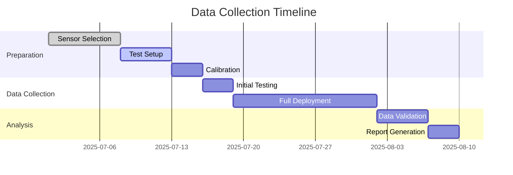
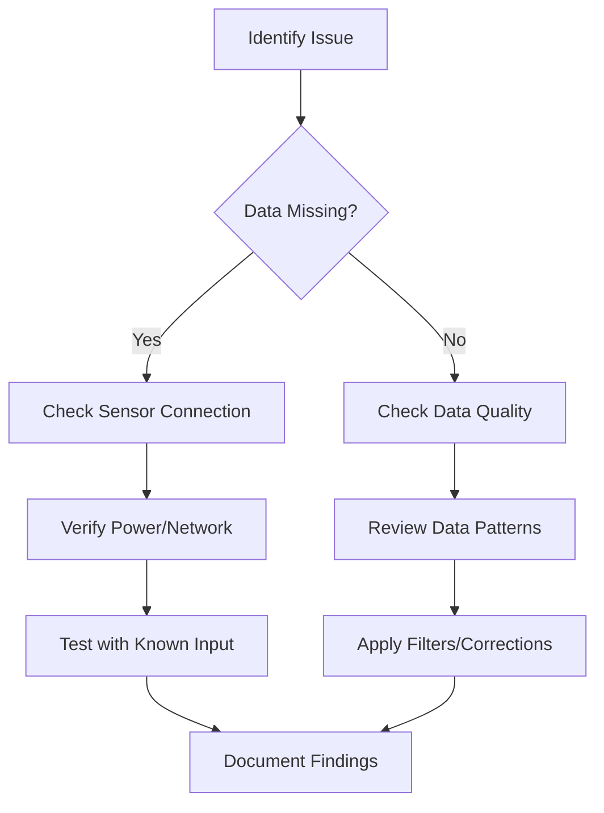

# Data Collection

---
title: Sensor Data Collection Guide
description: Comprehensive guide to sensor data collection methodologies, best practices, and implementation
author: Sensor Engineering Team
created_at: '2025-07-04'
updated_at: '2025-07-05'
version: 2.0.0
---

# Sensor Data Collection Guide

## Table of Contents

1. [Introduction](#introduction)
2. [Planning Data Collection](#planning-data-collection)
3. [Sensor Selection](#sensor-selection)
4. [Data Collection Methods](#data-collection-methods)
5. [Data Quality Management](#data-quality-management)
6. [Data Preprocessing](#data-preprocessing)
7. [Storage and Management](#storage-and-management)
8. [Real-time Data Collection](#real-time-data-collection)
9. [Case Studies](#case-studies)
10. [Best Practices](#best-practices)
11. [Troubleshooting](#troubleshooting)

## Introduction

Effective sensor data collection is fundamental to building reliable sensor systems. This guide provides comprehensive methodologies and best practices for collecting high-quality sensor data across various applications.

### Key Objectives
- Ensure data accuracy and reliability
- Optimize collection processes
- Maintain data integrity
- Enable efficient analysis
- Support system scalability

## Planning Data Collection

### 1. Define Requirements
- **Purpose**: Clearly state the objectives of data collection
- **Parameters**: Identify which parameters to measure
- **Accuracy**: Define required precision and resolution
- **Frequency**: Determine sampling rates and intervals
- **Environment**: Consider operating conditions

### 2. Resource Assessment
- **Sensors**: Available vs. required specifications
- **Infrastructure**: Data transmission and storage capabilities
- **Processing**: On-device vs. cloud processing needs
- **Power**: Energy requirements and constraints

### 3. Data Collection Plan



## Sensor Selection

### Key Considerations

| Factor | Description | Example |
|--------|-------------|---------|
| **Accuracy** | How close measurements are to true values | ±0.1°C for temperature |
| **Precision** | Consistency of measurements | 0.01mm resolution |
| **Range** | Minimum and maximum measurable values | 0-100°C |
| **Sampling Rate** | Measurements per second | 100Hz |
| **Power** | Energy consumption | 5mA @ 3.3V |
| **Interface** | Communication protocol | I²C, SPI, UART |
| **Environment** | Operating conditions | IP67, -40°C to +85°C |

### Common Sensor Types

1. **Environmental**
   - Temperature, humidity, pressure
   - Air quality, gas sensors
   - Weather stations

2. **Motion/Inertial**
   - Accelerometers
   - Gyroscopes
   - IMUs (Inertial Measurement Units)

3. **Optical**
   - Cameras
   - LIDAR
   - Infrared sensors

4. **Proximity/Position**
   - Ultrasonic
   - LIDAR
   - GPS

## Data Collection Methods

### 1. Direct Sensor Reading

```python
import board
import adafruit_bme280
import time

def read_bme280():
    # Initialize I2C and sensor
    i2c = board.I2C()
    bme280 = adafruit_bme280.Adafruit_BME280_I2C(i2c)
    
    while True:
        # Read sensor values
        temperature = bme280.temperature
        humidity = bme280.humidity
        pressure = bme280.pressure
        
        # Print values
        print(f"Temperature: {temperature:.1f}°C")
        print(f"Humidity: {humidity:.1f}%")
        print(f"Pressure: {pressure:.1f} hPa")
        
        # Wait before next reading
        time.sleep(1)
```

### 2. Data Logging

```python
import csv
from datetime import datetime

def log_sensor_data(filename, data):
    # Create or append to CSV file
    with open(filename, 'a', newline='') as f:
        writer = csv.writer(f)
        
        # Write header if file is empty
        if f.tell() == 0:
            writer.writerow(['timestamp', 'sensor_id', 'value', 'unit'])
        
        # Write data row
        timestamp = datetime.utcnow().isoformat()
        writer.writerow([
            timestamp,
            data['sensor_id'],
            data['value'],
            data['unit']
        ])
```

### 3. Wireless Sensor Networks

```python
# Example using MQTT for IoT sensor data collection
import paho.mqtt.client as mqtt
import json

def on_connect(client, userdata, flags, rc):
    print(f"Connected with result code {rc}")
    client.subscribe("sensors/+/data")

def on_message(client, userdata, msg):
    try:
        payload = json.loads(msg.payload.decode())
        print(f"Received: {payload}")
        # Process sensor data
        process_sensor_data(payload)
    except Exception as e:
        print(f"Error processing message: {e}")

# Initialize MQTT client
client = mqtt.Client()
client.on_connect = on_connect
client.on_message = on_message

client.connect("mqtt.example.com", 1883, 60)
client.loop_forever()
```

## Data Quality Management

### 1. Data Validation

```python
def validate_sensor_reading(value, min_val, max_val):
    """Validate sensor reading is within expected range."""
    if value < min_val or value > max_val:
        raise ValueError(f"Value {value} outside valid range [{min_val}, {max_val}]")
    return True

def check_data_quality(reading):
    """Perform basic data quality checks."""
    try:
        # Check for missing values
        if reading is None:
            return False, "Missing value"
            
        # Check for numeric type
        if not isinstance(reading, (int, float)):
            return False, "Non-numeric value"
            
        # Check for reasonable range
        if reading == 0 or reading > 1e6:  # Example range check
            return False, "Value out of range"
            
        return True, "OK"
    except Exception as e:
        return False, f"Validation error: {str(e)}"
```

### 2. Outlier Detection

```python
import numpy as np
from scipy import stats

def detect_outliers_zscore(data, threshold=3.0):
    """Detect outliers using Z-score method."""
    z_scores = np.abs(stats.zscore(data))
    return np.where(z_scores > threshold)[0]

def detect_outliers_iqr(data, k=1.5):
    """Detect outliers using IQR method."""
    q1, q3 = np.percentile(data, [25, 75])
    iqr = q3 - q1
    lower_bound = q1 - (k * iqr)
    upper_bound = q3 + (k * iqr)
    return np.where((data < lower_bound) | (data > upper_bound))[0]
```

## Data Preprocessing

### 1. Noise Reduction

```python
import numpy as np
from scipy import signal

def moving_average(data, window_size=5):
    """Apply moving average filter to reduce noise."""
    window = np.ones(window_size) / window_size
    return np.convolve(data, window, mode='same')

def butter_lowpass_filter(data, cutoff, fs, order=5):
    """Apply low-pass Butterworth filter."""
    nyq = 0.5 * fs
    normal_cutoff = cutoff / nyq
    b, a = signal.butter(order, normal_cutoff, btype='low', analog=False)
    return signal.filtfilt(b, a, data)
```

### 2. Data Alignment

```python
import pandas as pd

def align_time_series(sensor_data_list):
    """Align multiple time series data."""
    # Convert to pandas DataFrames
    dfs = []
    for i, (timestamps, values) in enumerate(sensor_data_list):
        df = pd.DataFrame({
            'timestamp': pd.to_datetime(timestamps),
            f'sensor_{i}': values
        }).set_index('timestamp')
        dfs.append(df)
    
    # Merge dataframes on timestamp
    aligned = pd.concat(dfs, axis=1)
    
    # Forward fill missing values (optional)
    aligned.ffill(inplace=True)
    
    return aligned
```

## Storage and Management

### 1. Data Storage Options

| Storage Type | Best For | Example Technologies |
|--------------|----------|----------------------|
| **Time-Series DB** | High-frequency sensor data | InfluxDB, TimescaleDB |
| **Document DB** | Flexible schema, JSON data | MongoDB, CouchDB |
| **SQL Database** | Structured, relational data | PostgreSQL, MySQL |
| **Data Lake** | Raw, unstructured data | AWS S3, Azure Data Lake |
| **Edge Storage** | Local, low-latency access | SQLite, RocksDB |

### 2. Data Retention Policy

```yaml
# Example retention policy configuration
retention_policy:
  default_retention: 365d  # Keep data for 1 year by default
  
  # Keep high-frequency data for shorter periods
  high_frequency:
    match: "sensors/high_freq/*"
    retention: 30d
    
  # Keep aggregated data longer
  aggregated:
    match: "aggregates/*"
    retention: 5y
    
  # Never delete calibration data
  calibration:
    match: "calibration/*"
    retention: forever
```

## Real-time Data Collection

### 1. Stream Processing

```python
from kafka import KafkaConsumer
import json

def process_sensor_stream():
    # Set up Kafka consumer
    consumer = KafkaConsumer(
        'sensor-data',
        bootstrap_servers=['localhost:9092'],
        value_deserializer=lambda m: json.loads(m.decode('utf-8'))
    )
    
    # Process messages
    for message in consumer:
        sensor_data = message.value
        
        # Process in real-time
        process_reading(sensor_data)
        
        # Optional: Send to time-series database
        write_to_tsdb(sensor_data)
        
        # Optional: Trigger alerts
        check_alerts(sensor_data)
```

### 2. Edge Processing

```python
# Example of edge processing with TensorFlow Lite
import tflite_runtime.interpreter as tflite
import numpy as np

class EdgeInference:
    def __init__(self, model_path):
        # Load TFLite model
        self.interpreter = tflite.Interpreter(model_path=model_path)
        self.interpreter.allocate_tensors()
        
        # Get input/output details
        self.input_details = self.interpreter.get_input_details()
        self.output_details = self.interpreter.get_output_details()
    
    def preprocess(self, sensor_data):
        # Convert sensor data to model input format
        input_data = np.array(sensor_data, dtype=np.float32)
        input_data = np.expand_dims(input_data, axis=0)
        return input_data
    
    def predict(self, sensor_data):
        # Preprocess data
        input_data = self.preprocess(sensor_data)
        
        # Set input tensor
        self.interpreter.set_tensor(
            self.input_details[0]['index'], 
            input_data
        )
        
        # Run inference
        self.interpreter.invoke()
        
        # Get output
        output = self.interpreter.get_tensor(
            self.output_details[0]['index']
        )
        
        return output[0]
```

## Case Studies

### Case Study 1: Smart Agriculture
**Challenge**: Monitor soil moisture across 100-acre farm  
**Solution**: Deployed wireless sensor network with solar-powered nodes  
**Results**:
- 30% reduction in water usage
- 20% increase in crop yield
- Real-time monitoring via mobile app

### Case Study 2: Industrial Vibration Monitoring
**Challenge**: Detect early signs of equipment failure  
**Solution**: Installed wireless accelerometers with edge processing  
**Results**:
- 90% reduction in unplanned downtime
- Early fault detection (3-6 weeks in advance)
- Predictive maintenance scheduling

## Best Practices

### 1. Data Collection
- **Synchronize Clocks**: Use NTP for time synchronization
- **Metadata**: Include sensor ID, timestamp, location, and calibration info
- **Sampling Rate**: Follow Nyquist-Shannon theorem (2x max frequency)
- **Power Management**: Optimize sampling rate vs. battery life

### 2. Data Quality
- **Validation**: Implement range and consistency checks
- **Calibration**: Regular sensor calibration
- **Redundancy**: Use multiple sensors for critical measurements
- **Documentation**: Record all data collection parameters

### 3. Storage and Management
- **Backup**: Regular automated backups
- **Versioning**: Track changes to data collection methods
- **Access Control**: Implement proper security measures
- **Retention**: Define and enforce data retention policies

## Troubleshooting

### Common Issues

1. **Missing Data**
   - Check power supply
   - Verify network connectivity
   - Review sensor health status
   - Check for memory or storage issues

2. **Noisy Data**
   - Verify sensor placement
   - Check for electromagnetic interference
   - Review grounding and shielding
   - Apply appropriate filtering

3. **Inconsistent Timestamps**
   - Synchronize system clocks
   - Handle timezone conversions consistently
   - Account for network latency

### Debugging Workflow



## Revision History

| Version | Date | Author | Changes |
|---------|------|--------|---------|
| 2.0.0 | 2025-07-05 | Sensor Team | Comprehensive data collection guide |
| 1.0.0 | 2025-07-04 | System | Initial stub |

## References

1. ISO/IEC 25012:2008 - Data Quality Model
2. NIST Special Publication 1500-201 - Big Data Interoperability Framework
3. IEEE 1451 - Smart Transducer Interface Standards
4. OGC Sensor Web Enablement (SWE) Standards

## Contact

For data collection support or questions:
- **Email**: data-collection@example.com
- **Slack**: #sensor-data-collection
- **Documentation**: https://docs.sensors.example.com/data-collection
