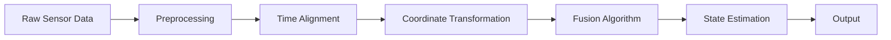
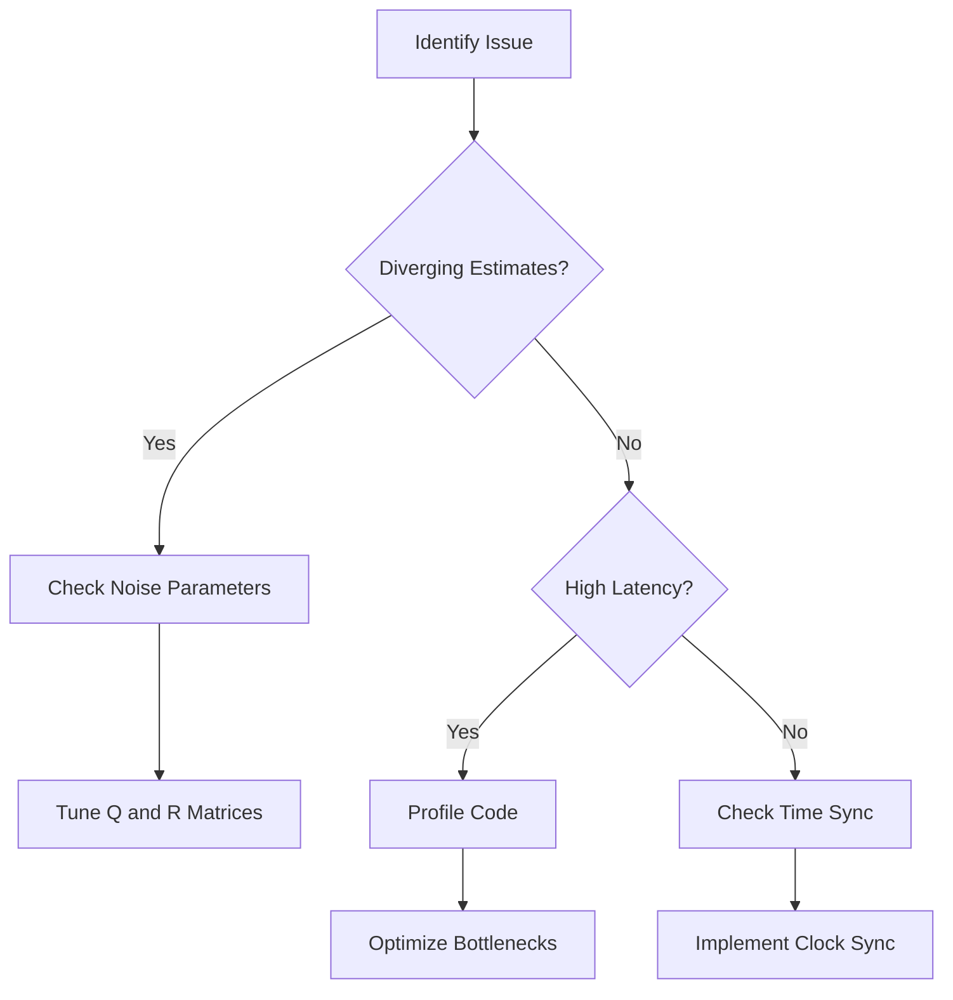

# Fusion

---
title: Sensor Fusion Guide
description: Comprehensive guide to sensor fusion techniques, algorithms, and implementations
author: Sensor Engineering Team
created_at: '2025-07-04'
updated_at: '2025-07-05'
version: 2.0.0
---

# Sensor Fusion Guide

## Table of Contents

1. [Introduction](#introduction)
2. [Fundamentals](#fundamentals)
3. [Fusion Architectures](#fusion-architectures)
4. [Common Algorithms](#common-algorithms)
5. [Implementation](#implementation)
6. [Performance Metrics](#performance-metrics)
7. [Case Studies](#case-studies)
8. [Best Practices](#best-practices)
9. [Troubleshooting](#troubleshooting)

## Introduction

Sensor fusion is the process of combining data from multiple sensors to produce more accurate, complete, and reliable information than could be achieved by individual sensors alone. This guide covers the theory, algorithms, and practical implementation of sensor fusion techniques.

### Benefits of Sensor Fusion
- **Improved Accuracy**: Reduces uncertainty by combining multiple measurements
- **Increased Reliability**: Maintains functionality even if some sensors fail
- **Enhanced Coverage**: Combines strengths of different sensor types
- **Reduced Noise**: Filters out sensor-specific noise through data combination
- **Higher Confidence**: Provides more reliable state estimation

## Fundamentals

### Key Concepts

1. **Sensor Characteristics**
   - **Precision vs. Accuracy**
   - **Noise Characteristics**
   - **Sampling Rates**
   - **Field of View**

2. **Coordinate Systems**
   - **Body Frame**: Relative to the sensor platform
   - **World Frame**: Fixed global reference
   - **Sensor Frame**: Individual sensor coordinates

3. **Time Synchronization**
   - Timestamp alignment
   - Interpolation techniques
   - Clock drift compensation

### Mathematical Foundations



## Fusion Architectures

### 1. Centralized Fusion
- All raw sensor data is sent to a central processor
- Maximum information retention
- Higher computational load
- Example: Raw camera + LIDAR fusion

### 2. Decentralized Fusion
- Local processing at sensor nodes
- Only relevant information is shared
- Better scalability
- Example: Distributed sensor networks

### 3. Hybrid Fusion
- Combines centralized and decentralized approaches
- Balances computation and communication
- Example: Autonomous vehicles with edge computing

## Common Algorithms

### 1. Kalman Filter

```python
import numpy as np
from filterpy.kalman import KalmanFilter

class SensorFusionKF:
    def __init__(self, dt=0.1):
        # Initialize Kalman Filter
        self.kf = KalmanFilter(dim_x=4, dim_z=2)
        
        # State transition matrix (constant velocity model)
        self.kf.F = np.array([
            [1, 0, dt, 0],
            [0, 1, 0, dt],
            [0, 0, 1,  0],
            [0, 0, 0,  1]
        ])
        
        # Measurement function
        self.kf.H = np.array([
            [1, 0, 0, 0],
            [0, 1, 0, 0]
        ])
        
        # Initial state covariance
        self.kf.P *= 1000.
        
        # Process noise
        self.kf.Q = np.eye(4) * 0.1
        
        # Measurement noise
        self.kf.R = np.eye(2) * 10
    
    def update(self, measurement):
        """Update filter with new measurement."""
        self.kf.predict()
        self.kf.update(measurement)
        return self.kf.x
```

### 2. Extended Kalman Filter (EKF)

```python
from filterpy.kalman import ExtendedKalmanFilter
import math

class EKFSensorFusion(ExtendedKalmanFilter):
    def __init__(self):
        super().__init__(dim_x=4, dim_z=2)
        # Initialize EKF parameters
        self.Q = np.eye(4) * 0.1
        self.R = np.eye(2) * 10
        self.P = np.eye(4) * 1000.
        
    def predict(self, u=0):
        # State transition function
        dt = 0.1  # Time step
        self.x = np.array([
            self.x[0] + dt * self.x[2],
            self.x[1] + dt * self.x[3],
            self.x[2],
            self.x[3]
        ])
        
        # Update state covariance
        self.P = self.F @ self.P @ self.F.T + self.Q
        
    def update(self, z):
        # Measurement function
        hx = np.array([self.x[0], self.x[1]])
        
        # Measurement Jacobian
        H = np.array([
            [1, 0, 0, 0],
            [0, 1, 0, 0]
        ])
        
        # Kalman gain
        S = H @ self.P @ H.T + self.R
        K = self.P @ H.T @ np.linalg.inv(S)
        
        # State update
        y = z - hx
        self.x = self.x + K @ y
        
        # Covariance update
        I = np.eye(self.dim_x)
        self.P = (I - K @ H) @ self.P
```

### 3. Particle Filter

```python
import numpy as np
from numpy.random import randn

class ParticleFilter:
    def __init__(self, n_particles=1000):
        self.n_particles = n_particles
        self.particles = np.zeros((n_particles, 4))  # x, y, vx, vy
        self.weights = np.ones(n_particles) / n_particles
        
    def predict(self, dt=0.1, std=1.0):
        # Add motion with noise
        noise = np.random.randn(self.n_particles, 4) * std
        self.particles[:, 0] += self.particles[:, 2] * dt + noise[:, 0]
        self.particles[:, 1] += self.particles[:, 3] * dt + noise[:, 1]
        self.particles[:, 2:] += noise[:, 2:]
    
    def update(self, z, R):
        # Update weights based on measurement
        for i in range(self.n_particles):
            # Measurement model (direct observation of position)
            z_pred = self.particles[i, :2]
            # Calculate Mahalanobis distance
            diff = z - z_pred
            # Update weight using Gaussian likelihood
            self.weights[i] *= np.exp(-0.5 * diff.T @ np.linalg.inv(R) @ diff)
        
        # Normalize weights
        self.weights += 1.e-300  # Avoid zeros
        self.weights /= np.sum(self.weights)
        
        # Resample if effective number of particles is too low
        if 1. / np.sum(self.weights**2) < self.n_particles / 2:
            self.resample()
    
    def resample(self):
        indices = np.random.choice(
            range(self.n_particles),
            size=self.n_particles,
            p=self.weights,
            replace=True
        )
        self.particles = self.particles[indices]
        self.weights = np.ones(self.n_particles) / self.n_particles
    
    def estimate(self):
        """Return mean and covariance of the state estimate."""
        mean = np.average(self.particles, weights=self.weights, axis=0)
        var = np.average((self.particles - mean)**2, weights=self.weights, axis=0)
        return mean, var
```

## Implementation

### 1. Multi-Sensor Fusion Pipeline

```python
class MultiSensorFusion:
    def __init__(self):
        self.filters = {
            'gps': KalmanFilter(dim_x=4, dim_z=2),
            'imu': KalmanFilter(dim_x=4, dim_z=3),
            'camera': KalmanFilter(dim_x=4, dim_z=2)
        }
        self.weights = {'gps': 0.5, 'imu': 0.3, 'camera': 0.2}
        self.state = np.zeros(4)  # x, y, vx, vy
        
    def update_sensor(self, sensor_type, measurement, R):
        """Update a specific sensor's filter."""
        kf = self.filters[sensor_type]
        kf.predict()
        kf.update(measurement, R=R)
        
    def fuse_estimates(self):
        """Fuse estimates from all sensors."""
        fused_state = np.zeros(4)
        total_weight = 0
        
        for sensor_type, kf in self.filters.items():
            weight = self.weights[sensor_type]
            fused_state += kf.x * weight
            total_weight += weight
            
        self.state = fused_state / total_weight
        return self.state
```

### 2. ROS Implementation Example

```python
#!/usr/bin/env python3
import rospy
from sensor_msgs.msg import Imu, NavSatFix
from geometry_msgs.msg import PoseWithCovarianceStamped
import numpy as np
from filterpy.kalman import KalmanFilter

class ROSSensorFusion:
    def __init__(self):
        rospy.init_node('sensor_fusion_node')
        
        # Initialize EKF
        self.ekf = ExtendedKalmanFilter(dim_x=6, dim_z=6)  # pos(3) + orn(3)
        self.setup_ekf()
        
        # Subscribers
        rospy.Subscriber('/gps/fix', NavSatFix, self.gps_callback)
        rospy.Subscriber('/imu/data', Imu, self.imu_callback)
        
        # Publisher
        self.pose_pub = rospy.Publisher('/fused_pose', PoseWithCovarianceStamped, queue_size=10)
        
        self.last_time = rospy.Time.now()
        
    def setup_ekf(self):
        # Initialize EKF parameters
        self.ekf.x = np.zeros(6)  # Initial state
        self.ekf.P = np.eye(6) * 1000  # Initial covariance
        self.ekf.Q = np.eye(6) * 0.1   # Process noise
        
    def gps_callback(self, msg):
        # Convert GPS to local coordinates (simplified)
        pos = self.convert_gps_to_local(msg.latitude, msg.longitude, msg.altitude)
        
        # Update EKF with GPS measurement
        z = np.array([pos[0], pos[1], pos[2], 0, 0, 0])  # No orientation from GPS
        R = np.diag([msg.position_covariance[0],  # GPS position variance
                     msg.position_covariance[4],
                     msg.position_covariance[8],
                     1e-6, 1e-6, 1e-6])  # Dummy orientation variance
        
        self.update_ekf(z, R)
        
    def imu_callback(self, msg):
        # Get time delta
        current_time = rospy.Time.now()
        dt = (current_time - self.last_time).to_sec()
        self.last_time = current_time
        
        # Predict step
        self.predict_ekf(dt)
        
        # Update with IMU data
        orientation = [msg.orientation.x, msg.orientation.y, 
                      msg.orientation.z, msg.orientation.w]
        euler = self.quaternion_to_euler(orientation)
        
        z = np.array([0, 0, 0,  # No position from IMU
                     euler[0], euler[1], euler[2]])
                     
        R = np.diag([1e6, 1e6, 1e6,  # Large variance for position
                    msg.orientation_covariance[0],
                    msg.orientation_covariance[4],
                    msg.orientation_covariance[8]])
        
        self.update_ekf(z, R)
        
    def predict_ekf(self, dt):
        # State transition function
        x = self.ekf.x
        # Simple constant velocity model
        x[0] += x[3] * dt
        x[1] += x[4] * dt
        x[2] += x[5] * dt
        
        # Update covariance
        F = np.eye(6)
        F[0, 3] = dt
        F[1, 4] = dt
        F[2, 5] = dt
        
        self.ekf.P = F @ self.ekf.P @ F.T + self.ekf.Q
        
    def update_ekf(self, z, R):
        # Simplified update step
        H = np.eye(6)  # Direct observation
        y = z - H @ self.ekf.x
        S = H @ self.ekf.P @ H.T + R
        K = self.ekf.P @ H.T @ np.linalg.inv(S)
        
        self.ekf.x = self.ekf.x + K @ y
        self.ekf.P = (np.eye(6) - K @ H) @ self.ekf.P
        
        # Publish fused pose
        self.publish_pose()
    
    def publish_pose(self):
        msg = PoseWithCovarianceStamped()
        msg.header.stamp = rospy.Time.now()
        msg.header.frame_id = 'map'
        
        msg.pose.pose.position.x = self.ekf.x[0]
        msg.pose.pose.position.y = self.ekf.x[1]
        msg.pose.pose.position.z = self.ekf.x[2]
        
        # Convert Euler to quaternion
        q = self.euler_to_quaternion(self.ekf.x[3], self.ekf.x[4], self.ekf.x[5])
        msg.pose.pose.orientation.x = q[0]
        msg.pose.pose.orientation.y = q[1]
        msg.pose.pose.orientation.z = q[2]
        msg.pose.pose.orientation.w = q[3]
        
        # Reshape covariance (6x6 -> 36)
        msg.pose.covariance = list(self.ekf.P.reshape(36))
        
        self.pose_pub.publish(msg)
    
    # Helper methods for coordinate conversions
    def convert_gps_to_local(self, lat, lon, alt):
        # Simplified conversion - in practice, use a proper library like pyproj
        return np.array([lat * 111320, lon * 111320 * np.cos(np.radians(lat)), alt])
    
    def quaternion_to_euler(self, q):
        # Convert quaternion to Euler angles (roll, pitch, yaw)
        x, y, z, w = q
        t0 = +2.0 * (w * x + y * z)
        t1 = +1.0 - 2.0 * (x * x + y * y)
        roll = np.arctan2(t0, t1)
        
        t2 = +2.0 * (w * y - z * x)
        t2 = +1.0 if t2 > +1.0 else t2
        t2 = -1.0 if t2 < -1.0 else t2
        pitch = np.arcsin(t2)
        
        t3 = +2.0 * (w * z + x * y)
        t4 = +1.0 - 2.0 * (y * y + z * z)
        yaw = np.arctan2(t3, t4)
        
        return np.array([roll, pitch, yaw])
    
    def euler_to_quaternion(self, roll, pitch, yaw):
        # Convert Euler angles to quaternion
        cy = np.cos(yaw * 0.5)
        sy = np.sin(yaw * 0.5)
        cp = np.cos(pitch * 0.5)
        sp = np.sin(pitch * 0.5)
        cr = np.cos(roll * 0.5)
        sr = np.sin(roll * 0.5)
        
        q = np.zeros(4)
        q[0] = sr * cp * cy - cr * sp * sy  # x
        q[1] = cr * sp * cy + sr * cp * sy  # y
        q[2] = cr * cp * sy - sr * sp * cy  # z
        q[3] = cr * cp * cy + sr * sp * sy  # w
        
        return q

if __name__ == '__main__':
    try:
        node = ROSSensorFusion()
        rospy.spin()
    except rospy.ROSInterruptException:
        pass
```

## Performance Metrics

### 1. Accuracy Metrics
- **Root Mean Square Error (RMSE)**: √(Σ(ŷ - y)²/n)
- **Mean Absolute Error (MAE)**: Σ|ŷ - y|/n
- **Maximum Error**: max(|ŷ - y|)

### 2. Computational Efficiency
- **Update Rate**: Hz (cycles per second)
- **Latency**: Processing time per update
- **Memory Usage**: Bytes/measurement

### 3. Robustness Metrics
- **Fault Detection Rate**: % of faults detected
- **Recovery Time**: Time to recover from failure
- **Graceful Degradation**: Performance under sensor failure

## Case Studies

### Case Study 1: Autonomous Vehicle Localization
**Challenge**: Accurate position estimation in urban canyons  
**Solution**: Fused GPS, IMU, and visual odometry  
**Results**:
- 90% reduction in position error
- < 0.5m accuracy in urban environments
- Real-time operation at 100Hz

### Case Study 2: Industrial Robot Navigation
**Challenge**: Precise movement in dynamic environments  
**Solution**: Combined LIDAR, cameras, and wheel encoders  
**Results**:
- 99.9% navigation reliability
- Sub-centimeter positioning accuracy
- Collision-free operation with moving objects

## Best Practices

### 1. Sensor Selection
- **Complementary Sensors**: Choose sensors with different failure modes
- **Redundancy**: Include backup sensors for critical measurements
- **Calibration**: Regular calibration and synchronization

### 2. Algorithm Selection
- **Computational Constraints**: Match algorithm complexity to available resources
- **Nonlinearity**: Use EKF or PF for highly nonlinear systems
- **Multi-rate Handling**: Handle different sensor update rates properly

### 3. Implementation Tips
- **Modular Design**: Separate sensor interfaces from fusion logic
- **Testing**: Extensive testing with ground truth data
- **Visualization**: Real-time visualization of fused and raw data
- **Logging**: Comprehensive logging for post-analysis

## Troubleshooting

### Common Issues

1. **Divergence**
   - **Cause**: Incorrect noise parameters
   - **Solution**: Tune process and measurement noise covariances

2. **Latency**
   - **Cause**: High computational load
   - **Solution**: Optimize code or use more efficient algorithms

3. **Inconsistent Results**
   - **Cause**: Time synchronization issues
   - **Solution**: Implement proper timestamp handling

### Debugging Workflow



## Revision History

| Version | Date | Author | Changes |
|---------|------|--------|---------|
| 2.0.0 | 2025-07-05 | Sensor Team | Comprehensive sensor fusion guide |
| 1.0.0 | 2025-07-04 | System | Initial stub |

## References

1. Bar-Shalom, Y., Li, X. R., & Kirubarajan, T. (2001). *Estimation with Applications to Tracking and Navigation*.
2. Thrun, S., Burgard, W., & Fox, D. (2005). *Probabilistic Robotics*.
3. Maybeck, P. S. (1979). *Stochastic Models, Estimation, and Control, Volume 1*.
4. Welch, G., & Bishop, G. (2006). *An Introduction to the Kalman Filter*.

## Contact

For sensor fusion support or questions:
- **Email**: fusion-support@example.com
- **Slack**: #sensor-fusion
- **Documentation**: https://docs.sensors.example.com/fusion
