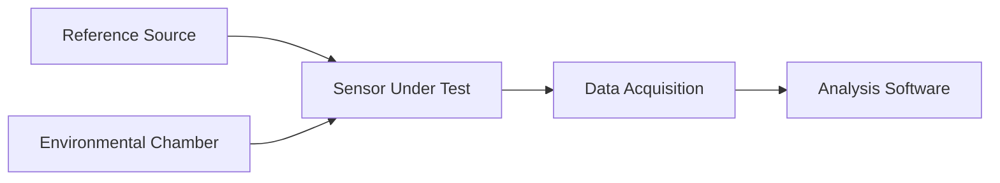
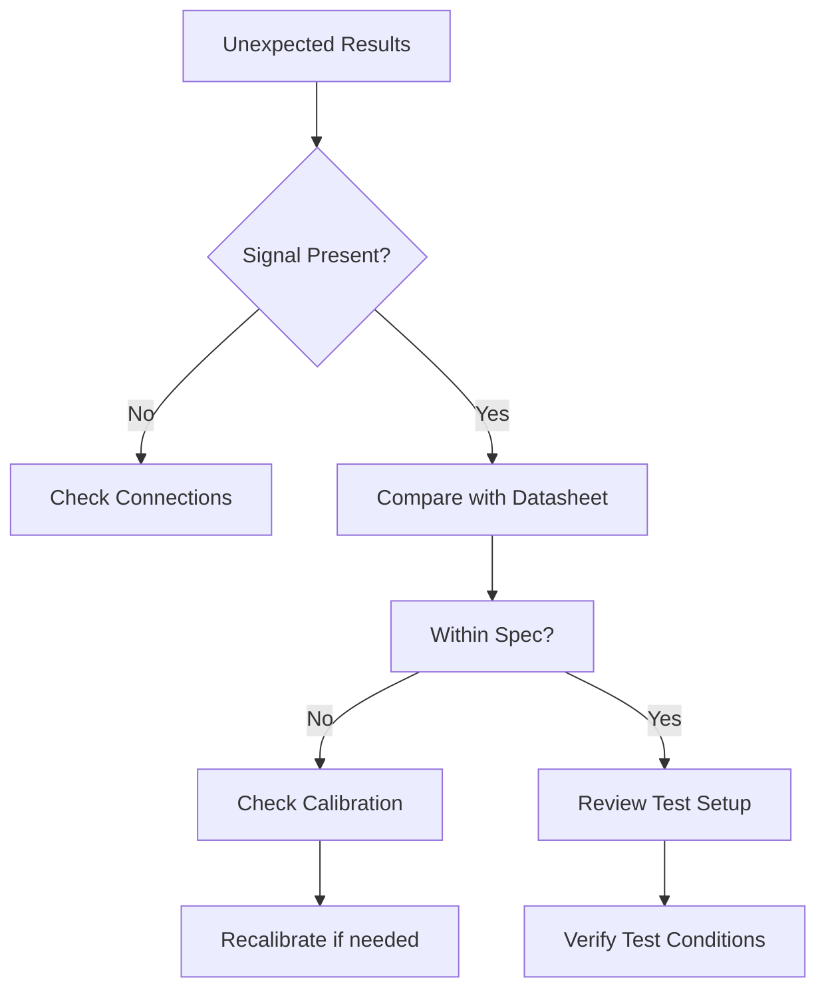

# Validation

---
title: Sensor Validation Framework
description: Comprehensive guide to sensor validation methodologies, processes, and best practices
author: Sensor Engineering Team
created_at: '2025-07-04'
updated_at: '2025-07-05'
version: 2.0.0
---

# Sensor Validation Framework

## Table of Contents

1. [Introduction](#introduction)
2. [Validation Lifecycle](#validation-lifecycle)
3. [Validation Methods](#validation-methods)
4. [Test Procedures](#test-procedures)
5. [Data Analysis](#data-analysis)
6. [Documentation Requirements](#documentation-requirements)
7. [Case Studies](#case-studies)
8. [Tools & Software](#tools--software)
9. [Best Practices](#best-practices)
10. [Troubleshooting](#troubleshooting)

## Introduction

Sensor validation is a critical process that ensures sensors meet specified requirements and perform reliably in their intended applications. This document outlines a comprehensive framework for validating various types of sensors used in our systems.

### Purpose
- Ensure sensor accuracy and reliability
- Verify performance under various conditions
- Document compliance with specifications
- Identify potential failure modes
- Establish baseline performance metrics

### Scope
This framework applies to all sensor types including but not limited to:
- Environmental sensors (temperature, humidity, pressure)
- Inertial sensors (IMUs, accelerometers, gyroscopes)
- Optical sensors (cameras, LIDAR, ToF)
- Force/torque sensors
- Proximity and presence sensors
- Chemical/gas sensors

## Validation Lifecycle

### 1. Planning Phase
- Define validation objectives and success criteria
- Identify required test equipment and facilities
- Develop test plans and procedures
- Establish data collection and analysis methods

### 2. Preparation Phase
- Set up test environment and equipment
- Calibrate reference instruments
- Prepare test fixtures and DUTs (Devices Under Test)
- Conduct pre-test inspections

### 3. Execution Phase
- Perform tests according to procedures
- Document test conditions and observations
- Collect and store test data
- Monitor for anomalies or failures

### 4. Analysis Phase
- Process and analyze collected data
- Compare results against specifications
- Identify trends and anomalies
- Calculate performance metrics

### 5. Reporting Phase
- Document test results and findings
- Prepare validation report
- Make pass/fail determinations
- Recommend corrective actions if needed

## Validation Methods

### 1. Static Validation
- **Null Test**: Measure output with zero input
- **Sensitivity Test**: Response to known input changes
- **Linearity Test**: Output versus input relationship
- **Hysteresis Test**: Directional dependency

### 2. Dynamic Validation
- **Step Response**: Time to reach steady state
- **Frequency Response**: Performance across frequency spectrum
- **Bandwidth Verification**: Operating frequency range
- **Settling Time**: Time to stabilize after input change

### 3. Environmental Testing
- **Temperature Cycling**: -40°C to +85°C
- **Humidity Exposure**: 20% to 95% RH
- **Vibration Testing**: 5-2000 Hz, 10g RMS
- **Shock Testing**: 50g, 11ms half-sine
- **EMC/EMI Testing**: Immunity and emissions

### 4. Lifetime Testing
- Accelerated life testing
- Mechanical wear assessment
- Long-term drift analysis
- Power cycling endurance

## Test Procedures

### Standard Test Setup



### Example: Temperature Sensor Validation

1. **Equipment Setup**
   - Precision temperature chamber
   - NIST-traceable reference thermometer
   - Data acquisition system
   - Test fixtures

2. **Test Sequence**
   ```python
   def run_temperature_validation(sensor, temp_range=(-40, 125), steps=10):
       results = []
       for temp in np.linspace(*temp_range, steps):
           chamber.set_temperature(temp)
           time.sleep(stabilization_time)
           ref_temp = reference_thermometer.read()
           sensor_temp = sensor.read()
           results.append({
               'setpoint': temp,
               'reference': ref_temp,
               'sensor': sensor_temp,
               'error': sensor_temp - ref_temp
           })
       return pd.DataFrame(results)
   ```

3. **Pass/Fail Criteria**
   - Accuracy: ±0.5°C over operating range
   - Repeatability: ±0.1°C
   - Hysteresis: < 0.2°C
   - Response time: < 5 seconds

## Data Analysis

### Key Metrics
- **Mean Absolute Error (MAE)**: Average absolute difference between measured and reference values
- **Root Mean Square Error (RMSE)**: Square root of average squared differences
- **R² Score**: Coefficient of determination (0-1)
- **Signal-to-Noise Ratio (SNR)**: Ratio of signal power to noise power

### Visualization

```python
import matplotlib.pyplot as plt
import seaborn as sns

def plot_validation_results(df):
    plt.figure(figsize=(12, 6))
    
    # Time series
    plt.subplot(1, 2, 1)
    plt.plot(df['timestamp'], df['reference'], label='Reference')
    plt.plot(df['timestamp'], df['sensor'], label='Sensor')
    plt.xlabel('Time')
    plt.ylabel('Value')
    plt.legend()
    
    # Error distribution
    plt.subplot(1, 2, 2)
    sns.histplot(df['error'], kde=True)
    plt.xlabel('Error')
    plt.ylabel('Frequency')
    
    plt.tight_layout()
    plt.savefig('validation_results.png')
```

## Documentation Requirements

### Test Report Contents
1. **Header**
   - Test ID and revision
   - Date and location
   - Tester information
   - Equipment used

2. **Test Parameters**
   - Sensor details (model, serial number, firmware version)
   - Test conditions
   - Reference standards used

3. **Results**
   - Raw and processed data
   - Performance metrics
   - Pass/fail determination
   - Anomalies or observations

4. **Appendices**
   - Calibration certificates
   - Raw data files
   - Supporting calculations

## Case Studies

### Case Study 1: IMU Calibration
**Challenge**: High drift in orientation estimation  
**Solution**: Implemented 12-point calibration procedure  
**Result**: Reduced orientation error from 5° to 0.5°

### Case Study 2: Pressure Sensor Compensation
**Challenge**: Temperature-induced drift  
**Solution**: Developed polynomial compensation algorithm  
**Result**: Improved accuracy from ±2% to ±0.1% FS

## Tools & Software

### Recommended Tools
- **Data Acquisition**: NI LabVIEW, MATLAB Data Acquisition Toolbox
- **Analysis**: Python (NumPy, SciPy, Pandas)
- **Visualization**: Matplotlib, Plotly, Tableau
- **Test Automation**: PyVISA, SCPI, TestStand

### Example Validation Script

```python
import numpy as np
import pandas as pd
from scipy import stats

def analyze_sensor_data(reference, measured):
    """Calculate key validation metrics."""
    error = measured - reference
    mae = np.mean(np.abs(error))
    rmse = np.sqrt(np.mean(error**2))
    r2 = 1 - (np.sum(error**2) / np.sum((reference - np.mean(reference))**2))
    
    return {
        'MAE': mae,
        'RMSE': rmse,
        'R2': r2,
        'Max_Error': np.max(np.abs(error)),
        'Bias': np.mean(error)
    }
```

## Best Practices

1. **Pre-Test Verification**
   - Verify calibration of all reference equipment
   - Perform system noise floor analysis
   - Document environmental conditions

2. **During Testing**
   - Monitor for environmental fluctuations
   - Log all test parameters and conditions
   - Take periodic reference measurements

3. **Data Management**
   - Use version control for test scripts
   - Store raw data in non-proprietary formats (CSV, HDF5)
   - Implement automated backup procedures

4. **Uncertainty Analysis**
   - Quantify all sources of measurement uncertainty
   - Calculate combined standard uncertainty
   - Report expanded uncertainty with coverage factor (k=2 for 95% confidence)

## Troubleshooting

### Common Issues

1. **Noisy Measurements**
   - Check ground loops and shielding
   - Verify proper sensor grounding
   - Consider power supply noise

2. **Drift Over Time**
   - Allow sufficient warm-up time
   - Check for environmental factors
   - Verify reference stability

3. **Unexpected Values**
   - Verify wiring and connections
   - Check for electromagnetic interference
   - Confirm proper signal conditioning

### Debugging Workflow



## Revision History

| Version | Date | Author | Changes |
|---------|------|--------|---------|
| 2.0.0 | 2025-07-05 | Sensor Team | Comprehensive validation framework |
| 1.0.0 | 2025-07-04 | System | Initial stub |

## References

1. NIST Special Publication 250-64 - Thermometer Calibration
2. ISO 5725 - Accuracy of measurement methods and results
3. IEEE 1057 - Digitizing Waveform Recorders
4. JCGM 100:2008 - Evaluation of measurement data — Guide to the expression of uncertainty in measurement

## Contact

For questions or support:
- **Email**: sensors@example.com
- **Slack**: #sensor-validation
- **Documentation**: https://docs.sensors.example.com/validation
